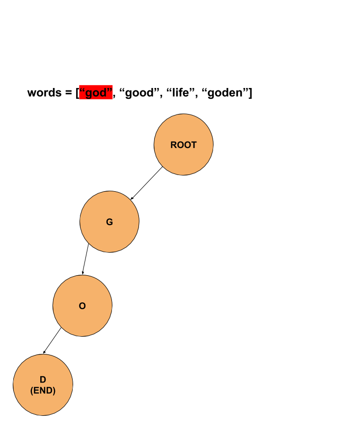
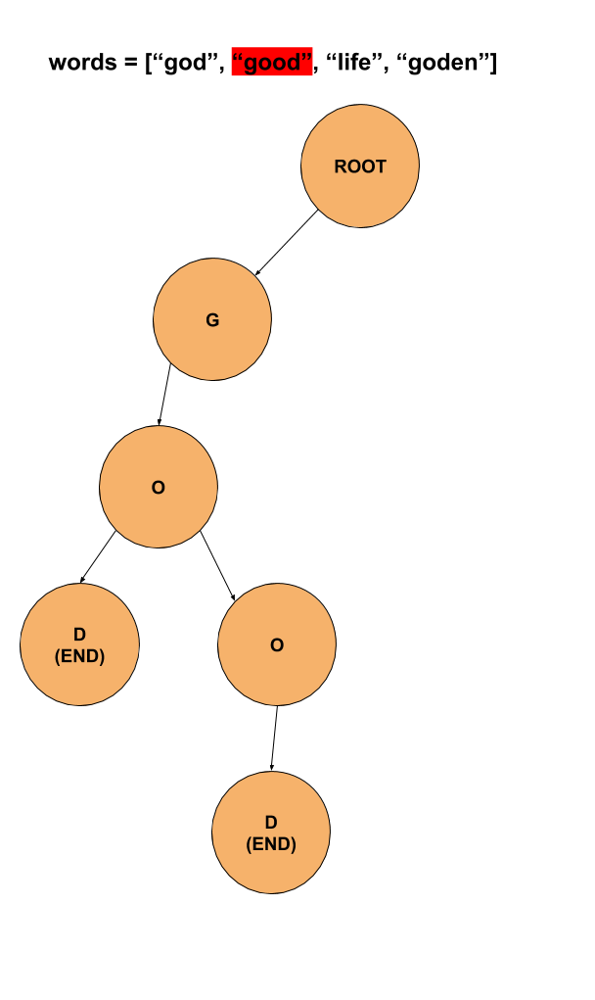
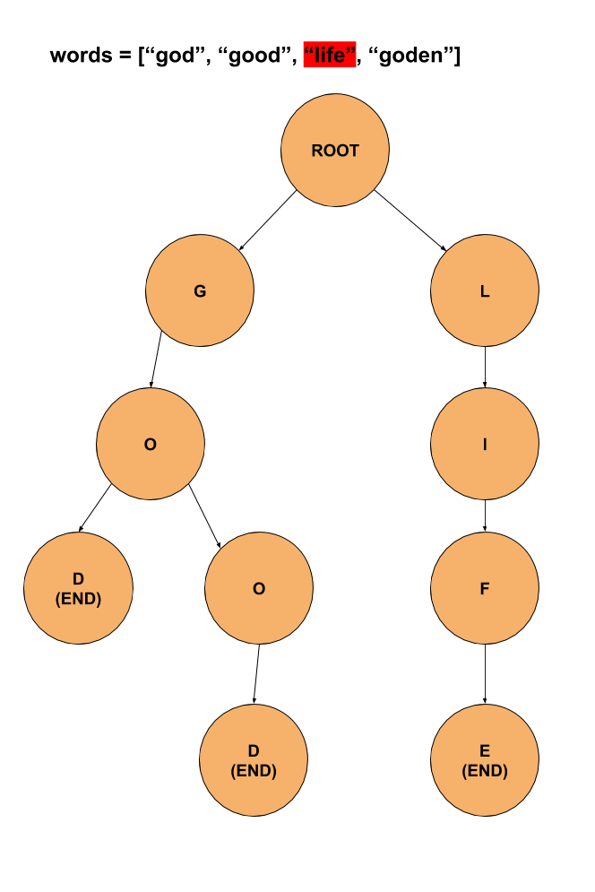
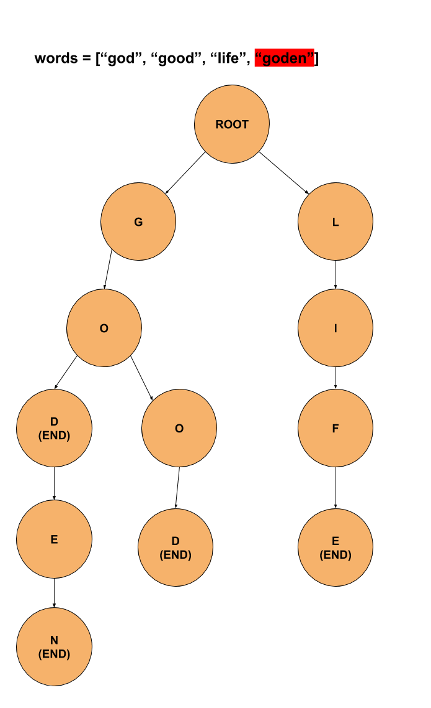
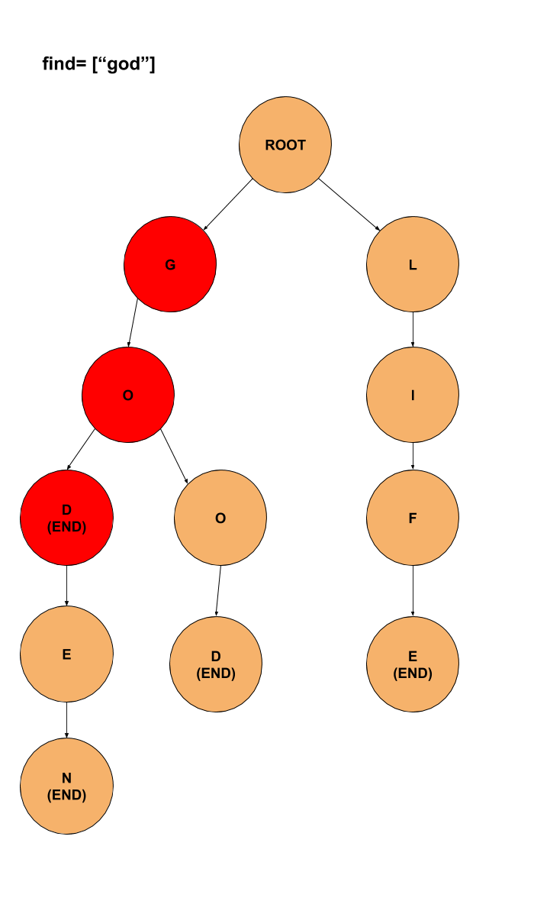

# Trie 란?


트라이는 여러 문자열이 있을때 해당 문자열이 있는지 빠르게 확인 할 수 있는 자료구조이다.

문자열 search시 O(m)의 시간복잡도를 가지고 있다.(이때 m은 문자열의 길이)

# 예시
`words = ["god", "good", "life", "goden"]` 이라는 단어에 대해 Trie 자료구조를 만들어보자.

root 노드로부터 각 알파벳을 퍼트린다



go까지는 이미 있던것이므로 od만 뒤에 노드를 달아준다.



life는 이전에 없던 노드이므로 새롭게 달아준다.



goden에서 god은 이미 있으므로 en만 추가로 달아준다.



이렇게 완성된 노드에서 god을 한번 찾아보자. 만약 순차적으로 해당 알파벳들에 대한 노드가 전부 있고, 마지막으로 매칭된 노드가 END라면 해당 문자가 존재하는걸 알 수 있다.




# 소스코드
<details>
    <summary>전체 소스코드 보기</summary>
    
    ```
    /*
        트라이(Trie) 자료구조
        문자열을 O(m)으로 서치하게 해줌
    */

    #include <iostream>
    #include <string>
    #include <cstring>
    using namespace std;

    const int ALPHABT_SIZE = 26;

    // 알파벳 소문자만 받는다는 가정하에 만들어진 Trie 알고리즘
    struct Trie {
        Trie* children[ALPHABT_SIZE];
        bool isEndOfWord;

        Trie() {
            memset(this->children, NULL, sizeof(this->children));
            this->isEndOfWord = false;
        }
        ~Trie() {
            for (int i = 0; i < ALPHABT_SIZE; ++i)
                if (this->children[i])
                    delete this->children[i];
        }

        // 문자열을 포인터로 접근하는 재귀방식
        void insert(const char* key) {
            if (*key == '\0')
                isEndOfWord = true;
            else {
                int cur = *key - 'a';
                if (children[cur] == NULL)
                    children[cur] = new Trie();
                insert(children[cur], key + 1);
            }
        }

        // 문자열을 인덱스로 접근하는 반복문 방식
        void insert(Trie* root, string key) {
            Trie* pNode = root;
            for (int i = 0; i < key.length(); ++i) {
                int index = key[i] - 'a';
                if (!pNode->children[index])
                    pNode->children[index] = new Trie();
                pNode = pNode->children[index];
            }
            pNode->isEndOfWord = true;
        }

        bool search(const char* key) {
            if (this->isEndOfWord && *key == '\0')
                return true;
            else if (*key == '\0')
                return false;
            int cur = *key - 'a';
            if (this->children[cur] == NULL)return false;
            return this->children[cur]->search(key + 1);
        }

        bool search(Trie* root, string key) {
            Trie* pNode = root;

            for (int i = 0; i < key.length(); ++i) {
                int index = key[i] - 'a';
                if (pNode->children[index] == NULL)
                    return false;
                pNode = pNode->children[index];
            }
            return (pNode != NULL && pNode->isEndOfWord);
        }
    };

    int main() {
        Trie* root = new Trie();
        string key[] = { "marinelife", "god", "fan", "algorithm", "trie", "abs", "any" };
        
        int sz = sizeof(key) / sizeof(key[0]);
        
        for (int i = 0; i < sz; ++i) {
            root->insert(root, key[i]);
        }
        root->search(root, "marine") ? cout << "Yes!\n" : cout << "No!\n";
        root->search(root, "marinelife") ? cout << "Yes!\n" : cout << "No!\n";
        root->search(root, "godfan") ? cout << "Yes!\n" : cout << "No!\n";
        root->search(root, "algorithm") ? cout << "Yes!\n" : cout << "No!\n";
        root->search(root, "any") ? cout << "Yes!\n" : cout << "No!\n";
        cout << "\n\n";

        Trie* root2 = new Trie();
        const char *words[] = { "marinelife", "god", "fan", "algorithm", "trie", "abs", "any" };

        for (int i = 0; i < sz; ++i) {
            root2->insert(words[i]);
        }
        root2->search("marine") ? cout << "Yes!\n" : cout << "No!\n";
        root2->search("marinelife") ? cout << "Yes!\n" : cout << "No!\n";
        root2->search("godfan") ? cout << "Yes!\n" : cout << "No!\n";
        root2->search("algorithm") ? cout << "Yes!\n" : cout << "No!\n";
        root2->search("any") ? cout << "Yes!\n" : cout << "No!\n";
        cout << "\n\n";
    }
    ```
</details>

# 관련문제
* <https://www.acmicpc.net/problem/9202>

# 참고 문항
* <https://twpower.github.io/187-trie-concept-and-basic-problem>
* <https://www.geeksforgeeks.org/trie-insert-and-search/>
* <https://en.wikipedia.org/wiki/Trie>