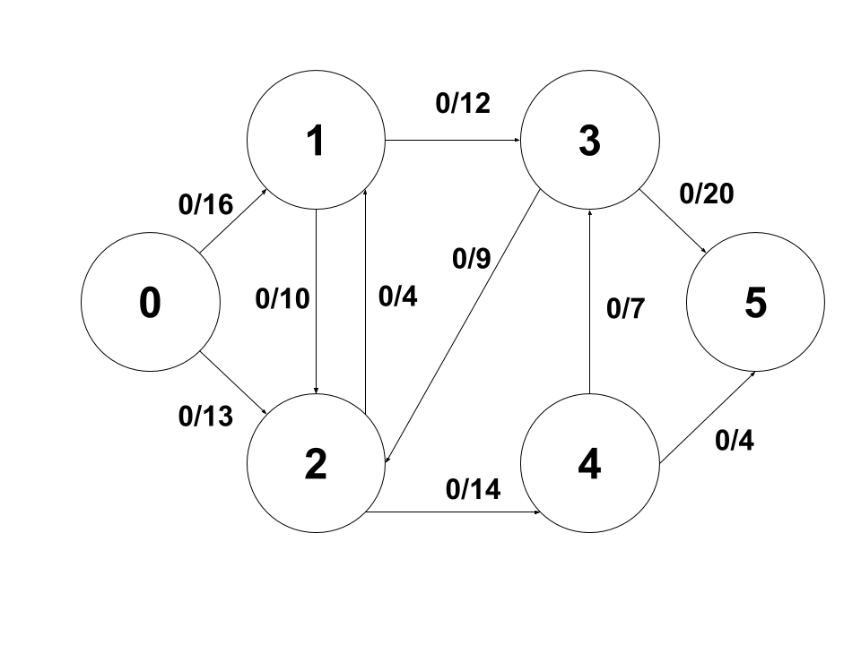
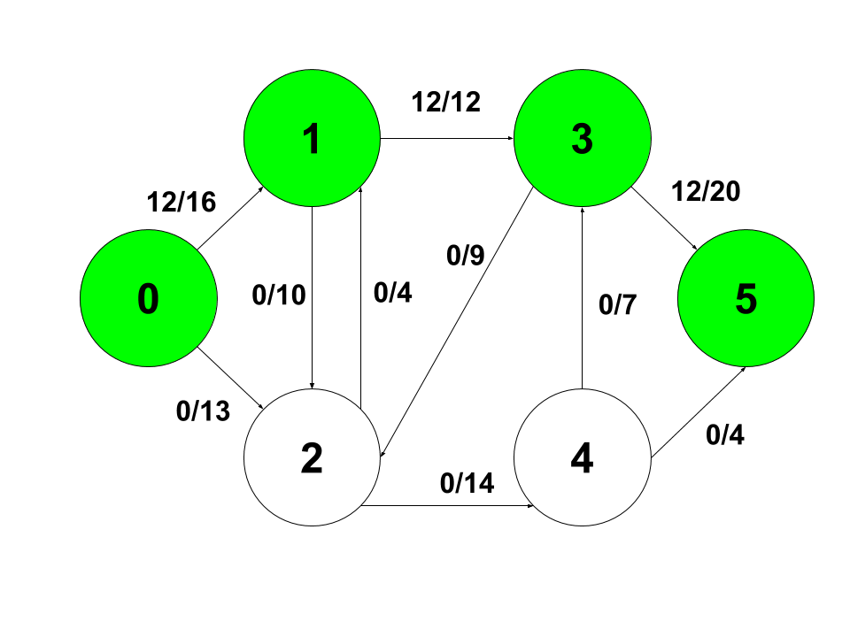
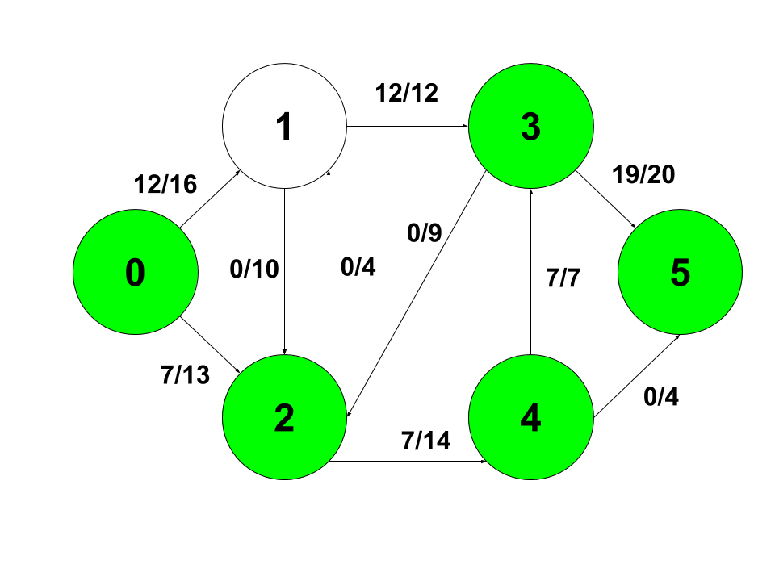
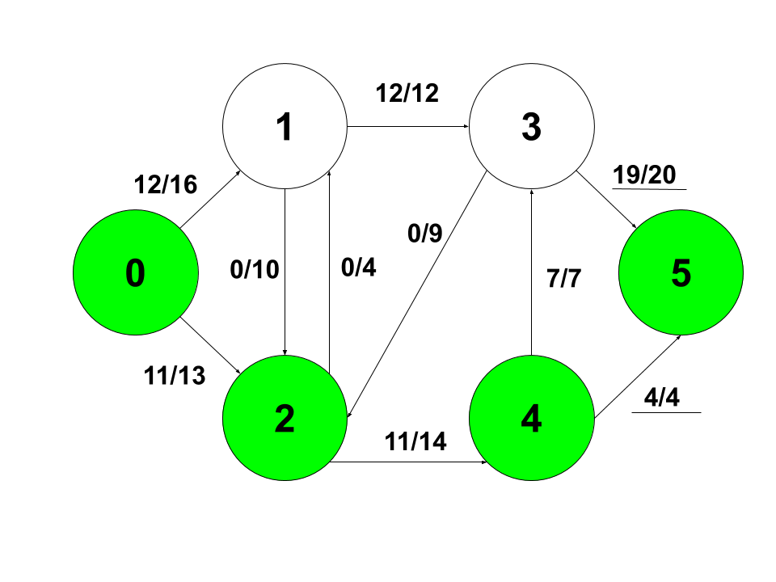
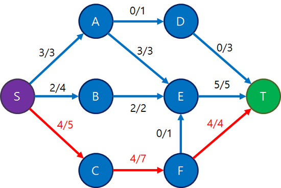
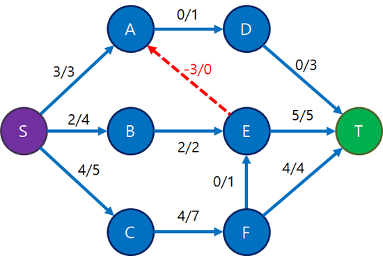
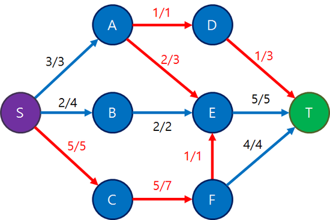

# 네트워크 플로우란?
A라는 지점에서 B지점으로 데이터가 얼마나 많이 흐르고 있는가를 측정하는 알고리즘 입니다. 이러한 알고리즘은 물이 흐르는 강가의 유량에 비유해 플로우가 붙여졌는데요. 네트워크 데이터 전송, 교통 데이터 갱신 등에 유용한 알고리즘 입니다.

# 예시
6개의 구역이 있습니다. 여기서 아무 경로나 s에서 t까지 가보겠습니다.



0 - 1- 3- 5의 경로를 거쳐 갈 수 있는 최대 flow는 12이므로 해당 경로에 12라는 값을 갱신해줍니다.



0 - 2 - 4- 3- 5 경로로 거쳐 갈 수 있는 최대 flow는 7이므로 각각 해당 경로에 7라는 값을 갱신해줍니다.



마지막으로 0 - 2- 4 - 5 경로로 최대 flow는 4이므로 각각 해당 경로에 4라는 값을 갱신해줍니다.



더 이상 0에서 5로 갈 수 있는 방법이 없으므로 최종적으로 `19 + 4 = 23`의 값을 토대로 0에서 5로 가는 최대유량은 23이라는 답이 됩니다.

# 그런게 이게 끝?
위에 예제는 사람 입장에서 유량을 찾는다고 한다는 가정으로 해보았습니다. 컴퓨터도 마찬가지로 dfs나 bfs로 0 -> 5로 가는 경로가 없을때까지 flow를 갱신해주면 되겠죠. 그런데 문제가 하나 있습니다.

컴퓨터가 0 -> 5로 가는 경로가 없다고 판단했음에도 아직 최선의 경우가 있는 경우입니다.

> 예제를 구성하기 어려워 아래 사진은 Ries 마법의 슈퍼마리오님의 블로그 예제를 가져왔습니다

아래 예제에서 얼핏보면 더 이상 갱신할게 없어보입니다. S -> T로 가는 경로가 더 이상 없거든요!



그런데 만약 반대 경로에 - 가중치를 준다면 어떻게 될까요?



컴퓨터가 해당 경로를 통해 길이 있다고 판단하게 됩니다. 그러면서 얻는 최대유량이 1이 되므로 경로의 반대방향의 flow가 1씩 작아지고 정방향은 1씩 증가하며 완전한 탐색을 하게됩니다.



# 설명
s에서 t까지 최대 유량을 구하는 소스코드이다. bfs로 하는 이유는 dfs로 할때보다 최악인 경우에 안정성을 보이기 때문입니다.
1. flow를 담는 rGraph에 graph값을 담아주고 시작한다.
1. bfs를 통해 s에서 t까지 가는 경로를 구함
1. 구한 경로를 통해 추가되는 최대 유량을 구함
1. 해당 경로에 구한 유량을 더해주고 반대방향은 빼줌

# 소스코드
```
#include <iostream>
#include <limits.h>
#include <string.h>
#include <queue>
#include <algorithm>
using namespace std;

// 그래프 크기
const int V = 6;

// s -> t 까지가 있는 경우 경로에 유량을 채워주고 return true한다.
bool bfs(int graph[V][V], int s, int t, int path[]) {
	bool visited[V];
	memset(visited, false, sizeof(visited));

	queue<int> q;
	q.push(s);
    visited[s] = true;
    path[s] = -1;

    while (!q.empty()) {
        int u = q.front();
        q.pop();

        for (int v = 0; v < V; ++v) {
            if (visited[v])continue;
            if (graph[u][v] <= 0)continue;
            q.push(v);
            path[v] = u;
            visited[v] = true;
        }
    }
    // 목적지까지 도달했으면 true 반환
    return visited[t];
}

int fordFulkerson(int graph[V][V], int s, int t) {
    int u, v;

    int rGraph[V][V]; // flow를 담는 그래프

    memcpy(rGraph, graph, sizeof(rGraph));
    int path[V]; // bfs할때 flow 경로를 저장할 친구

    int max_flow = 0;

    while (bfs(rGraph, s, t, path)) {
        int path_flow = INT_MAX;
        // 모든 경로를 통해 지나갈 수 있는 최대 유량을 찾는다.
        for (v = t; v != s; v = path[v]) {
            u = path[v];
            path_flow = min(path_flow, rGraph[u][v]);
        }

        // 찾은 유량을 업데이트 해준다. 반대방향은 빼줌
        for (v = t; v != s; v = path[v]) {
            u = path[v];
            rGraph[u][v] -= path_flow;
            rGraph[v][u] += path_flow;
        }

        max_flow += path_flow;
    }
    return max_flow;
}

int main() {
    int graph[V][V] = { {0, 16, 13, 0, 0, 0},
                        {0, 0, 10, 12, 0, 0},
                        {0, 4, 0, 0, 14, 0},
                        {0, 0, 9, 0, 0, 20},
                        {0, 0, 0, 7, 0, 4},
                        {0, 0, 0, 0, 0, 0}
    };

    cout << "최고 유량 -> " << fordFulkerson(graph, 0, 5) << endl;
    return 0;
}
```


# 참고자료
* <https://blog.naver.com/PostView.nhn?blogId=kks227&logNo=220804885235>
* <https://en.wikipedia.org/wiki/Flow_network>
* <https://www.geeksforgeeks.org/ford-fulkerson-algorithm-for-maximum-flow-problem/>