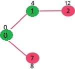

# 다익스트라 알고리즘이란?
다익스트라 알고리즘은 그래프에서 하나의 정점을 기준으로 다른점과의 최단거리를 구할때 유용한 알고리즘입니다. 시험에서도 유도과정을 구하는 문제로 나오는 단골문제이기도 하죠. 간단히 정리하면 아래와 같습니다.

* 하나의 정점을 기준으로 다른점들과의 최단거리를 구할때 쓴다.
* O(n*logn)의 시간 복잡도를 가진다.
* 거리가 음수가 아닐때 사용할 수 있다.
* 아직 가지 못하거나 못가는 곳은 INF로 표시된다.

# 예시

아래와 같은 그래프에서 최단거리를 탐색한다고 가정하자.


0인 노드에서부터 시작하여 0과 다른 노드간의 최단거리를 구할 것이다.


먼저 1 vs 7 노드로 가는길 중 1이 4로 더 작기 때문에 4노드를 탐색한다.



그 후 7노드로 가는 비용이 제일 작으므로 7선택


6 노드 선택


이런 식으로 뻗어나갈때 최소비용으로 뻗어나갈 수 있는 노드를 선택하면서 갱신해준다.


이러한 과정을 표로 표현하면 이렇게 된다.


|0|1|2|3|4|5|6|7|8|
|:---:|:---:|:---:|:---:|:---:|:---:|:---:|:---:|:---:|
|0|INF|INF|INF|INF|INF|INF|INF|INF|
|0|4|INF|INF|INF|INF|INF|INF|INF|
|0|4|INF|INF|INF|INF|INF|8|INF|
|0|4|INF|INF|INF|INF|9|8|INF|
|0|4|INF|INF|INF|11|9|8|INF|
|0|4|12|INF|INF|11|9|8|INF|
|0|4|12|INF|INF|11|9|8|14|
|0|4|12|19|INF|11|9|8|14|
|0|4|12|19|21|11|9|8|14|

# 설명
* 모든 정점과의 거리를 INF 초기화하고, 정점 0부터 출발한다.
* 이어져 있는 노드 중 최소 비용인것을 선택한다.
* 고른 노드를 통해 최솟값인 경우 갱신해주고 후보에 삽입해준다.
* 모든 노드를 탐색할때까지 반복한다.

# 소스코드
O(n^2)인 소스
```
#include <iostream>
using namespace std;

const int V = 9;
const int INF = 1e9;

// 방문하지 않은 정점 중 가장 비용이 작은 정점을 구하는 함수
int minDistance(int dist[], bool sptSet[]) {
	int min = INF, min_index;
	for (int v = 0; v < V; ++v) {
		if (!sptSet[v] && dist[v] <= min) {
			min = dist[v], min_index = v;
		}
	}
	return min_index;
}

// 다익스트라를 통해 구한 한 정점에서 각 정점까지의 거리를 출력하는 함수
void printSolution(int dist[]) {
	cout << "Vertex \t\t Distance from Source\n";
	for (int i = 0; i < V; ++i)
		cout << i << " \t\t " << dist[i] << '\n';
}

// 한 정점에서 다른 정점과의 최단거리를 구하는 함수
void dijkstra(int graph[V][V], int src) {
	int dist[V]; // 최단거리를 담는 배열
	bool sptSet[V]; // 해당 정점이 최단거리인지 알려주는 배열

	// 모든 정점과의 거리를 INF로 초기화
	for (int i = 0; i < V; ++i) {
		dist[i] = INF, sptSet[i] = false;
	}
	// 시작 정점은 자신과의 거리 0
	dist[src] = 0;

	for (int count = 0; count < V - 1; ++count) {
		// 최소 정점을 골라줌
		int u = minDistance(dist, sptSet);
		sptSet[u] = true;

		// 해당 정점에서 다른 정점으로 가는 값이 기존의 값보다 작으면 갱신해줌
		for (int v = 0; v < V; ++v) {
			if (!sptSet[v] && graph[u][v] && dist[u] != INF
				&& dist[u] + graph[u][v] < dist[v])
				dist[v] = dist[u] + graph[u][v];
		}
	}
	printSolution(dist);
}

int main() {
	int graph[V][V] = { { 0, 4, 0, 0, 0, 0, 0, 8, 0 },
					   { 4, 0, 8, 0, 0, 0, 0, 11, 0 },
					   { 0, 8, 0, 7, 0, 4, 0, 0, 2 },
					   { 0, 0, 7, 0, 9, 14, 0, 0, 0 },
					   { 0, 0, 0, 9, 0, 10, 0, 0, 0 },
					   { 0, 0, 4, 14, 10, 0, 2, 0, 0 },
					   { 0, 0, 0, 0, 0, 2, 0, 1, 6 },
					   { 8, 11, 0, 0, 0, 0, 1, 0, 7 },
					   { 0, 0, 2, 0, 0, 0, 6, 7, 0 } };

	dijkstra(graph, 0);

	return 0;
}
```

priority_queue를 이용하여 O(nlogn)인 소스

minDistance 함수를 priority_queue로 대체 했을뿐 그 외 다른건 없다.

```
#include <iostream>
#include <queue>
using namespace std;

const int V = 9;
const int INF = 1e9;

struct vertex {
	int index, distance;

	// 거리 작은 순으로 정렬
	bool operator < (const vertex& v) const {
		return this->distance > v.distance;
	}
};
// 다익스트라를 통해 구한 한 정점에서 각 정점까지의 거리를 출력하는 함수
void printSolution(int dist[]) {
	cout << "Vertex \t\t Distance from Source\n";
	for (int i = 0; i < V; ++i)
		cout << i << " \t\t " << dist[i] << '\n';
}

// 한 정점에서 다른 정점과의 최단거리를 구하는 함수
void dijkstra(int graph[V][V], int src) {
	int dist[V]; // 최단거리를 담는 배열
	bool sptSet[V]; // 해당 정점이 최단거리인지 알려주는 배열
	priority_queue<vertex> pq; // 최단거리 순으로 반환하는 최소힙

	// 모든 정점과의 거리를 INF로 초기화
	for (int i = 0; i < V; ++i) {
		dist[i] = INF, sptSet[i] = false;
	}
	// 시작 정점은 자신과의 거리 0
	dist[src] = 0;
	pq.push({ src, 0 });
	while (!pq.empty()) {
		int u = pq.top().index;
		pq.pop();
		sptSet[u] = true;

		for (int v = 0; v < V; ++v) {
			if (!sptSet[v] && graph[u][v] && dist[u] != INF
				&& dist[u] + graph[u][v] < dist[v]) {
				dist[v] = dist[u] + graph[u][v];
				pq.push({ v, dist[v] });
			}
		}
	}
	
	printSolution(dist);
}

int main() {
	int graph[V][V] = { { 0, 4, 0, 0, 0, 0, 0, 8, 0 },
					   { 4, 0, 8, 0, 0, 0, 0, 11, 0 },
					   { 0, 8, 0, 7, 0, 4, 0, 0, 2 },
					   { 0, 0, 7, 0, 9, 14, 0, 0, 0 },
					   { 0, 0, 0, 9, 0, 10, 0, 0, 0 },
					   { 0, 0, 4, 14, 10, 0, 2, 0, 0 },
					   { 0, 0, 0, 0, 0, 2, 0, 1, 6 },
					   { 8, 11, 0, 0, 0, 0, 1, 0, 7 },
					   { 0, 0, 2, 0, 0, 0, 6, 7, 0 } };

	dijkstra(graph, 0);

	return 0;
}
```

# 참고자료
* <https://en.wikipedia.org/wiki/Dijkstra%27s_algorithm>
* <https://www.geeksforgeeks.org/dijkstras-shortest-path-algorithm-greedy-algo-7/>