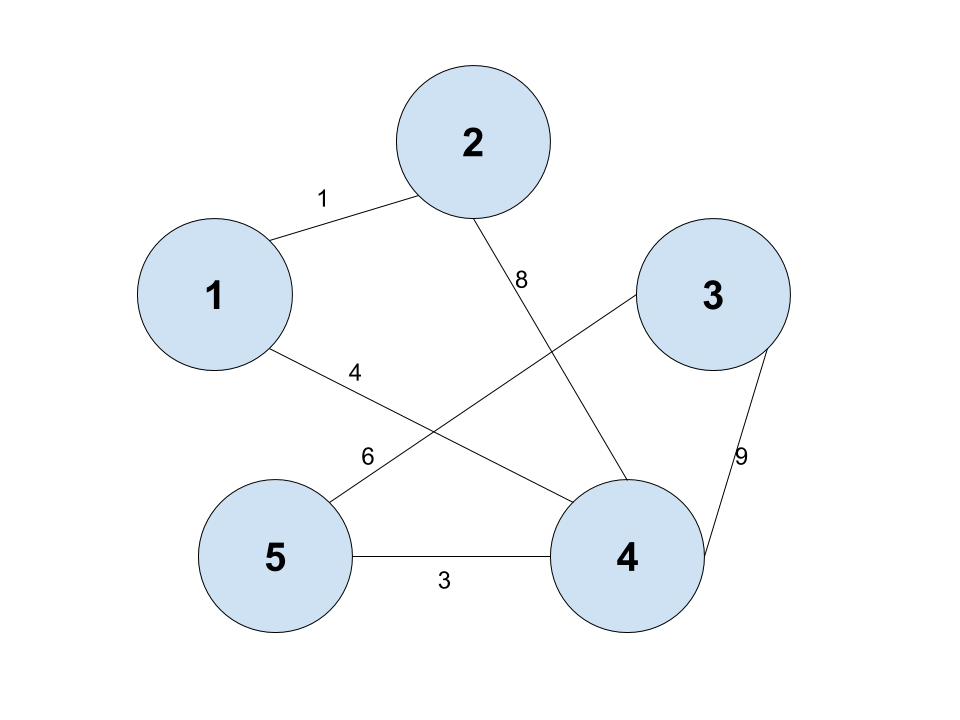

# 플로이드 와샬(Floyd Warshall)이란?
플로이드 와샬은 모든 정점에서 다른 모든 정점 사이의 최단 경로를 구하는 문제이다. 다 대 다의 최단 경로를 구할 경우 유용하게 쓰이며 엄청나게 심플하다. 시간 복잡도는 O(n^3)

* 다 대 다 최단거리를 구할 때 쓰는 알고리즘
* 음의 가중치를 가진 간선도 사용 가능
* 모든 정점에 대한 경로를 계산하므로 그래프가 아닌 2차원 배열 형태를 사용

# 예시


위와 같이 양방향 그래프가 있다고 하면 초기 상태는 2차원 배열로 이렇게 표현 될 수 있다.

|x|1|2|3|4|5|
|:---:|:---:|:---:|:---:|:---:|:---:|
|1|0|1|INF|4|INF|
|2|1|0|INF|8|INF|
|3|INF|INF|0|9|6|
|4|4|8|9|0|3|
|5|INF|INF|6|3|0|


# 설명
* 그냥 소스 돌려서 확인해보자(귀찮앙 언젠가 고치겠지??)

# 소스코드
```
#include <iostream>
using namespace std;

const int INF = 1e9;
int graph[5][5] = {
	{0, 1, INF, 4, INF},
	{1, 0, INF, 8, INF},
	{INF, INF, 0, 9, 6},
	{4, 8, 9, 0, 3},
	{INF, INF, 6, 3, 0}
};

void print() {
	for (int i = 0; i < 5; ++i) {
		for (int j = 0; j < 5; ++j) {
			if (graph[i][j] == INF)
				cout << "INF ";
			else
				cout << graph[i][j] << ' ';
		}
		cout << '\n';
	}
}

void floydwarshall() {
	for (int by = 0; by < 5; ++by) {
		for (int from = 0; from < 5; ++from) {
			for (int to = 0; to < 5; ++to) {
				if (from == to)continue;
				if (graph[from][by] + graph[by][to] < graph[from][to]) {
					graph[from][to] = graph[from][by] + graph[by][to];
				}
			}
		}
		cout << by + 1 << "번째 노드를 거쳐 가서 갱신" << endl;
		print();
		cout << '\n';
		cout << endl;
	}
}

int main() {
	cout << "초기 상태" << endl;
	print();
	floydwarshall();
	return 0;
}
```
# 참고자료
* <https://www.geeksforgeeks.org/floyd-warshall-algorithm-dp-16/>