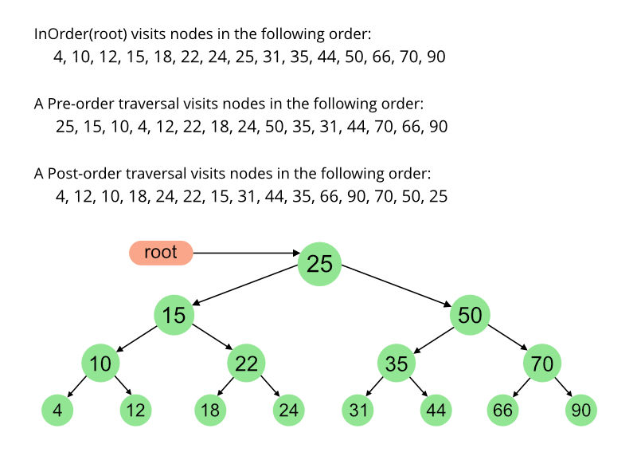

# 이진트리란?
우리가 트리라는 개념을 처음 접할때 이진 트리로 접한다. 사실 트리는 이진이든 삼진 사진 오진 개발자가 만들기 나름이다. 단지 우리가 개념을 보다 쉽게 접하기 위해, 짜기 편하기 때문에 이진트리로 배우는 것이다.

* 이진 트리는 자식을 최대 두개 가질 수 있는 자료구조이다.
* 짜기나름이지만 삽입할때 부모 노드보다 작으면 왼쪽, 크면 오른쪽에 넣는다.
* 전위 순회, 중위 순회, 후위 순회 등의 노드를 순회하는 방법이 있다.
* 삽입, 탐색시 시간복잡도가 O(log2(n))이다. but 최악은 O(n)이다.(한쪽 방향으로만 노드가 치우치는 경우 때문이다.)


# 예시
> 요즘 예시로 이런거 그릴 여유가 없네..



트리의 삽입은 위와 같이 부모 노드를 기준으로 작으면 왼쪽, 크면 오른쪽에 넣는다. 에..? 그럼 노드들이 정렬되는것도 아니고 일관성이 없지 않는가?(그렇다.. 이건 이진트리의 기본형태일뿐 이 형태를 이용해 향후 heap, avl 등을 배우게 될것이다.)

그리고 만약 원소를 찾는다고 하면 현재 원소가 부모노드보다 큰지 작은지에 따라 왼쪽으로 갈지 오른쪽으로 갈지 판단 해서 찾아가면 될것이다.


# 이진트리의 순회방식
이진트리에 순회방식이 있다. 어느 노드를 중점으로 순회하느냐에 따라 전위 순회, 중위 순회, 후위순회라고 불린다. 그렇게 중요한 개념은 아니지만 시험에 내기 좋은 문제다 =ㅅ=(그냥 방문 방식일뿐!) 이 세가지 방식은 모두 dfs방식이다.

아래 사진을 예제로 해보자


## 전위 순회(preorder traversal)
> root -> left -> right 순으로 탐색한다
left를 기점으로 삼각형을 그리며 탐색된다.

`Inorder (Left, Root, Right) : 4 2 5 1 3`

## 중위 순회(inorder traversal)
> left -> root -> right 순으로 탐색한다.
root를 기점으로 삼각형을 그리며 탐색된다.

`Preorder (Root, Left, Right) : 1 2 4 5 3`

## 후위 순회(postorder traversal)
> left -> rigt -> root
right를 기점으로 삼각형을 그리며 탐색된다.

`Postorder (Left, Right, Root) : 4 5 2 3 1`

후위 순회는 left에서부터 시작해서 가장 헷갈린다 =ㅅ=

## bfs방식 탐색
bfs는 각 노드를 큐에 담아서 순회하기 때문에 레벨 순으로 순회가 가능하다.(따로 구현하진 않음)

`Breadth First or Level Order Traversal : 1 2 3 4 5`

# 소스코드
```
#include <iostream>
using namespace std;

struct node {
	int value;
	node* left;
	node* right;

	node(int key) : value(key) {
		left = NULL;
		right = NULL;
	}
};

class BinaryTree {
public:
	BinaryTree();
	~BinaryTree();

	void insert(int key); // 올바른 위치에 노드를 생성해 key를 집어넣는다.
	node* find(int key); // 해당 key를 가진 노드가 있는지 찾고 있으면 해당 노드를, 없으면 null을 반환한다.
	void preorder_print(); // 전위순회
	void inorder_print(); // 중위순회
	void postorder_print(); // 후위순회
	
private:
	node* root;

	void destroy_tree(node* leaf); // 순회하며 할당된 노드들을 삭제한다.
	void insert(int key, node* leaf);
	node* find(int key, node *leaf);
	void preorder_print(node* leaf); // root -> left -> right
	void inorder_print(node* leaf); // left -> root -> right
	void postorder_print(node* leaf); // left -> right -> root
	
};

BinaryTree::BinaryTree() {
	root = NULL;
}

BinaryTree::~BinaryTree() {
	destroy_tree(root);
}

void BinaryTree::destroy_tree(node* leaf) {
	if (leaf != NULL) {
		destroy_tree(leaf->left);
		destroy_tree(leaf->right);
		delete leaf;
	}
}

void BinaryTree::insert(int key) {
	if (root) insert(key, root);
	else root = new node(key);
}

void BinaryTree::insert(int key, node *leaf) {
	
	if (key < leaf->value) {
		if (leaf->left) insert(key, leaf->left);
		else leaf->left = new node(key);
	}
	else {
		if (leaf->right) insert(key, leaf->right);
		else leaf->right = new node(key);
	}
}

node* BinaryTree::find(int key) {
	return find(key, root);
}

node* BinaryTree::find(int key, node* leaf) {
	if (leaf == NULL)return NULL;

	if (key < leaf->value) {
		return find(key, leaf->left);
	}
	else if (key == leaf->value) {
		return leaf;
	}
	else {
		return find(key, leaf->right);
	}
}

void BinaryTree::preorder_print() {
	cout << "전위순회 :";
	preorder_print(root);
	cout << '\n';
}

void BinaryTree::preorder_print(node* leaf) {
	if (leaf == NULL)return;
	cout << ' ' << leaf->value;
	preorder_print(leaf->left);
	preorder_print(leaf->right);
}

void BinaryTree::inorder_print() {
	cout << "중위순회 :";
	inorder_print(root);
	cout << '\n';
}

void BinaryTree::inorder_print(node* leaf) {
	if (leaf == NULL)return;
	inorder_print(leaf->left);
	cout << ' ' << leaf->value;
	inorder_print(leaf->right);
}

void BinaryTree::postorder_print() {
	cout << "후위순회 :";
	postorder_print(root);
	cout << '\n';
}

void BinaryTree::postorder_print(node* leaf) {
	if (leaf == NULL)return;
	postorder_print(leaf->left);
	postorder_print(leaf->right);
	cout << ' ' << leaf->value;
}

int main() {
	BinaryTree* tree = new BinaryTree();

	tree->insert(10);
	tree->insert(6);
	tree->insert(14);
	tree->insert(5);
	tree->insert(8);
	tree->insert(11);
	tree->insert(18);
	tree->insert(13);

	node* k = tree->find(5);
	if (k)cout << "find!!" << k->value << '\n';
	else cout << "null!!\n";
	tree->preorder_print();
	tree->inorder_print();
	tree->postorder_print();

	delete tree;

	return 0;
}
```

# 참고자료