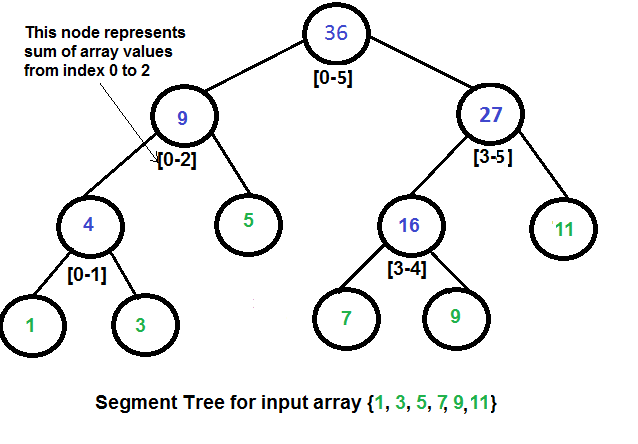

# 세그먼트 트리란?
고인물 알고리즘 중 하나인 세그먼트 트리이다.

A에서 B까지의 합을 구하는데 용이하게 쓰인다.

만약 문제에서 10만개의 집합에 대한 1~9만, 3만~8만의 합을 구하라 같은 질의가 여러번 오가게 된다면 합을 구하는데 어마어마한 시간이 걸릴것이다. 이럴때 쓰는게 바로 세그먼트 트리이다.

원리는 간단하다. 이진트리로 10개의 값이 있다면 1~5는 왼쪽, 6~10은 오른쪽으로 가게 되고, 1~5쪽은 또 1~2, 3~5로 나누고, 1~2 -> 1, 2로 나뉘는 식으로 각 구간을 절반으로 나누어서 합을 구한다.

* 세그먼트 트리는 이진트리로 구간을 절반씩 나눠 해당 구간에 대한 합을 저장한다.
* 구해 놓은 구간의 합을 이용해 구간합을 구할 수 있다 ex) 3~7의 구간합을 구하기 위해서 3~5, 6~7 구간합을 더해줄 수 있다.
* 중간에 해당 집합의 원소 값이 바뀌는 경우 바뀐 차이 만큼 해당 노드에 업데이트를 해준다.

# 예시


위 사진과 같이 루트 노드는 모든 집합의 합이다.

루트노드부터 시작하여 범위를 절반으로 나누어 구간합을 구해주어 세그먼트 트리를 만든다.

# 설명
1. 세그먼트 트리의 크기를 할당해준다. ceil은 올리함수로 log2(N)의 값을 올림해준거에 + 1이 h가 되는데, 이 말은 즉슨 이진트리이기 완전한 이진트리 형태일때 필요한 노드의 개수만큼 할당해주겠다는 것이다. ex) n= 8 일때 모든 노드가 균형잡히게 할당되는데 이때 필요한 노드 개수가 8 + 4 + 2 + 1 = 15이다. 아래 공식대로 하면 16만큼 사이즈를 할당해주게 된다.
    ```
    SegmentTree(int N, long long* A) {
        int h = (int)ceil(log2(N));
        int node_size = 1 << (h + 1);
        nodes = new long long[node_size];

        this->A = A;
        init(0, 0, N - 1);
    }
    ```
1. init함수는 집합들을 이용해 초기 세그먼트 트리를 구성하는 함수 이다. start == end가 될때까지, 즉 원소가 하나 남을때까지 범위를 절반으로 나누어 재귀를 돌려준다. 그리고 남은 하나의 원소를 되돌려준다. 하나가 아닌 경우 해당 범위에 대한 합을 되돌리기 된다. nodes는 범위에 대한 값을 담는 배열이다.
    ```
    long long init(int index, int start, int end)
    {
        if (start == end)
            nodes[index] = A[start];
        else
            nodes[index] =
            init(2 * index + 1, start, (start + end) / 2) +
            init(2 * index + 2, (start + end) / 2 + 1, end);

        return nodes[index];
    }
    ```

1. left~right범위의 합을 구하는 함수이다. 구하는 범위가 밖에가면 그냥 0을 반환해주면 되구, 구하는 범위 내 인 경우 해당 구간합을 반환해준다. 두 경우 모두 아닌 경우 구간을 둘로 나누어주어 반환값을 합을 반환해준다.
    ```
    long long getSum(int index, int start, int end, int left, int right)
    {
        //구하려는 범위가 밖에 있는 경우
        if (left > end || right < start)
            return 0;
        else if (left <= start && right >= end)
            return nodes[index];

        int mid = (start + end) / 2;
        return getSum(index * 2 + 1, start, mid, left, right) +
            getSum(index * 2 + 2, mid + 1, end, left, right);
    }
    ```

1. 바뀐 값의 차이 만큼(diff) changed_index가 범위 내에 들어가면 전부 값을 수정해준다.
    ```
    void update(int changed_index, long long diff, int index, int start, int end)
    {
        if (changed_index < start || changed_index > end)
            return;

        nodes[index] += diff;

        if (start != end) {
            int mid = (start + end) / 2;
            update(changed_index, diff, index * 2 + 1, start, mid);
            update(changed_index, diff, index * 2 + 2, mid + 1, end);
        }
    }
    ```

# 소스코드
```
#include <iostream>
#include <cmath>
using namespace std;

class SegmentTree
{
private:
	long long* nodes;
	long long* A;

	long long init(int index, int start, int end)
	{
		if (start == end)
			nodes[index] = A[start];
		else
			nodes[index] =
			init(2 * index + 1, start, (start + end) / 2) +
			init(2 * index + 2, (start + end) / 2 + 1, end);

		return nodes[index];
	}
public:
	SegmentTree(int N, long long* A) {
		int h = (int)ceil(log2(N));
		int node_size = 1 << (h + 1);
		nodes = new long long[node_size];

		this->A = A;
		init(0, 0, N - 1);
	}
	~SegmentTree() {
		delete[] nodes;
	}
	long long getSum(int index, int start, int end, int left, int right)
	{
		//구하려는 범위가 밖에 있는 경우
		if (left > end || right < start)
			return 0;
		else if (left <= start && right >= end)
			return nodes[index];

		int mid = (start + end) / 2;
		return getSum(index * 2 + 1, start, mid, left, right) +
			getSum(index * 2 + 2, mid + 1, end, left, right);
	}
	void update(int changed_index, long long diff, int index, int start, int end)
	{
		if (changed_index < start || changed_index > end)
			return;

		nodes[index] += diff;

		if (start != end) {
			int mid = (start + end) / 2;
			update(changed_index, diff, index * 2 + 1, start, mid);
			update(changed_index, diff, index * 2 + 2, mid + 1, end);
		}
	}
};

int main() {
	long long A[5] = { 1, 2, 3, 4, 5 };
	int distance[4][3] = {
		{1, 3, 6},
		{2, 2, 5},
		{1, 5, 2},
		{2, 3, 5}
	};

	SegmentTree st(5, A);

	for (int i = 0; i < 4; ++i) {
		// b번째 수를 c로 바꿈
		if (distance[i][0] == 1) {
			long long diff = distance[i][2] - A[distance[i][1]-1];
			A[distance[i][1] - 1] = distance[i][2];
			st.update(distance[i][1] - 1, diff, 0, 0, 5 - 1);
		}
		// b부터 c까지 수의 합 구함
		else {
			for (int i = 0; i < 5; ++i)
				cout << A[i] << ' ';
			cout << '\n';
			cout << distance[i][1] << "부터 " << distance[i][2] << "까지의 합 " 
				<< st.getSum(0, 0, 5 - 1, distance[i][1] - 1, distance[i][2] - 1) << '\n';
		}
	}
}
```
# 참고자료
* <https://www.geeksforgeeks.org/segment-tree-set-1-sum-of-given-range/>
* <https://wkdtjsgur100.github.io/segment-tree/>