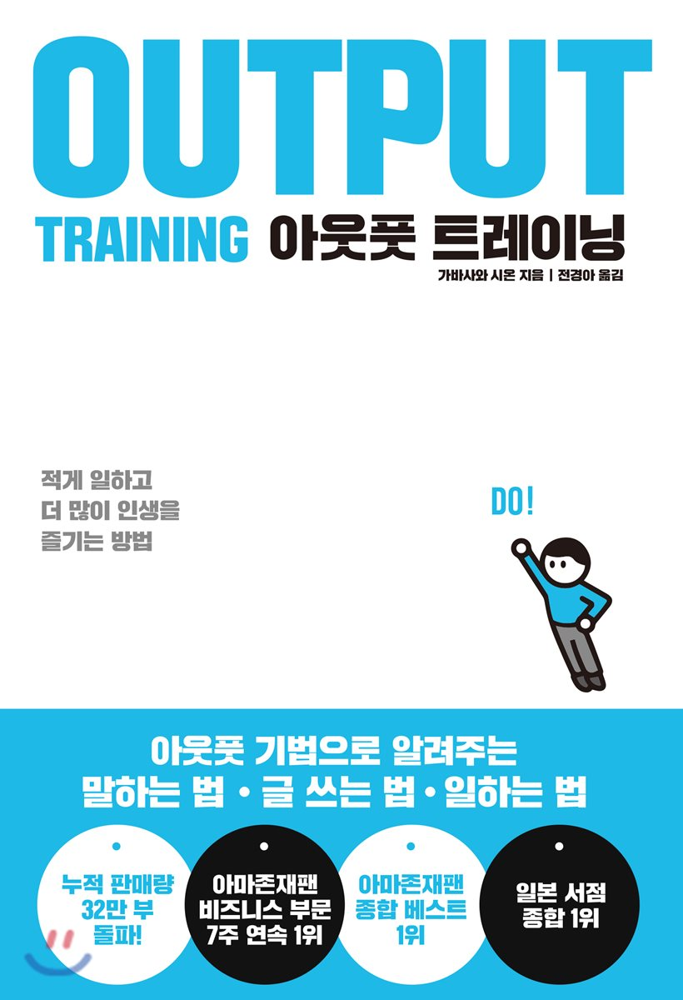
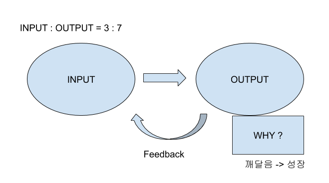
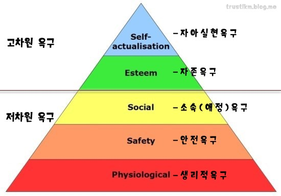
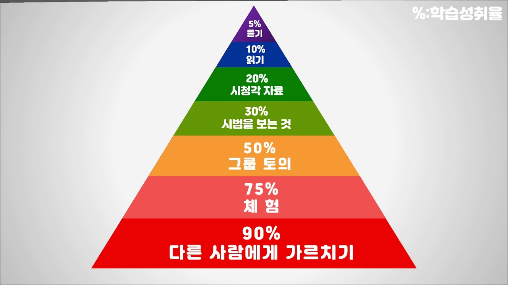

# 책을 읽게된 동기
나는 꾸준히 자기 계발을 하는것을 좋아하는 편이다. 그런데 공부는 많이 하는데도 무엇인가 지식을 습득하는 양이 체감이 되지 않았다.

예전부터 아웃풋에 대한 중요성은 잘 알고 있었다. 하지만 아웃풋을 막상 하려하면 정말 귀찮고 두렵다. 시험을 보는걸 싫어하는 것과 같은 이치랄까? 그저 나는 인풋만 넣고 아웃풋이 없는 기계같은 학습을 지금껏 하고 있었다.

이 책을 집어들게 되었던건 별 다른 이유는 없었다. 그저 도서관에서 공부법에 대한 책을 찾던 도중 눈에 띄었을뿐이다. 이 책이 딱 봤을때 마음에 들었던 이유는 매 회차 구성이 1~3페이지로 나누어져 읽기 편한 구성이 되어있었던 점도 한 몫한다.

# 내용
좋은 내용들이 많았으나 나한테 도움이 되었던 내용만 정리해본다.

## 인풋과 아웃풋은 3: 7 황금비율!
많은 사람들은 인풋만 잔뜩하고 아웃풋은 하지 않는다. 귀찮거든! 하지만 아웃풋은 자신이 해당 지식을 받아 들이고 활용할 수 있는지에 대한 중요한 질의 과정이기 때문에 더 많은 비율을 할당 해야 한다.

## 긍정적인말 OUTPUT
> 부하직원이 잘못한것을 꾸짖으려 한다 당신은 어떻게 할것인가?
* No But화법 : 못했는데 잘했어
    * ex) 회의 할때 말을 더듬었지만 준비는 잘했네
* Yes But화법 : 잘했는데 못했어
    * ex) 회의 할때 준비는 잘했는데 말을 더듬었어
* Yes And화법 : 잘했고 + 정보 & 조언
    * ex) 회의 할때 준비 잘했고 말을 명확하게 전달하면 좋을거 같아
* Yes How화법 : 잘했어 + 어떻게하면 더좋을까?
    * ex) 회의 할때 준비 잘했고 어떻게 하면 다음에 더 좋은 결과를 낼 수 있을까?

어떤 화법이 상대방입장에서 좋을까?? 나는 현재 어떤 화법으로 애기하고 있을까? 개인적으로 Yes How화법이 생각할 여지를 주어 맘에 드는 화법이라고 생각한다.

>  ※ 애기할때 Eye Contact은 필수사항이다!! 눈을 피하지 말자

## 기억력에 도움을 주는것
* `사전테스트를 보는 것`은 안본 사람보다 더 높은 습득력을 보여줬다.
* 기억은 `에피소드` 형식으로 더 잘남는다. 수학 공식을 무작정 외우는것 보다 공식을 유도하다 보면 공식이 외워지는것과 같은 이치
* 공부한 후 백지에 공부했던 것들을 정리해보자
* 메모하고 생각을 정리하는 행위는 output이며 기억력에 도움을 준다.

## 매슬로우 욕구 5단계

현재 나는 자아실현을 위해 자기계발을 열심히 하고 있다. 몇달 전만해도 자존 욕구가 채워지지 않았었는데, 매일 꾸준히 운동하고 밖에 좀 나가니 슬슬 한단계 업그레이드 된것 같다.

## 목표 세우기
* 목표를 세운다(What?) -> 구체적으로(When?, How?) -> 목표의식을 가짐(Why?) -> 목표를 잘게 쪼갬
* 다이어트를 한다 -> 링피트를 매일 저녁에 해서, 식단 조절을 해서, 한달 동안 5kg를 뺄것이다. -> 건강은 내 정신을 더 맑게해주기 때문에 나를 위해 살을 뺄것이다. -> 1주차 1.5kg, 2주차 1.5kg, 3주차 1kg, 4주차 1kg
* 구체적인 목표나 수로 나타낼 경우 목표를 성취하기 수월해진다.

## 러닝 피라미드

이 피라미드를 보자마자 최근 내 방 버렸던 화이트 보드가 떠올랐다. 버리지 말걸... ㅠㅠ 남을 가르친다는 것만큼 최대의 output은 없다는 것을 알 수 있다. 시범을 보는것까지는 수동적으로 학습하고 그 아래부터 능동적 학습이야말로 러닝에 큰 도움이 되는걸 알 수 있다.

# 배운점
이 책을 읽으면서 내가 아웃풋을 할 수 있는게 무엇이 있을까? 고민했다. 제일 베스트라고 생각했던것이 블로그를 하는것이였다! 나는 미뤄뒀던 깃헙 Jekyll 블로그를 주말 동안 만들었고, 하루 동안 공부한 것에 대한 기록을 간단하게 하기로 했다. 매일 정해진 시간인 11시에 하루 동안 한것에 대한 OUTPUT을 하기로 했다(TIL). 그리고 중간 중간에 아이패드로 메모하는 습관을 들이게 되었다.