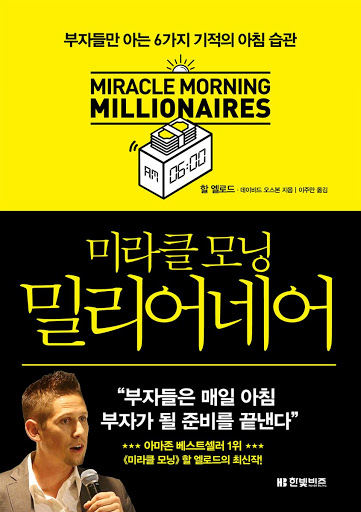
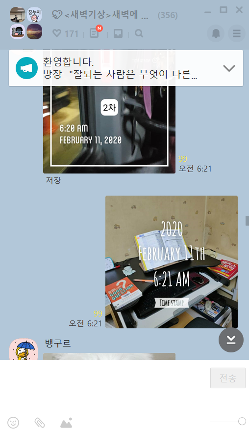

공익 하면서 내가 건강이 계속해서 안좋았다. 덕분에 금방 피로해지고 회복해야 되는 시간도 자연스레 많아지니 잠자는 시간이 많아졌다.

하루에 편입 준비하는 시간을 당연히 짧아지고 내 삶의질은 떨어졌다. 그래서 아침에 일찍일어나서 머리가 맑은 시간을 가용하는 미라클모닝을 맞이하기로 했다.

이 책은 베스트 셀러였기 때문에 사서 일을 하고 있던 내가 도서를 구매해놓고 읽지는 않고 있었다. [새벽기상 카카오 오픈채팅방](https://open.kakao.com/o/geAONNL)을 들어가게 되면서 태그에 달린 미라클 모닝을 봤을때, 이 책이 다시 떠오르게 되어 읽게 되었다. 오픈채팅방에서는 아래와 같이 저녁에 자신이 기상할 시간을 말하고, 기상한 시간에 타임스탬프가 찍힌시간을 10분간격으로 두번 돌려서 인증하는 방식으로 진행한다.(다시 잠자는것 방지 목적)

이 책을 읽으면서 아침에 만드는 습관에 대해서는 약간 이상주의적이고 현실적으로 실천하기 힘든 이야기가 많았다는 것을 느꼈다. 이미 `아침형 인간`과 같은 책들을 통해 이러한 일찍 일어남에 대한 장점은 수도 없이 들어 봤으니 이 책이 왜 이렇게 떴는지는 잘 이해할 수 없는것 같다. 부자들의 습관이라고 해봐야 이것도 부자, 성공학을 다루는 다른 책과 크게 차이가 없었다. 단지 사람들이 좋아하는 부자+아침형인간을 짬뽕 시키고 마케팅을 잘한 책이 아닌가 싶다. 결론적으론 이 책을을 읽고 동기부여가 더 되고 도움이 되었냐고 한다면 No이다.

# 6분 미라클 모닝
* 1분(S) : 눈을 감은 채 고요하게 침묵의 시간을 즐긴다.
* 2분(A) : 가장 중요한 확신의 말을 읽는다
* 3분(V) : 오늘 완수해야 하는 중요한 과제를 시각화 한다.
* 4분(E) : 눈을 뜨자마자 바로 할 수 있는 운동을 실행한다.
* 5분(R) : 책을 들고 한 단락이든 한 쪽이든 읽는다.
* 6분(S) : 일기장을 꺼내 감사하게 여길 만한 것을 한 가지라도 적는다.

이 6가지를 각 1분씩만에 하라고 한다.. 솔직히 이게 앞페이지에 있는 내용이라 보자마자 덮을뻔 했다. 전혀 현실가능성 없는 애기며 20분은 잡아줘야 할 수 있는 애기다. 실제로 저자가 이렇게 실천을 하고 있는지 궁금하다. 그저 자신의 이상을 책에다 적어 놓는건 바람직하지 못하다.

# 부자가 되기 위한 습관
솔직히 여기 써져 있는 이야기는 다른 책에도 다 쓰여 있는 이야기다. 단지 거기에는 운과 정보력과 판단이 따른다. 인생을 사업 or 투자에 걸지 않는 이상 책에 쓰여 있는대로 살아가는건 힘들다.. 시간이 지날수록 돈의 가치는 떨어진다. 왜? 돈은 계속해서 찍혀나오기 때문이다. 바로 죽어가는 경제를 회생하기 위해서... 물가는 오르고, 자산가치는 오른다. 하지만 내 월급은 오르지 않는다. 내 자금은 오르지 않는다. 이러한 상황에서 돈을 굴리는 자만이 살아남는건 당연한 애기이다. 다만 돈을 굴린다는 것은 잃을 수 도 있다는것과, 전업이 아닌 경우 그저 개미투자자가 되어버릴수 있다는 것이다.

예를 들면 이번에 문재인 정부가 종부세를 엄청 올려서 1주택 정책을 펼쳤다. 집값을 잡겠다는 것이다. 난 당연히 우리가 가지고 있는 집을 팔아야 된다고 생각했다. 전부 1주택자가 되면은 집 공급이 늘어나고 집값은 떨어질것이기 때문이다. 하지만 달랐다. 2주택인 사람이 집을 팔고 강남권 비싼 집을 1주택으로 사려는 수요가 늘면서 오히려 집값이 엄청 올라버렸다. 내가 아는 머릿속의 정보와 현실의 비매칭이다. 또 다른 예로 손정희는 테슬라, 쿠팡, 우버, 위워크를 대표적으로 투자했는데 전형적으로 미래를 투자한 케이스이다. 여기서 위워크는 완전 쪽박을 찼고, 테슬라는 초대박을 쳤다. 근데 우리가 이런걸 어캐 알겠는가? 사모 펀드? 개인적 투자 이런것도 할 수도 없다. 우린 그저 주식이 상장되면 그것을 그제서야 살 수 있는 개미투자자일 뿐이다.

결론적으로 돈을 굴리는 법을 알려줘야지, 돈을 굴려야 된다! 알려주는건 아무 쓸모가 없는 애기다. 돈을 굴리는 법을 안다면 책 안쓰고 자기 혼자 꿀빨고 있겠지만.. ㅋㅋ

# 후기
책 자체는 좋다고 하는 내용들이 짬뽕해서 다들어가 있다. 하지만 실제로 실천까지 옮길 수 있거나, 명확히 행위가 묘사되어 있는것은 없다. 뭐.. 읽으면서 크게 도움이 될만한 내용은 없었으나 내가 아침형 인간을 결심하는 또 하나의 자극물이 되었으면 좋겠다. 편입을 결심한 만큼 최선을 다해서 끝까지 열심히 할 수 있으면 좋겠다