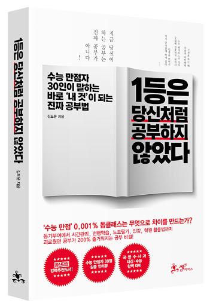

유튜브에서 즐겨보는 김작가TV사람이 쓴 책이다. 이 사람은 주로 우리가 속히 말하는 성공한 사람들에게 우리들이 궁금한것에 대해 질문을 하며 인터뷰를 하는 컨텐츠를 주로 진행한다.

# 나는 몇등 공부?
나는 뭐.. 그냥 아무 생각없이 공부해야돼!!라고 생각하는 3등급 수준의 공부가 아닐까 싶다. 다만 책을 읽으면서 느낀거지만 만점자들은 결코 자신을 괴롭히면서 고통스럽게 공부하지 않았다는 것이다. 그럼 나와 그들이 다른점은 무엇인가?

# 공부를 할 수 있는 환경
그들은 먼저 공부를 할 수 있는 환경이 갖추어 져야한다는것을 가장 중요하게 생각했다. 이것은 가정적 요인도 포함 된다. 내가 공부하는 것에 대하여 부모님이 강요하지 않고 늘 믿어주고 지지해주는 것은 심리적으로 상당한 영향을 미쳤다고 한다. 그리고 집에서 공부는 x, 학교나 도서관 등 같은 목적을 갖고 공부하는 분위기인 곳에서 공부하는 것을 다들 좋아 했다.

# 나를 지치게하지 말아라
공부를 못하는 사람들은 무엇가 마음을 먹으면 단기간은 열심히 한다. 하지만 몇일이 지나면 다시 예전 그대로 돌아온다. 하지만 그들은 다르다. 그들은 쉬는시간엔 놀고, 매사에 공부하는 시간만큼은 오직 공부에만 집중했다. 우리가 수업시간에 다른 과목 공부하고 쉬는시간에까지 공부하며 딴짓하고 있을 시간에 말이다.. 자기 자신을 채찍질 하는식의 공부법은 길게가지 못한다. 언제든 자신에게 열심히 공부한것에 대한 보상이 주어져야 하며 지치면 쉬어라. 잠도 마찬가지다. 내가 볼땐 12시에서 6시, 6시간 자는게 최적인거 같다.

# 방해 요소를 차단하라

# 문제를 분석하고 파악하라

# 오답노트 No 단권화 Yes

# 영어 공부법

# 수학 공부법