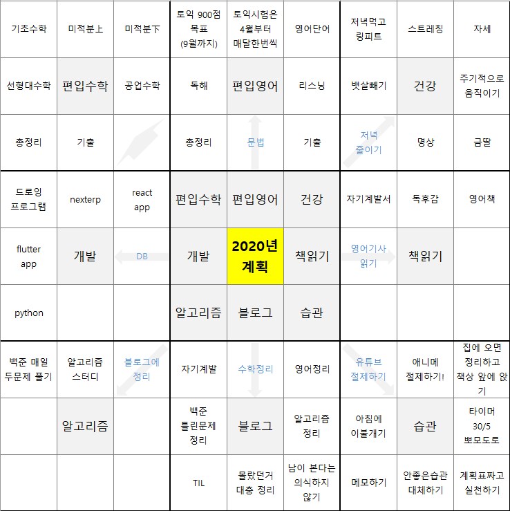
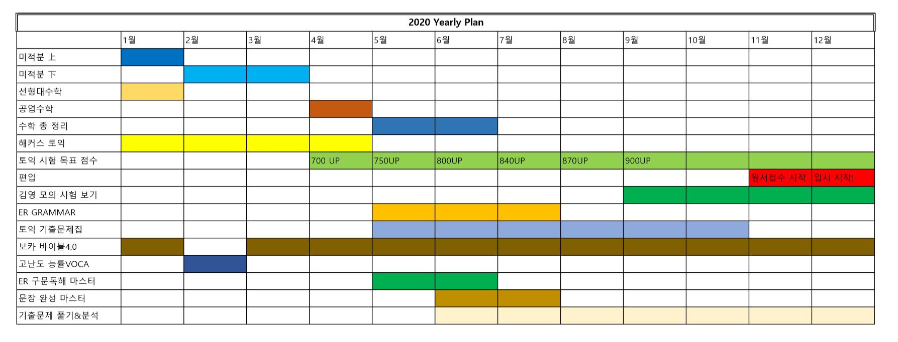

2020년이 오기까지 글을 쓰는 시점에서 3시간 정도 남았다. 작년에도 만다르트 기법으로 분명 잘 작성해서 컴퓨터에 저장해놨는데 포맷하면서 없어진 것 같다 ㅠㅠ

내가 만다르트에 대해 처음 알게 된건 사회복무요원 교육에서 알게 되었는데 나름 괜찮은 방법인 것 같다.

1년이란 긴 시간에 대한 목표를 세우는 것 만큼 큰것부터 작은것까지 목표를 세부적으로 쪼개어 세울 수 있기 때문이다.

그리고 8개 채우는거 엄청 빡시다 =ㅅ=

# 2019년 회고
## 2019년도는 나에게 어떤해였는가?
2019년은 정말 나에겐 방황하는 연도였던것 같다. 사회복무요원으로 근무하면서 비교적 널널해진 시간, 남은 시간동안 무언가 자기 성장해야 된다는 생각 때문에 아무런 계획도 없이 도서관에서 집히는 책, 유행한다는 프레임워크 등을 공부했던 것 같다.

열심히 공부한다고 공부했지만, 실제로 머릿속에 든건 없는것 같은 애매한 이 느낌... 정말 기분 나쁘다. 말년에 들어 메모, 아웃풋에 대한 책을 읽어서 이러한 문제를 해결하기 위해 내가 공부 했던것을 정리하고, 메모하고, 블로그에 남기는 형태의 공부를 지속해내가는 방향으로 향하고 있다.

## 최악이였던 건강..

나에게 있어서 정말 최악이었던 것은 건강이 아닌가 싶다. 건강이 최악으로 안좋았었는데 두통 때문에 공부에 집중하기가 힘든 지경이였다. 내가 봤을땐 알맞지 않은 책상, 의자 높낮이, 자세, 운동량, 과제중, 혈압 등의 복합적 원인에 대한 증상인것 같다 ㅜㅠ

## 링피트와 함께라면
10월 즈음에 정말 정말 안움직이는 나를위해 나온 게임이 있는데 그건 바로 링피트 였다.

바로 게임을 기반으로 운동하는 것으로 센서로 나의 움직임을 확인할 수 있는 닌텐도 스위치 기기로 할 수 있는 게임이다. 기기까지 구매해야 되었지만 큰 고민 없이 바로 결제를 긁었던것 같다.(소비를 잘 안해서 돈이 좀 남는편이라..)

결과는 만족스러웠다. 나 뿐만 아니라 가족들 모두가 링피트를 하며 티비 또는 핸드폰을 보며 누워있는 시간을 그나마 줄일수 있게 되었다. 정말 건강은 돈으로 살 수 없다고 하지만.. 돈으로 살 수 없는게 정말 있을까?? ㅋㅋㅋ 라는 생각이 드는 게임이였다. 돈으로 살 수 없는게 있다면 그거야 말로 새로운 창업아이템이 되겠지... 모든건 직간접적으로 살 수 있는건 어쩔수 없는것 같다.

매일 퇴근하고 한시간 정도 즐기는 링피트 앞으로도 꾸준히 할 수 있으면 좋겠다.

## 동기가 필요하다.. 목표는 편입!
편입에 대해서는 2019년 초기부터 고민하고, 여러 자료를 찾아봤었다. 그리고 6월에 이르러서 12월까지 살살 편입수학과 편입영어를 건드렸다.

사실 내가 편입을 하기 싫었던 가장 큰 이유는 나는 개발자가 되고 싶은거라 개발에 대한 공부에 집중을 하고 싶은데, 편입은 장기간 영어와 수학에 매진하게 되기 때문이다. 결론적으로 내가 편입을 결심하게 된 이유는 **동기**다.

아무일도 일어나지 않는 편안한 일상이 반복되자 나의 공부에 대한 집념이 점점 사그라지고 있던 것이다. 때문에 나는 약했던 영어공부와 더불어, 다니던대학교에서 가르쳐 주지 않은 대학수학에 대한 지식을 익힐수 있는 기회로 삼을겸 가벼운 마음이면서 무거운 마음으로 도전하기로 한다.

공부법은 이미 익혔기 때문에 학원도 인강도 없이 그저 쌩독학으로, 큰 돈 안들이고(거의 책값위주) 공부하기로 했다.(사실 부모님의 경제적 지원없이 편입에 도전하려 하는것도 이유 중 하나이다.)

대학은 당연히 큰포부를 가지고 지원할 예정이다. 집에서 한시간 반이네 거리여야되는건 필수! 학과는 컴공 + (창업, 금융 관련)을 지원하려 한다. 요즘 컴공이 엄청 떠서 문과에서도 많이 지원해서 경쟁률이 높다지만 어떻하겠는가.. 난 개발자가 하고싶은데~  서성한 ~ 국숭세단 급으로 도전해보려 한다. 원하는 결과가 안나올수도 있지만 끝까지 최선을 다해서 좋은 결과를 낼 수 있었으면 좋겠다.

## 나의 목표는 삼성소프트웨어 멤버십!
하나의 수확이 있다고 한다면 알고리즘의 실력이 많이 늘었다는 것이다. 1일 1백준이라는 목표아래에서 지금까지 약 700문제를 맞추었다.

꾸준히 하루에 한문제 이상씩 풀다보니 골드상위권~플레문제까지도 야금야금 풀 수 있게 되었다. 지금은 비요뜨 스터디를 하며 매일 2문제 이상씩 풀고 있는데 계속 꾸준히 할 수 있으면 좋겠다.

재수, 휴학 등 여러 문제가 꼬이면서 내가 정상적으로 졸업했을때 취업을 시작하는 나이가 28이 되었다. 빡빡하게 갔을때 남성입장에서 25살 스타트 할 수 있다는 점에서 3년이나 늦어진다는건 확실히 뼈아프다. 그렇기 때문에 졸업전에 대학생으로서 더더욱 해보고 싶은게 있다.

바로 삼성 소프트웨어 멤버십이다. 조건은 **c형 또는 SCPC수상**을 해야한다. 또한 재학중에 기회가 된다면 소프트웨어 마에스트로도 참여해보고 싶고, ICPC대회, 경연대회 등에 참여해보고 싶다.(하고싶은게 많아서 너무 조아~)

# 나의 2020 만다르트

작년 말에 편입준비 맛보기를 하면서 내가 정말 편입을 잘 할 수 있을까 라는 두려움도 있다. 학원 같은 곳에서의 정보에 의존하지도 않고 혼자 힘으로만 하는 것이라 더더욱 두려움이 큰것 같다.

이번년도는 사실상 편입준비 위주로 생활을 보낼것 같다. 영어가 안받쳐줘서 힘들겠지만 1년간 잘 준비해서 좋은 결과를 낼 수 있었으면 좋겠다.

## 편입수학
정보보안 학과라 편입수학과 거리가 먼 이산수학, 정수론을 배웠었다.. 공부해야 할 양이 많은 만큼 잘 정리하고 꾸준히 하고, 문제 풀이, 증명 등에 쓰이는 많은 시간을 아까워 하지 말자

### 기초수학
고3까지 이과과정에 대한 지식을 말한다. 2019년에 공부했었는데 크게 문제는 없었다. 여유가 될때 개념정리 간단하게 해주는 정도만 해주면 좋을것 같다.

### 미적분上
미적분 상은 사실 그렇게 어렵지도 않고 시험에 낼만한 내용도 많이 없다.. 그냥 미적분에 대한 활용이 주. 특별한 개념과 문제풀이 위주로 정리하자 아직 조금 남은게 있어서 1월중에 마무리 한다.

### 미적분下
미적분에서 시험을 낸다면 이부분에 대한 지식을 많이 물어볼 것 같다.. 양도 상당히 많다 2~3월 동안 쭉 보며 정리할 것이다.

### 선형대수학
행렬을 갖고 놀기에는 아직 내가 많이 미숙하다.. 그래도 컴공에서 중요한 지식인 만큼 잘했으면 좋겠다. 이것도 거의 안남았으니 1월 중에 마무리 한다.

### 공업수학
공업 수학이 애매한 영역이다. 내는학교도 있고 안내는 학교도 있다. 4월 한달 동안 개념 위주로 공부하자.

### 총정리
5월은 수학 위에 5가지 범위에 대한 총 정리를 하는 시간을 가질 것이다. 한달만에 하는게 무리 일수도 있다.. 하지만 6월부터 기출문제 풀이에 들어가니 그 후에도 짬짬히 추가 개념정리를 해주자. 큰 그림을 그리는건 정말 중요하기 때문이다.

### 기출
아무래도 편입이라는 시험은 범위만 비슷할뿐 학교마다 내는건 학교맘이기 때문에 기출을 통해 자주나오는 유형에 익숙해지고 특성을 파악하는게 중요한것 같다. 영어, 수학 번갈아 가며 한개치만 보고 문제 정리 및 오답을 위주로 할것이다. 남은 시간은 수학 회독

## 편입영어
### 토익 900점 목표(9월까지)
확실한 점수와 기간을 정해놓고 하는게 좋을것 같다. 공대 계열이고 900점 이상이면 안정권일꺼라 생각한다. 제일 취약한 영어.. 토익이 900점이라니 정말 가슴이 두근거리는게 느껴지지 않는가?

### 토익 시험은 4월부터 매달 한번씩
뭐.. 내가 열심히 이번년도부터 했다면 진작에 매달 봤었을텐데,, 너무 IT쪽 공부에도 빠져있었구 여러 핑계를 대며 게을리 살아왔다. 이젠 피할수 없다. 4월부터 매달 한번씩 토익 시험을 보며 성적을 올릴것이다. 토익시험비.. 매달 5만원 아깝긴 하지만 아까우면 빨리 900점 찍고 날 해방시켜주길 바란다!! ㅋㅋ..

### 영어단어
매일 아침 6시에 기상해서 암기한다. 암기 방식은 회독이다. 여러번 쓱쓱 봐서 익숙해지면 금방 뇌속으로 들어오기 때문이다. 보카바이블 Day 2개씩, 복습은 하루전꺼만 하고, 일요일에 일주일치 전부 보는식으로 하는게 좋겠다. 1,3, 7, 14 복습은 솔직히 너무 지쳐서 금방 관두게 된다..

### 독해
독해는 익숙하지 않은 문장구조를 만났을때 아무 생각없이 쓰윽 지나가게 되는것 같다. 영어는 양치기가 정말로 중요한 과목인거 같다.(그래서 내가 못하는거도 있구.. ㅠ) 천일문으로 일단 문장구조를 파악하는데 익숙해지는걸 우선시 하고, 계속 독해 하는수 밖에 없다고 생각한다!!!

### 리스닝
영어 쉐도잉 하면서 좀 늘었다고 생각했는데 아직 부족한것 같다... 토익에서 꽁으로 먹어야 하는 분야인 만큼, 그리고 리스닝이 영어의 시작인 만큼 잘 다듬고 가고 싶다. 반복 청킹으로 리스닝 정복 아자아자!

### 문법
문법은 솔직히 외우고 어떻게 적용하느냐가 제일 중요한데... 일단 로즈리 문법을 기반으로 해서 문제를 접근하는 띵킹을 늘리는게 중요한 것 같다. 문법만큼 시험을 위해 공부해야하는건 없다.

### 총정리
블로그로 몰랐던 것에 대한 총 정리를 할 것이다. 특히 이러한 문법이나 문장구조가 어떤 형태로 시험에 내어지는지 분석을 하면 많은 도움이 될 것 같다. 정리 자체는 짬짬히 하고 6월쯔음에 한달 정도 시간 잡아서 정리한걸 총정리하는 시간을 갖는게 좋을 것 같다.

### 기출
기출이 수능특강 마냥 도움 되는건 아니지만 편입형 복합문장에 익숙해질 수 있다는점, 편입 영단어와 친숙해질 수 있다는 점 등 여러 이점이 있다고 생각한다. 틀린문제는 문장분석을 해주고, 맞은문제라도 어려웠던 문장도 분석해준다. 몰랐던 영단어 정리 후 암기는 기본! 6월부터 시작해서 시간 재면서 푸는거 9월부터 할것이다.

## 건강
내 건강은 언제나 빨간불이 켜져 있다. 그래서 공익이겠지.. 흑흑. 분명 소집해제하기 전에 건강한 사람과 비할것 없이 나올꺼라 다짐했었는데 그 후로 변한것은 크게 없다..(역시 사람이 바뀌어야 하나...). 특히 아프면 공부에 지장이 있을 정도로 아프기 때문에 나에게 공부를 하면서 운동을 병행해야 되는 필수 사항이다. 몸을 움직이면 세로토닌이 분비되어서도 집중하는데 도움이 된다 하니 운동하는 시간 아까워 하지 말고 꾸준히 하자 ㅎ

### 저녁먹고 링피트
집에 오면 7시 쯤, 저녁 먹고 링피트 7시 30분 ~ 8시 30분까지 한다. 8시 30분 ~ 9시는 유튜브에 트레이닝 영상을 보고 하체랑 복근 조진다 카캌

<iframe width="420" height="315" src="https://youtu.be/MG69sFM1UIw?list=PLTpciTqyNUg6W8aKkG0QkTJN6JE3_Lr8v" frameborder="0" allowfullscreen></iframe>

### 스트레칭
오랜 시간 같은 자세로 앉아 있는건 건강에 좋지 않다. 앉은 상태로 할 수 있는 스트레칭들을 주기적으로 해준다. 정면을 바라보고 좌우로 비틀어 꽈배기, 양팔 머리위로 감싸고 좌우 허리 스트레칭 등 허리 위주로 해주면 된다.

### 자세
자세가 워낙 안좋아서..(허리디스크) 바른자세 의자, 허리 보정기의 힘을 빌려서 바른자세를 되찾자. 앉을때는 의자 끝에 걸터서 앉는건 필수이다.

### 뱃살빼기
띠로리.. 뱃살이 다른 몸 부위와 맞닿는것은 혈류에 크게 방해가 된다. 가장 나중에 빠지는게 뱃살이라는데.. 복근 조지러 ㄱㅈㅇ~

### 주기적으로 움직이기
난 진짜 안움직인다. 밖에 나갈일 없으면 집에 앉아서 박혀만 있고 누워있거나 앉아있는 시간이 대부분이다. 뽀모도로로 시간을 맞춰서 서있는 자세로 몇분간 있거나 햇빛을 쬐는것이 좋을것 같다.

### 저녁줄이기
나는 식곤증이 정말 심한편이다. 특히 아침은 괜찮은데 점심, 저녁은 좀만 많이 먹어도 피곤해서 뻗어버린다. 특히 저녁에 뻗으면 편입 공부에 심히 지장이 있기 때문에 저녁을 정해진양을 먹어 줄이도록 한다.(ex 시중에 도시락, 샐러드, 볶음밥)

### 명상
### 금딸
난 아직 이십대 중반 혈기 왕성할때이다.. 짐슴 관점에서 보자면 번식력이 뛰어나다. 슬프게도 남자에게 성행위는 하루 동안 쓸수 있는 에너지를 쏟아 붙는 행위이다. 하고나면 다음날 내내 피곤해진다. 성행위는 인간에게 있어서 어떻게 보면 최종목적인 유전자 전달을 위한 행위이기 때문에 도파민이 최고조라 분비된다. 덕분에 그 최고의 희락을 느낄수록 다른 일을 할때 도파민 분비가 덜되어 금방 흥미를 잃고 우울해지게 된다... 금딸을 해야하는 이유에 대해서는 구글에 치면 많이 나오니.. 뭐... 매일 습관리스트에서 체크할꺼닷! 일주일에 두번정로 줄였으면 좋겠다.

## 개발
이번년도에 개발을 할 시간이 있을련지는 모르겠다. 솔직히 슬럼프 올때나 건드려 볼거 같긴하다... 일단은 하고싶은건 적어놔야지!

### 드로잉 프로그램
스터디하는데 윈도우화면에 드로잉 프로그램이 쓸만한게 별로 없었다. 어느 정도 만들어 놓았는데 모든 사람이 쓸수 있을정도의 퀼리티로 만들어 보고 싶다. 다양한 기능 구성들도 구상해놨다.

### nexterp
오픈소스 erp 분석을 하는 것이다. 아직은 세팅만 해봤는데(세팅하는데도 엄청 삽질함;;) frappe이라는 프레임워크를 기반으로 짜여져 있어서 보기가 좀 힘들다. 심지어 bench라는 툴을 이용해 설치한거라 어떻게 구현되어있는지도 잘 모르것다.. 사실 어디부터 볼지가 잘모르겠는 ㅜㅜ

### react app
유명 웹 프레임워크에서 배우고 싶은것이다. SPA관련된거 하나정돈 알아두면 차후에 쓸일이 많이 있지 않을까?

### flutter app
react native에 대항하여 나온 구글의 flutter님이시다. 구글이 만든것인것 만큼 하이브리드 플랫폼 지원도 빵빵하고 앱을 만들땐 차세대 유행 프레임워크가 되지 않을까 싶다. 공부해둬서 손해볼건 없다.

### DB
DB에 대해 정식적으로 공부해본적이 없고 그냥 필요할때 찾아서 쿼리만 날려보았다.. 데이터베이스에 쿼리를 날리면 어떤식으로 내부적으로 돌아가는지부터해서 차근차근 배우고 싶다.

### python
파이썬이라고 하면 포괄적이지만, 파이썬의 다양한 라이브러리를 공부해고 정리하고 싶다. 물론 배우고 싶은거 골라서!!

## 책읽기
편입 준비 중에 책을 읽는게 시간 낭비라고 생각할 수도 있지만 책을 읽는것을 독해력과 사고력을 높여준다. 꼭 책의 형태가 아니더라도 여러 매체를 통해서 글을 읽는것을 중요하다고 생각한다.

### 자기계발책
나는 자기계발책을 정말 좋아한다. 성공한 사람들의 이야기를 엿볼수 있는 기회이기 때문이다. 하지만 실제로 그들이 말하는대로 실천하는건 너무나 어려운 일이다. 모든걸 그대로 따라할 필요는 없다고 생각한다. 나랑 맞다고 생각하는 습관을 하나씩 나에게 카피를 하자!! 덕분에 메모하는 습관과 계획을 세우며 실천하고, 다양한 공부법에 접근해볼 수 있었다.

### 독후감
무언가 읽었으면 아웃풋을 하는 것을 정말로 중요하다. 책을 다 읽었다고 한들 그 내용이 머릿속에 남는건 20%도 되지 않는다. 다시 책을 훑어보며 내용을 되새기고 독후감을 쓰자.

### 영어책
한국인의 대부분 성인들의 독해능력이 초등학교 6학년 수준에 머무른다고 한다.(공부머리 독서법 中) 그것은 초등학생 이후로 독서를 거의 하지 않는다는 것인데, 실험결과 책을 읽는 집단과, 읽지 않은 집단의 독해능력이 월등히 차이났다고 하는 것이다. 그 만큼 영어에서도 책을 읽는것을 독해력을 올리는게 큰 도움이 되는것이라 생각한다. 지금은 **중학교 영어로 다시 읽는 세계명작 시리즈**를 위주로 읽고 있다. 뒤에 해석과 바로 아래 단어가 있기에 읽기 편하기 때문이다.

### 영어기사 읽기
편입 영어 지문 중에서 영어기사에서 발췌하여 가져오는것도 꽤 있다고 한다. 물론 그것 뿐만아니라 우리가 매일 아침 네이버, 다음 뉴스를 챙겨 보는것 처럼 영어도 꾸준히 챙겨보면 영어에 접하는 시간이 많아지기 때문에 좋을것이다.

## 알고리즘
편입준비에도 불구하고, 매일 두 시간씩 투자하고 있는 알고리즘님이시다. 게임 대신 재밌게 하고 있다.

### 백준 매일 두문제 풀기
내가 건드리는 문제가 보통 한문제 푸는데 40분~1시간20분 정도 걸리는것 같다. 딱 두시간 정해놓고 두 문제 풀어 제끼고 있다. 잘해주고 있다~~ 이번년도에도 계속 이렇게 해줄수만 있으면 실력 일취월장!

### 알고리즘 스터디
일주일에 하나의 알고리즘 정해놓고 문제집을 만들어서 풀고, 일요일에 해당 문제집에 대해 스터디하는 방식이다. 두개월짼데 언제까지 할 수 있을지는 모르겠다... 점점 고인물 알고리즘 하면서 하나둘씩 이탈하기도 하고, 내가 편입준비 때문에 꾸준히 참여 할 수 있을지는 모르겠다. 하루에 두 문제씩 풀고도 부족하면 나머진 주말에 풀고 있다.

### 블로그에 정리
틀렸던거나 어려웠던 문제를 블로그에 정리하며 피드백한다. 귀찮을수도 있지만 생각보다 실력 향상에 도움이 된다.

## 블로그
공부했던 내용들을 정리하고, 아웃풋하는데 사용하는게 주 목표이다. 틀리는걸 두려워하지 말자. 고치면 그만이다. 개념적인것을 정리해가면서 다시 한번 개념을 반복해서 보고, 구글링을 하며 전체적인 맥락을 이해하는것을 목표로 한다.

### 자기계발
공부하면서 느낀 자기와 맞는 공부법이나 깨달은 점들을 정리한다. 내가 또 다시 안 좋은 습관으로 되돌아 가게 되었을때 썼었던 글을 보고 되돌아 올 수 있게 말이다. 내가 과거에 어떤 좋은 습관을 가지고 있었어도 나쁜 습관으로 바뀌면 그게 어떤 좋은 습관이였는지 조차 기억이 나지가 않는다... 하루하루 점차 성장해나갈 수 있도록하자!

### 수학정리
수학이 개념 자체는 많은 편이 아니다. 해당 개념으로 어떤 형식으로 문제가 주어지고, 증명하는것에 대해서 위주로 정리해주자.

### 영어정리
영어는 영문법이 위주로 정리가 될 것 같다. 시험을 위한 공부를 하는 파트 중 영문법만한 곳이 없기 때문이다. 독해력은 스킬이 있으면 좋아 보일수도 있지만, 그냥 문장구조에 익숙하고 많이 접하는게 더 도움이 된다. 독해력 향상을 위해 구동사, 어미, 접두사, 어근 같은것을 정리하는것도 나쁘지 않아 보인다.

### 백준 틀린 문제 정리
쓰다보니 겹치는 부분이다. 틀리거나 어려웠던 문제 정리하자 10분도 안걸린다.

### 알고리즘 정리
거의 1~2 문제 정도 풀 시간 투자해서 알고리즘 하나 정리 할 수 있다. 

### TIL
TIL(TODAY I LEARN)은 많이 알려진건 아니다. 하루에 무엇을 공부했는가 정리하는 시간을 가지는 건데,,, 실제로 하는건 많이 힘들다고 생각한다. 그래서 WEEK I LEARN으로 매주 일요일마다 일주일 동안 공부한걸 되돌아 보는 시간을 가지려고 한다.

### 몰랐던거 대충 정리
몰랐던거 대충 정리를 해두면 흔적이 남는다. 그냥 넘어가는것 보다 백배낫다. 다음에 기억을 해서 정리할 수 있는 기회를 가질수 있기 때문이다.

### 남이 본다는 의식하지 않기
내가 이전에 티스토리 블로그를 접은 이유였다. 방문자수가 늘어나니깐 남이 본다는 의식을 가지고 고퀼리티 포스트 글을 올리려고 했기 때문이다. 하지만 그건 나에게 큰 도움은 되지 않는다. 나에게 있어서 이해가 되게끔만 정리해도, 퀼리티가 낮아도 신경쓰지 말고 이 공간을 나만의 공간이라고 생각하고 포스팅을 하자 ㅎㅎ.

## 습관
좋은 습관을 만들고, 나쁜 습관을 없애는 것은 정말 힘든 일이다. 2020년에 만들었으면 좋겠는 습관들을 적어보았다.

### 유튜브 절제하기
유튜브 절제하기 위해서 일단해야 할것을 추천영상 하루에 5개 이하로 보기이다. 구독탭에서만 보는걸 권장한다!! 추천영상으로 보면 유튜브 알고리즘 이녀석이 나를 유튜브의 늪으로 빠져들게 해버린다,, 가장 중요한건 핸드폰과 접하지 않는 환경을 만드는게 제일 중요할것이다.

### 애니메 절제하기
애니메 이녀석도 시간 삭제의 원흉이다... 점심시간이나 버스탈때나 짬짬히 보기만하자.

### 집에 오면 정리하고 책상앞에 앉아있기
집에 와서 가장 먼저할 것은 공부할 환경을 만드는 것이다. 책상 위에 공부할 수 있는 환경으로 세팅하고, 핸드폰은 전원을 끄고 방 밖에 피아노 위에 둔다.

### 아침에 이불개기
아침에 일어나서 이불부터 개세요 !!

<iframe width="420" height="315" src="https://www.youtube.com/watch?v=whFZCmN__mM" frameborder="0" allowfullscreen></iframe>

아침에 일어나서 나에게 첫 작은 성공으로 이끌게 해주는 이불개기이다. 일어났으면 이제 스트레칭 해주고 하루를 시작하자~!

<iframe width="420" height="315" src="https://www.youtube.com/watch?v=6_LYz_XxD-g" frameborder="0" allowfullscreen></iframe>

### 타이머 30/5 뽀모도로
오랫동안 앉아 있는것은 건강에 독이 된다. 30/5 뽀모도로로 주기적으로 움직여 집중할 수 있는 시간을 늘릴수 있도록 하자.

### 메모하기
무언가 메모를 남긴다는 것 만으로 머릿속에 남을 확률이 더 높다. 혹여나 스쳐지나가며 그 메모를 다시 볼지 누가 아는가 ㅋㅋ. 예전엔 머릿속에서 다 커버를 해줬던거 같은데 나이를 먹으니깐 메모의 필요성이 절실해졌다. 뭔가 필요한데 금방 잊어먹을거 같으면 메모하는 습관을 가지자.

### 안좋은습관 대체하기
그 동안 쌓인 안좋은 습관을 다른 좋은 습관으로 대체하자. 예를 들면 "침대에 눕기" -> "의자에 앉기", "핸드폰 보기" -> "영단어장 보기", "유튜브 보기" -> "TED 보기" 등 많이 있을 것이다. 내가 A하면 B!!가 떠오를수 있게 대체해보자

### 계획표짜고 실천하기
난 계획은 정말 잘 짜는 편이다. 근데 실천을 안한다!! 이 게을러 터진녀석!! 계획표를 실천하고 확인하는 좋은 습관을 들였으면 좋겠다.

# 월별 계획표

1년을 크게 봤을때 월별 이번달엔 이걸 했으면 좋겠다~ 하는 것들을 정리해보았다. 이렇게 계획을 써놓고 보니 정말 할게 많다~ 흑흑.. 이번년도 한번 달려보자~!!