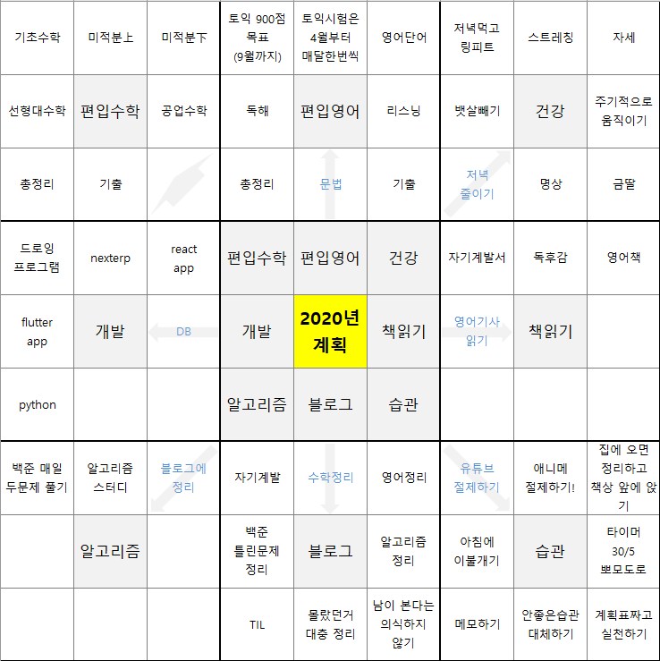

2020년이 오기까지 글을 쓰는 시점에서 3시간 정도 남았다. 작년에도 만다르트 기법으로 분명 잘 작성해서 컴퓨터에 저장해놨는데 포맷하면서 없어진 것 같다 ㅠㅠ

내가 만다르트에 대해 처음 알게 된건 사회복무요원 교육에서 알게 되었는데 나름 괜찮은 방법인 것 같다.

1년이란 긴 시간에 대한 목표를 세우는 것 만큼 큰것부터 작은것까지 목표를 세부적으로 쪼개어 세울 수 있기 때문이다.

그리고 8개 채우는거 엄청 빡시다 =ㅅ=

# 2019년 회고
## 2019년도는 나에게 어떤해였는가?
2019년은 정말 나에겐 방황하는 연도였던것 같다. 사회복무요원으로 근무하면서 비교적 널널해진 시간, 남은 시간동안 무언가 자기 성장해야 된다는 생각 때문에 아무런 계획도 없이 도서관에서 집히는 책, 유행한다는 프레임워크 등을 공부했던 것 같다.

열심히 공부한다고 공부했지만, 실제로 머릿속에 든건 없는것 같은 애매한 이 느낌... 정말 기분 나쁘다. 말년에 들어 메모, 아웃풋에 대한 책을 읽어서 이러한 문제를 해결하기 위해 내가 공부 했던것을 정리하고, 메모하고, 블로그에 남기는 형태의 공부를 지속해내가는 방향으로 향하고 있다.

## 최악이였던 건강..

나에게 있어서 정말 최악이었던 것은 건강이 아닌가 싶다. 건강이 최악으로 안좋았었는데 두통 때문에 공부에 집중하기가 힘든 지경이였다. 내가 봤을땐 알맞지 않은 책상, 의자 높낮이, 자세, 운동량, 과제중, 혈압 등의 복합적 원인에 대한 증상인것 같다 ㅜㅠ

## 링피트와 함께라면
10월 즈음에 정말 정말 안움직이는 나를위해 나온 게임이 있는데 그건 바로 링피트 였다.

바로 게임을 기반으로 운동하는 것으로 센서로 나의 움직임을 확인할 수 있는 닌텐도 스위치 기기로 할 수 있는 게임이다. 기기까지 구매해야 되었지만 큰 고민 없이 바로 결제를 긁었던것 같다.(소비를 잘 안해서 돈이 좀 남는편이라..)

결과는 만족스러웠다. 나 뿐만 아니라 가족들 모두가 링피트를 하며 티비 또는 핸드폰을 보며 누워있는 시간을 그나마 줄일수 있게 되었다. 정말 건강은 돈으로 살 수 없다고 하지만.. 돈으로 살 수 없는게 정말 있을까?? ㅋㅋㅋ 라는 생각이 드는 게임이였다. 돈으로 살 수 없는게 있다면 그거야 말로 새로운 창업아이템이 되겠지... 모든건 직간접적으로 살 수 있는건 어쩔수 없는것 같다.

매일 퇴근하고 한시간 정도 즐기는 링피트 앞으로도 꾸준히 할 수 있으면 좋겠다.

## 동기가 필요하다.. 목표는 편입!
편입에 대해서는 2019년 초기부터 고민하고, 여러 자료를 찾아봤었다. 그리고 6월에 이르러서 12월까지 살살 편입수학과 편입영어를 건드렸다.

사실 내가 편입을 하기 싫었던 가장 큰 이유는 나는 개발자가 되고 싶은거라 개발에 대한 공부에 집중을 하고 싶은데, 편입은 장기간 영어와 수학에 매진하게 되기 때문이다. 결론적으로 내가 편입을 결심하게 된 이유는 **동기**다.

아무일도 일어나지 않는 편안한 일상이 반복되자 나의 공부에 대한 집념이 점점 사그라지고 있던 것이다. 때문에 나는 약했던 영어공부와 더불어, 다니던대학교에서 가르쳐 주지 않은 대학수학에 대한 지식을 익힐수 있는 기회로 삼을겸 가벼운 마음이면서 무거운 마음으로 도전하기로 한다.

공부법은 이미 익혔기 때문에 학원도 인강도 없이 그저 쌩독학으로, 큰 돈 안들이고(거의 책값위주) 공부하기로 했다.(사실 부모님의 경제적 지원없이 편입에 도전하려 하는것도 이유 중 하나이다.)

대학은 당연히 큰포부를 가지고 지원할 예정이다. 집에서 한시간 반이네 거리여야되는건 필수! 학과는 컴공 + (창업, 금융 관련)을 지원하려 한다. 요즘 컴공이 엄청 떠서 문과에서도 많이 지원해서 경쟁률이 높다지만 어떻하겠는가.. 난 개발자가 하고싶은데~  서성한 ~ 국숭세단 급으로 도전해보려 한다. 원하는 결과가 안나올수도 있지만 끝까지 최선을 다해서 좋은 결과를 낼 수 있었으면 좋겠다.

## 나의 목표는 삼성소프트웨어 멤버십!
하나의 수확이 있다고 한다면 알고리즘의 실력이 많이 늘었다는 것이다. 1일 1백준이라는 목표아래에서 지금까지 약 700문제를 맞추었다.

꾸준히 하루에 한문제 이상씩 풀다보니 골드상위권~플레문제까지도 야금야금 풀 수 있게 되었다. 지금은 비요뜨 스터디를 하며 매일 2문제 이상씩 풀고 있는데 계속 꾸준히 할 수 있으면 좋겠다.

재수, 휴학 등 여러 문제가 꼬이면서 내가 정상적으로 졸업했을때 취업을 시작하는 나이가 28이 되었다. 빡빡하게 갔을때 남성입장에서 25살 스타트 할 수 있다는 점에서 3년이나 늦어진다는건 확실히 뼈아프다. 그렇기 때문에 졸업전에 대학생으로서 더더욱 해보고 싶은게 있다.

바로 삼성 소프트웨어 멤버십이다. 조건은 **c형 또는 SCPC수상**을 해야한다. 또한 재학중에 기회가 된다면 소프트웨어 마에스트로도 참여해보고 싶고, ICPC대회, 경연대회 등에 참여해보고 싶다.(하고싶은게 많아서 너무 조아~)

# 나의 2020 만다르트

이번년도는 사실상 편입준비 위주로 생활을 보낼것 같다. 영어가 안받쳐줘서 1년간 잘 준비해서 

## 편입수학
정보보안 학과라 편입수학과 거리가 먼 이산수학, 정수론을 배웠었다.. 공부해야 할 양이 많은 만큼 잘 정리하고 꾸준히 하고, 문제 풀이, 증명 등에 쓰이는 많은 시간을 아까워 하지 말자

### 기초수학
고3까지 이과과정에 대한 지식을 말한다. 2019년에 공부했었는데 크게 문제는 없었다. 여유가 될때 개념정리 간단하게 해주는 정도만 해주면 좋을것 같다.

### 미적분上
미적분 상은 사실 그렇게 어렵지도 않고 시험에 낼만한 내용도 많이 없다.. 그냥 미적분에 대한 활용이 주. 특별한 개념과 문제풀이 위주로 정리하자 아직 조금 남은게 있어서 1월중에 마무리 한다.

### 미적분下
미적분에서 시험을 낸다면 이부분에 대한 지식을 많이 물어볼 것 같다.. 양도 상당히 많다 2~3월 동안 쭉 보며 정리할 것이다.

### 선형대수학
행렬을 갖고 놀기에는 아직 내가 많이 미숙하다.. 그래도 컴공에서 중요한 지식인 만큼 잘했으면 좋겠다. 이것도 거의 안남았으니 1월 중에 마무리 한다.

### 공업수학
공업 수학이 애매한 영역이다. 내는학교도 있고 안내는 학교도 있다. 4월 한달 동안 개념 위주로 공부하자.

### 총정리
5월은 수학 위에 5가지 범위에 대한 총 정리를 하는 시간을 가질 것이다. 한달만에 하는게 무리 일수도 있다.. 하지만 6월부터 기출문제 풀이에 들어가니 그 후에도 짬짬히 추가 개념정리를 해주자. 큰 그림을 그리는건 정말 중요하기 때문이다.

### 기출
아무래도 편입이라는 시험은 범위만 비슷할뿐 학교마다 내는건 학교맘이기 때문에 기출을 통해 자주나오는 유형에 익숙해지고 특성을 파악하는게 중요한것 같다. 영어, 수학 번갈아 가며 한개치만 보고 문제 정리 및 오답을 위주로 할것이다. 남은 시간은 수학 회독

## 편입영어
### 토익 900점 목표(9월까지)
확실한 점수와 기간을 정해놓고 하는게 좋을것 같다. 공대 계열이고 900점 이상이면 안정권일꺼라 생각한다. 제일 취약한 영어.. 토익이 900점이라니 정말 가슴이 두근거리는게 느껴지지 않는가?

### 토익 시험은 4월부터 매달 한번씩
뭐.. 내가 열심히 이번년도부터 했다면 진작에 매달 봤었을텐데,, 너무 IT쪽 공부에도 빠져있었구 여러 핑계를 대며 게을리 살아왔다. 이젠 피할수 없다. 4월부터 매달 한번씩 토익 시험을 보며 성적을 올릴것이다. 토익시험비.. 매달 5만원 아깝긴 하지만 아까우면 빨리 900점 찍고 날 해방시켜주길 바란다!! ㅋㅋ..

### 영어단어
매일 아침 6시에 기상해서 암기한다. 암기 방식은 회독이다. 여러번 쓱쓱 봐서 익숙해지면 금방 뇌속으로 들어오기 때문이다. 보카바이블 Day 2개씩, 복습은 하루전꺼만 하고, 일요일에 일주일치 전부 보는식으로 하는게 좋겠다. 1,3, 7, 14 복습은 솔직히 너무 지쳐서 금방 관두게 된다..

### 독해

### 리스닝

### 문법

### 총정리

### 기출
기출이 수능특강 마냥 도움 되는건 아니지만 편입형 복합문장에 익숙해질 수 있다는점, 편입 영단어와 친숙해질 수 있다는 점 등 여러 이점이 있다고 생각한다. 틀린문제는 문장분석을 해주고, 맞은문제라도 어려웠던 문장도 분석해준다. 몰랐던 영단어 정리 후 암기는 기본! 6월부터 시작해서 시간 재면서 푸는거 9월부터 할것이다.

## 건강
### 저녁먹고 링피트
### 스트레칭
### 자세
### 뱃살빼기
### 주기적으로 움직이기
### 저녁줄이기
### 명상
### 금딸

## 개발
### 드로잉 프로그램
### nexterp
### react app
### flutter app
### DB
### python

## 책읽기
### 자기계발책
### 독후감
### 영어책
### 영어기사 읽기

## 알고리즘
### 백준 매일 두문제 풀기
### 알고리즘 스터디
### 블로그에 정리

## 블로그
### 자기계발
### 수학정리
### 영어정리
### 백준 틀린 문제 정리
### 알고리즘 정리
### TIL
### 몰랐던거 대충 정리
### 남이 본다는 의식하지 않기

## 습관
### 유튜브 절제하기
### 애니메 절제하기
### 집에 오면 정리하고 책상앞에 앉아있기
### 아침에 이불개기
### 타이머 30/5 뽀모도로
### 메모하기
### 안좋은습관 대체하기
### 계획표짜고 실천하기

# 월별 계획표