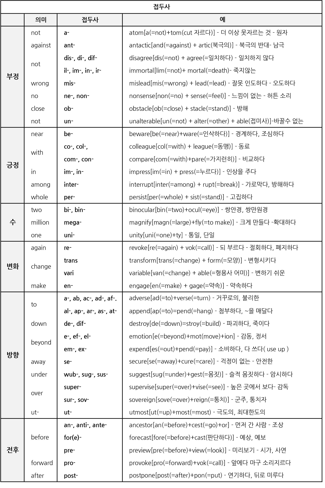
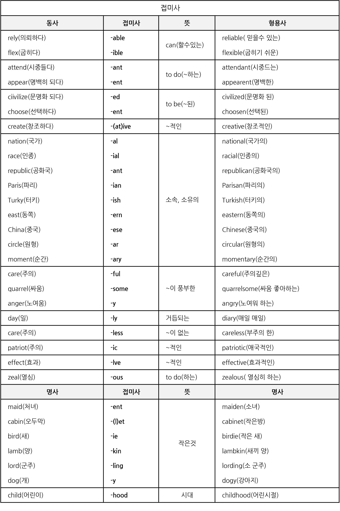
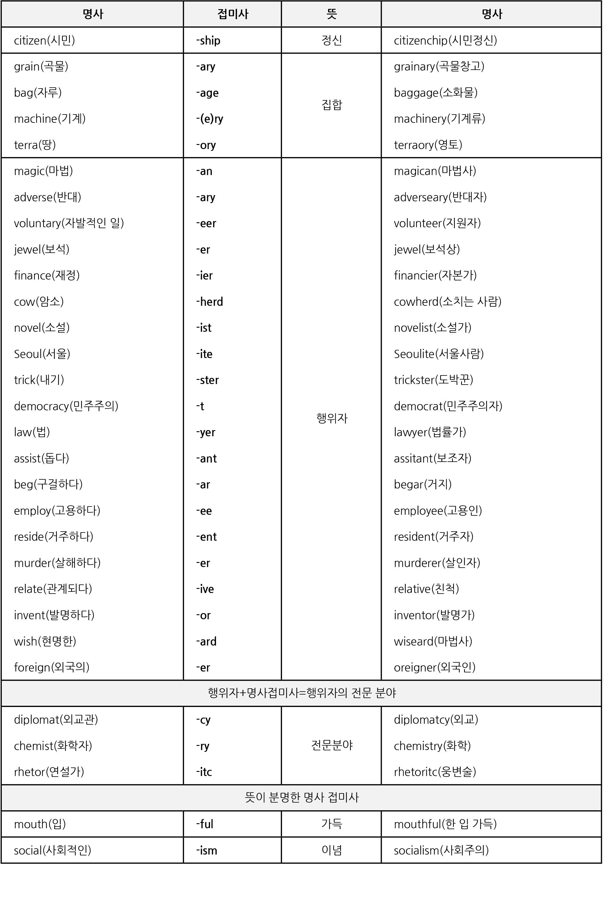

우리가 한글을 쓸때 모르는 단어를 접해도 금방 익히고, 그 뜻을 예측할수 있다. 왜 그런걸까? 그건 바로 무의식적으로 접두사, 접미사, 어원의 뜻을 통해 우리가 단어를 번역하고 있기 때문이다.

예를 들어 `나무꾼, 사기꾼, 농사꾼` 이라는 단어를 보았을때 우리는 ~꾼이라는 뒤에 접미사를 통해 ~하는 사람이라는 의미라고 받아들인다는 것이다. 이를 바탕으로 `수다꾼`이라는 단어를 보았을때 모르는 단어라도 수다를 하는사람이라는 의미라고 우리가 받아들일 수 있을것이다.

# 기본 어원, 접두사, 접미사
> 이미 인터넷 상에 떠돌고 있는 잘 정리된 자료가 있다. 시초는 누구의 자료인지는 잘모르겠다.

> 이미지 출처 : https://brunch.co.kr/@adipoman/263#comment

# 어원

# 접두사

# 접미사
## in(=in, on) == (변형:im, il, ir, i)
1. [in, into] 안에, 안으로
1. [on] ~위에, ~을 걸치고
1. [not] 부정

## a/n
 <table align="center">
        <tr bgcolor="red" align="center">
            <td>어근</td>
            <td>뜻</td>
            <td>기원</td>
            <td>예시와 정의</td>
        </tr>
        <tr align="center">
            <td>a/n</td>
            <td>not,without</td>
            <td>Greek</td>
            <td>abyss - without bottom; achromatic - without color; anhydrous - without water</td>
        </tr>
    </table>

### aberrant
* adjective
  * departing from an accepted standard.
      * Similar: deviant, deviating, ....
      * Opposite : normal, typical
  * (BIOLOGY)diverging from the nomal type
      * Similar: deviant, d...
* adjective
    1. 이상한
    2. 정도에서 벗어난
    

        

### 테스트용

    
aberrant

    <table align="center">
        <tr bgcolor="red" align="center">
            <td>한글뜻</td>
            <td>영영뜻</td>
        </tr>
        <tr align="center">
            <td>이상한</td>
            <td>departing from an accepted standard.</td>
        </tr>
        <tr align="center">
            <td>정도에서 벗어난</td>
            <td>(BIOLOGY)diverging from the nomal type</td>
        </tr>
    </table>

