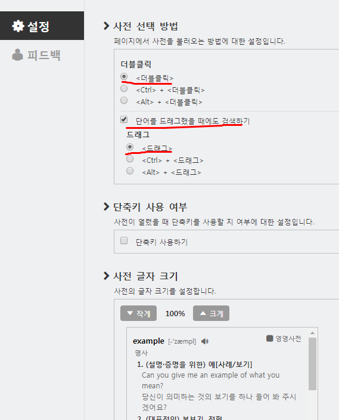
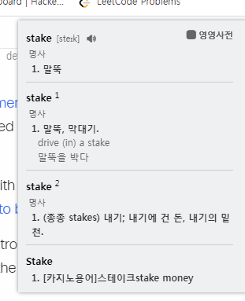
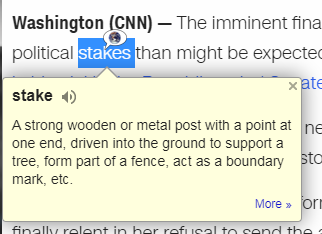
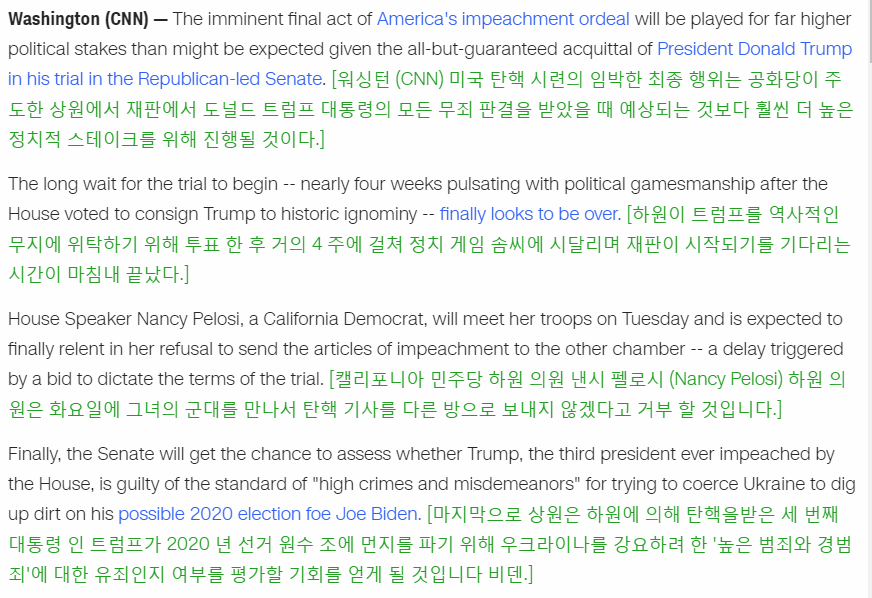

영어 공부를 시작한다 할때 영어기사를 꾸준히 읽으면 된다!! 하여 시작하신분들이 많을거라 생각합니다. 저도 그 중 하나인데 영어기사 읽을때, 웹에서 영어 관련 해석할때 도움이 되는 크롬 확장앱 세개를 소개 시켜드립니다.

# 네이버 사전
<https://chrome.google.com/webstore/detail/%EB%84%A4%EC%9D%B4%EB%B2%84-%EC%98%81%EC%96%B4%EC%82%AC%EC%A0%84-naver-english-di/jfibpeiddefellcfgnijpcpddoimbdij?hl=ko>

확장 프로그램을 눌러 아래와 같이 설정해주면 모르는 영단어 `더블클릭이나 드래그시` 좌측상단에 아래 사진과 같이 한국어 뜻이 나옵니다.

# Google Dictionary
<https://chrome.google.com/webstore/detail/google-dictionary-by-goog/mgijmajocgfcbeboacabfgobmjgjcoja>

설정은 기본이 영어로 되어 있는데 그대로 놔두시면 됩니다. 이거 까시면 모르는 단어 더블클릭시 아래에 영영 뜻으로 나오게 됩니다. 네이버 사전과 위치가 겹치기 않기 때문에 한국뜻과 영영뜻을 한번에 볼 수 있으므로 상당히 유용합니다.

# Imtranslator
<https://chrome.google.com/webstore/detail/imtranslator-translator-d/noaijdpnepcgjemiklgfkcfbkokogabh>

개인적으로 제가 제일 맘에 들어하는 확장프로그램입니다. 돈주고 써도 쓸만한 퀼리티입니다.

제가 맘에 들어하는 이유는 바로

inline translator 기능입니다. 바로 아래에 한줄 한줄 번역을 해서 보여주죠.

문장드래그 - Imtranslator - inline translator 하거나 문장드래그 - alt+c(기본설정되어 있는 단축키 바꿀수 있음)

해주시면 됩니다.