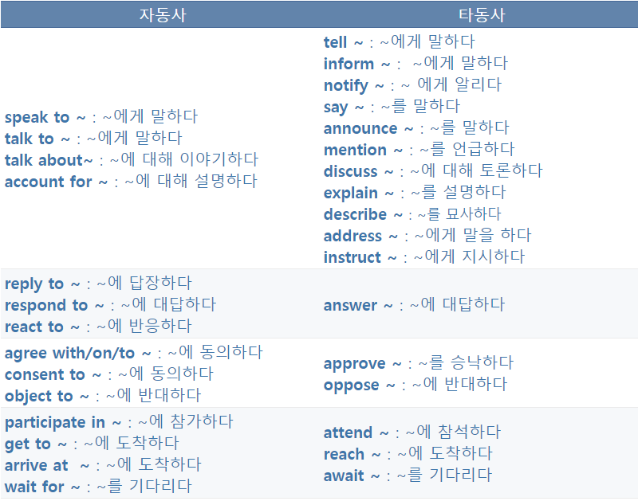

# 자동사란?
`혼자서 스스로 할 수 있다` 라는 의미로 목적어를 받지않는 행위나 성격을 나타낸다.

만약 자동사 뒤에 명사가 오게하고 싶다면 `S+V+전치사+N` 형태로 나타낼수 있다.

# 타동사란?
`~을 ~하다.` 누군가를 대상으로 하는 의미를 갖고 있는 행위를 나타내는 동사이다. 목적어가 필요하다.

`S+V+O`가 기본 형태이다.

# 구분하는 방법?
일차적으로 자주나오거나 헷갈리는 자타동사를 암기해주는게 좋다.

구분방법은 간단하다.

* 동사 뒤에 목적어가 있는가? => 타동사
* 해석할때 주어가 ~을/를 ~한다라고 해석할때 자연스러운가? -> 타동사
* 주어가 사람인가(사람처럼 동사(행위)를 할 수 있는것처럼 쓰이는가?) -> 타동사(최후의 방법으로 쓰자. 물체인데 사람처럼 행위하는것처럼 쓸 경우 예외가 될 수도 있다.)

# 구분해야 되는 이유?
자동사 vs 타동사로 문제를 낸다면 뭘 낼 수 있을까?

바로 `be + p.p vs be + ing` 구분 문제이다.

경우의 수를 나누어보자.

* 동사가 타동사인 경우
    * `he opened the door.` open이 타동사로 쓰였을때 -> `the door is opened` 3형식 문장을 2형식으로 바꾸었을 경우 `be + p.p`를 써야된다
    * `he was opening the door` 진행형으로 바꾸었을 경우 the door 목적어는 그대로 뒤에 남는다.
*  동사가 자동사인 경우
    * `he react to that`
    * `he is reacting to that`

만약 출제가 빈칸일 비운다면 어디를 비울까?

`he is ___ ~~~.` 형태로 비워질 것이다.

우리는 is를 보고 먼저 2형식으로 보어자리가 아닐까 의심을 해봐야 하고, 만약 나머지 동사 자리라면 `be + p.p vs be + ing` 문제임을 알 수 있다. 고려해야 할것들은 간단하다.

* 보기로 주어지는 단어가 자동사인가 타동사인가?
* 빈칸 뒤에 목적어가 존재하는가?
* 주어가 주체로 동사(행위)를 하는가?

# 혼동하기 쉬운 자동사 타동사


# 시험으로 낸다면?
1. 
    ```
    Young man is ____ to the major cities to get college education and jobs.

    1. move
    2. mover
    3. moved
    4. moving
    ```

    <details>
    <summary>정답</summary>
    4번이다. move는 자동사로 움직이다 라는 뜻도 있지만 ~을 옮기다라는 타동사의 뜻도 있다. 우리가 자타동사를 외워야 하는이유가 여기에 있다.. 감으로는 한계가 있다.
    </details>
2.
    ```
    Young man have been ____ to the major cities to get college education and jobs.

    1. move
    2. mover
    3. moved
    4. moving
    ```
    <details>
    <summary>정답</summary>
    4번이다. 위의 문제에서 is -> have been으로 바꾸었을 뿐인데 나도 모르게 be + p.p인 3번으로 손으로 갈수가 있다... 조심하자.
    </details>