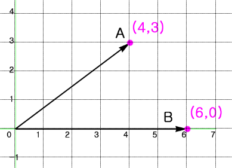
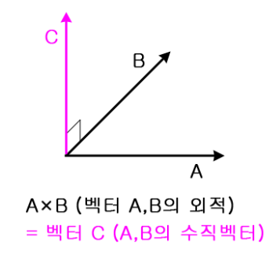
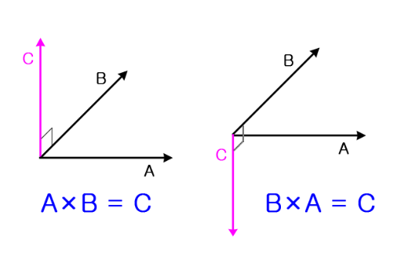
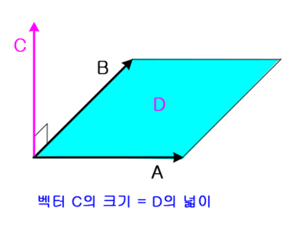

# 내적과 외적을 하는 이유?
고등학교때까지만 해도 내가 배웠던건 내적이였다. 그런데 내적은 왜 왜배운걸까? 그러고 외적을 하는 이유는 무엇일까?

2차원 벡터 공간에서의 내적 결과는 스칼라값이 되고, 3차원 벡터 공간에서의 외적 결과는 벡터가 된다. 이것은 즉슨 **내적은 벡터의 방향성을 무시하고, 크기를 구하기 위해서 하는 행위**가 아닐까 싶다.

# 벡터의 내적
벡터의 내적은 스칼라곱 $\overrightarrow{A}\cdot\overrightarrow{B}$로 표현한다.

> 내적의 결과는 벡터가 아닌 스칼라로 나온다는 것에 유의하자!

이는 공식으로 $\overrightarrow{a}\cdot \overrightarrow{b} = \vert \overrightarrow{a} \vert\vert \overrightarrow{b}\vert\cos{\theta} = (a_x b_x)+(a_y b_y)$로 나타낼수 있다.

$$
\begin{array}{l}
\text{위 그림을 예시로 공식을 적용해보자} \\
\vert\overrightarrow{A}\vert=5, \vert \overrightarrow{A'}\vert=4, \vert\overrightarrow{B}\vert=6\, 이다. \\
공식에\, 따르면 \\
\overrightarrow{A}\cdot \overrightarrow{B} = 5\times 6 \times \cos{\theta}=4\times6 \\
\Rightarrow \cos{\theta}=\cfrac{4}{5}\,을\, 구할수있다 \\
\\
추가적으로 \\
\vert \overrightarrow{A'}\vert=\vert\overrightarrow{A}\vert\times\cos{\theta}\text{를 통해 알수있는것은 내적의 결과값이 벡터 B에 대한 정사영이라는 것이다.}
\end{array}
$$

# 내적의 성질
1. 내적은 $벡터\times벡터=스칼라$이므로 $(\overrightarrow{a}\cdot \overrightarrow{b})\cdot \overrightarrow{c}$ 같은 식은 존재 할 수 없다.($\because (벡터\cdot 벡터)\cdot (벡터) = 스칼라 \cdot 벡터$)
1. $\overrightarrow{a}\cdot \overrightarrow{b}=0$일때
    * $\vert\overrightarrow{a}\vert=0\, or\, \vert\overrightarrow{b}\vert=0$
    * 두 벡터가 수직 또는 직교한다. ($\overrightarrow{a}\bot \overrightarrow{b} = 0$)
1. $\overrightarrow{a}\cdot \overrightarrow{a}=\overrightarrow{\vert a\vert}\cdot \overrightarrow{\vert a\vert}\cos{0}=\vert\overrightarrow{a}\vert^2$ (벡터 크기 계산할때 사용)
1. $\overrightarrow{a}//\overrightarrow{b}일때,\, \overrightarrow{a}\cdot \overrightarrow{b}=\pm\vert\overrightarrow{a}\vert\vert\overrightarrow{b}\vert$ (0도 혹은 180도이기 때문에 $\cos{\theta}=1, -1$이 된다.)
1. $\overrightarrow{a}\cdot \overrightarrow{b}=\overrightarrow{b}\cdot \overrightarrow{a}$ (교환법칙 성립)
1. $(k\overrightarrow{a})\cdot \overrightarrow{b}=\overrightarrow{a}\cdot (k\overrightarrow{b})=k(\overrightarrow{a}\overrightarrow{b})$ (실수배는 자유롭게 이동 가능)
1. $\overrightarrow{a}\cdot (\overrightarrow{b}+\overrightarrow{c})=\overrightarrow{a}\cdot \overrightarrow{b}+\overrightarrow{a}\cdot \overrightarrow{c}$ (분배법칙 성립)
1. $\cos{\theta}=\cfrac{\overrightarrow{a}\cdot \overrightarrow{b}}{\vert\overrightarrow{a}\vert\cdot \vert\overrightarrow{b}\vert}$

# 벡터의 외적

외적은 3차원적인 의미를 가지는데,

외적은 결과값으로 두벡터와 수직인 벡터를 반환하기 때문이다.

외적은 내적과 다르게 교환법칙이 생기지 않는다. 순서가 다를 경우 반대 방향으로 벡터의 방향이 바뀐다.(오른손 법칙을 떠올리자..!)

우리가 외적을 하는 이유이다. 결국 벡터 C의 크기는 벡터 A, B로 이루어지는 평행사변형의 넓이와 같다.

# 외적의 성질
1. $\overrightarrow{a}\times \overrightarrow{b}\not=\overrightarrow{b}\times \overrightarrow{a}$ (교환법칙 성립 x)
1. 외적의 결과값으로 나온 벡터C의 크기는 A, B 벡터를 연결한 평행사변형 넓이와 같다.(A, B벡터가 수직인 경우 직사각형)
1. $\overrightarrow{a}\times \overrightarrow{b} = 0$ 일때
    * $\vert\overrightarrow{a}\vert=0\,or\,\vert\overrightarrow{b}\vert=0$
    * $a//b$ (두 벡터가 서로 평행하다.)
1. $a\times b=-b\times a$
1. $(k\overrightarrow{a})\times \overrightarrow{b}= \overrightarrow{a}\times(k\overrightarrow{b})=k(\overrightarrow{a}\times \overrightarrow{b})$
1. $\overrightarrow{a}\times(\overrightarrow{b}+\overrightarrow{c})=\overrightarrow{a}\times \overrightarrow{b}+\overrightarrow{a}\times \overrightarrow{c}$ (분배 법칙 성립)
1. $\overrightarrow{a}\cdot (\overrightarrow{b}\times \overrightarrow{c})=(\overrightarrow{a}\times \overrightarrow{b})\cdot \overrightarrow{c}$
1. $\overrightarrow{a}\times (\overrightarrow{b}\times \overrightarrow{c})=(\overrightarrow{a}\cdot \overrightarrow{c})\overrightarrow{b}-(\overrightarrow{a}\cdot \overrightarrow{b})\overrightarrow{c}$

# 행렬 성분으로 주어질때 외적 계산
## 이차행렬식
$$
\begin{vmatrix}
a&b \\
c&d
\end{vmatrix} =
ad-bc
$$
## 삼차행렬식
$$
\begin{array}{l}
\begin{vmatrix}
a_1&a_2&a_3 \\
b_1&b_2&b_3 \\
c_1&c_2&c_3
\end{vmatrix}
=
a_1
\begin{vmatrix}
b2&b3 \\
c2&c3
\end{vmatrix}
-
a_2
\begin{vmatrix}
b1&b3 \\
c1&c3
\end{vmatrix}
+
a_3
\begin{vmatrix}
b1&b2 \\
c1&c2
\end{vmatrix}
\\
\\
\Rightarrow a\times b \\ \\
=
\begin{vmatrix}
i&j&k \\
a_1&a_2&a_3 \\
b_1&b_2&b_3
\end{vmatrix}
\\ \\
=
\begin{vmatrix}
a_2&a_3 \\
b_2&b_3
\end{vmatrix}i
-
\begin{vmatrix}
a_1&a_3 \\
b_1&b_3
\end{vmatrix}j
+
\begin{vmatrix}
a_1&a_2 \\
b_1&b_2
\end{vmatrix}k
\\ \\
=(a_2b_3-a_3b_2, a_3b_1-a_1b_3, a_1b_2-a_2b_1)\cdot (i,j,k)
\end{array}
$$

# 참고 자료
* <https://mrw0119.tistory.com/12>
* <https://m.blog.naver.com/PostView.nhn?blogId=ooooooooooo0&logNo=220635296928&proxyReferer=https%3A%2F%2Fwww.google.com%2F>
* <https://j1w2k3.tistory.com/1158>
* <https://j1w2k3.tistory.com/627>