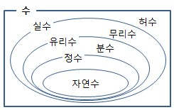
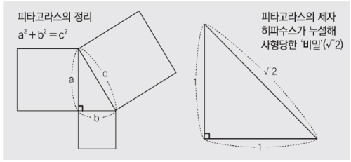

# 기초 수학이란?
이공계열 대학 편입에서 기초수학이라는 항목을 요구하는데 이는 결국 편입 시험에서 치르는 미적분1, 미적분2, 선형대수학, 공업수학에서 응용되어 사용될 수도 있는 고등과정의 수학 지식을 말한다. 수포자라고 해서 중등수학부터 고등수학까지 전부 공부하는 어리석은 짓을 하는것보단 편입수학과 연관된 내용만 학습하는게 관건이다. 미적 기초, 행렬, 벡터 등은 대학과정에서 다시 기초부터 다루기 때문에 기초 수학 파트에선 다루지 않겠다.

 > 이 포스팅을 하는데 이 블로그의 내용을 참고하여 작성하였음! 고등수학 공부할때 참고하기 좋음! 링크 -> [위너수학](https://j1w2k3.tistory.com/611) &
 [수학방](https://mathbang.net/) & [수학공장](https://www.mathfactory.net/)

# 수의 체계

우리가 사용하는 수를 집합적 그림으로 표현한 것이다. 수학은 수를 다루는 학문이기 때문에 당연히 이러한 체계로 이루어졌다는것은 깔고 들어가주어야 한다.

## 자연수
자연수는 0을 포함하지 않은 양수만을 나탄내다. 이를 또 세가지로 나눌 수 있다. 덧셈과 곱셈에 대해 닫혀있다.

1. 1
2. 소수
    * 1과 자기자신만으로 나누어지는 수 
3. 합성수
    * 세개 이상의 수로 나누어지는 수

## 정수
정수가 등장하면서 우리는 이제 음수와 아무것도 아닌값 0이라는 개념을 받아들이게 된다. 덧셈과 곱셈 그리고 뺄셈에 대해 닫혀있다.

1. 0
2. 양의 정수
3. 음의 정수

## 대수적 성질
$$
\text{실수 a, b, c에 대하여} \\
\text{교환법칙: } a + b = b + a, a \cdot b = b \cdot a \\
\text{결합법칙: } (a + b) + c = a + (b + c), (a \cdot b) \cdot c = a \cdot (b \cdot c) \\
\text{분배법칙: } (a + b) \cdot c = a \cdot c + b \cdot c
$$

중학교 때 배우는 교환법칙, 결합법칙, 분배법칙이다. 어떠한 연산자를 사용하느냐에 따라서 이러한 법칙이 성립할 수도 있고, 성립하지 않을수도 있다. 이에 대한 증명이나 ㄱ,ㄴ,ㄷ 문제가 나오지는 않지만 알고 넘어가자.

## 유리수
n/m 이라는 식에서 n, m이 정수이며, m≠0으로 표현 할 수 있는 수이다. 이러한 표현을 분수 표현이라고 한다.

1. 유한 소수
    * 유한개의 소수점으로 표현이 가능한 소수이다. ex) 0.5
2. 순환 소수
    * 특정한 패턴을 반복하는 소수이다. 대표적으로 1/3 = 0.333333
3. 무한 소수
    * 패턴이 없이 표현되는 유리수이다. 대표적인 예시로 π(3.14....)가 있다.

## 무리수

무리수라는 개념이 등장한 배경은 삼각형의 빗변과 다른변의 비율을 측정하려하는데 이게 여태까지 있던 수들로 표현할 수가 없던것이다. 피타고라스의 정리로 이 수를 표현하려 했지만 역부족이였다.

무리수는 정수의 비의 형태로 나타낼수 없는 실수를 의미한다.

## 실수
직선 위의 모든 점을 의미한다. 유리수 + 무리수이다.

## 허수
$\sqrt{a}$에서 좌표평면상에서 표현 할 수 있는 수는 a가 양수일때만이다. 하지만 a가 음수가 되면 좌표평면상에서 더 이상 표현할 수 없다. $\sqrt{-1} = i$로 표현된다.

# 단항식과 다항식
## 단항식
단하나의 항만으로 이루어진것을 말한다.

$$
5, 2x, 3xy^2
$$
## 다항식
여러개의 단항식이 모여 이루어진것을 말한다.

$$
3x^3+2x+5 \quad \text{최고차항 기준으로 3차 다항식이라 부른다.}
$$

## 사칙연산
$+, -, \cdot, /$ 네가지 기초적인 연산을 말한다. 중학교때 배우는 여러가지 인수분해 공식은 자주 쓰이기 때문에 외워줘야한다.

### 곱셈공식의 전개
$$
\begin{array}{c|c}
\mathrm{공식} & \mathrm{예시} \\
\hline \\
(a+b)^2=a^2+2ab+b^2 & (2x+5y)^2=4x^2+20xy+25y^2 \\
\Leftrightarrow (a+b)(a+b)=a^2+ab+ba+b^2 & \\
\hline \\
(a-b)^2=a^2-2ab+b^2 & (5x-2y)^2=25x^2-20xy+4y^2 \\
\Leftrightarrow (a-b)(a-b)=a^2-ab-ba+b^2 & \\
\hline \\
(a+b)(a-b)=a^2-b^2 & (3x+10y)(3x-10y)=9x^2-100y^2 \\
\Leftrightarrow (a+b)(a-b)=a^2+ab-ba+b^2 & \\
\hline \\
(ax+b)(cx+d)=acx^2+(ad+bc)x+bd & (5x+3)(9x+3)=45x^2+42x+9 \\
\hline \\
(ax+by+cz)^2=a^2x^2+b^2y^2+c^2z^2+2(abxy+bcyz+cazx) & (x+2y+3z)=x^2+4y^2+9z^2+2(4xy+6yz+3zx) \\
\hline \\
(a+b)^3 = a^3+3ab(a+b)+b^3 & (x+2)^3=x^3+6x(x+2)+8 \\
\hline \\
(a-b)^3 = a^3-3ab(a-b)-b^3 & (x-2)^3=x^3-6x(x-2)-8 \\
\hline \\
(x+a)(x+b)(x+c) = x^3+(a+b+c)x^2+(ab+bc+ca)x+abc & (x+1)(x+2)(x+3)=x^3+6x^2+11x+6 \\
\hline \\
(x-a)(x-b)(x-c) = x^3-(a+b+c)x^2+(ab+bc+ca)x-abc & (x-1)(x-2)(x-3)=x^3-6x^2+11x-6 \\
\hline \\
a^3+b^3+c^3-3abc=(a+b+c)(a^2+b^2+c^2-ab-bc-ca) & 2^3+3^3+4^3-3\cdot 2 \cdot 3 \cdot 4 \\
&=(2+3+4)(4+9+16-6-12-8)=9\cdot 3 = 27
\end{array}
$$

### 곱셈공식의 변형
$$
\begin{array}{c}
\mathrm{\text{곱셈공식 변형 공식}} \\
\hline \\
x^2+y^2=(x+y)^2-2xy=(x-y)^2+2xy \\
\hline \\
(x+y)^2=(x-y)^2+4xy \\
\hline \\
(x-y)^2=(x+y)^2-4xy \\
\hline \\
x^2+\cfrac{1}{x^2}=(x+\cfrac{1}{x})^2-2=(x-\cfrac{1}{x})^2+2 \\
\hline \\
(x+\cfrac{1}{x})^2=(x-\cfrac{1}{x})^2+4 \\
\hline \\
(x-\cfrac{1}{x})^2=(x+\cfrac{1}{x})^2-4 \\
\hline \\
x^3+y^3=(x+y)^3-3xy(x+y) \\
\hline \\
x^3-y^3=(x-y)^3+3xy(x-y) \\
\hline \\
x^2+y^2+z^2=(x+y+z)^2-2(xy+yz+zx) \\
\hline \\
x^2+y^2+z^2-xy-yz-zx=\cfrac{1}{2}\{(x-y)^2+(y-z)^2+(z-x)^2\} \\
\hline \\
x^2+y^2+z^2+xy+yz+zx=\cfrac{1}{2}\{(x+y)^2+(y+z)^2+(z+x)^2\} \\
\hline \\
x^5+y^5=(x^3+y^3)(x^2+y^2)-xy^2(x+y) \\
\hline \\
x^3+\cfrac{1}{x^3}=(x+\cfrac{1}{x})^3-3(x+\cfrac{1}{x}) \\
\hline \\
x^3-\cfrac{1}{x^3}=(x-\cfrac{1}{x})^3+3(x-\cfrac{1}{x}) \\
\end{array}
$$

### 근의공식
근의 공식은 2차원 방정식에서 두 근을 구할때 사용한다. 이 원리를 이용해 근의 존재여부도 판별하는 중요한 공식이다.

$$
\begin{array}{l}
\text{근의 공식 유도 과정}\\
ax^2+bx+c=0\quad(a\not=0)\\
\rightarrow x^2+\cfrac{b}{a}x+\cfrac{c}{a}=0\quad(양변을 \,x^2\,의\,계수\,a로\,나눔) \\
\rightarrow x^2+\cfrac{b}{a}x=-\cfrac{c}{a}\quad(상수항을\,우변으로\,이항함) \\
\rightarrow x^2+\cfrac{b}{a}x+(\cfrac{b}{2a})^2 = -\cfrac{c}{a}+(\cfrac{b}{2a})^2 \\
(양변에\,x의\,계수의\,절반의\,제곱을\,더함) \\
\rightarrow (x+\cfrac{b}{2a})^2=\cfrac{b^2-4ac}{4a^2}\quad(완전제곱식으로\,변형) \\
\rightarrow x+\cfrac{b}{2a}=\cfrac{\pm\sqrt{b^2-4ac}}{2a}\quad(제곱근을\,구함) \\
\rightarrow x=\cfrac{-b\pm\sqrt{b^2-4ac}}{2a}
\end{array}
$$

### 나머지 정리
$$
\begin{array}{l}
\text{다항식 f(x)를 일차식 G(x)로 나눌때 나머지를 구하는것이 목적} \\
f(x)=G(x)Q(x)+R(x) \quad \text{(G(x)의 최고차항지수가 a인경우 R(x)는 최대 a-1의 최차항지수를 가질수 있다)} \\
\text{만약 G(x)=x^2+2x-3 인경우} \\
f(x)=(x^2+2x-3)Q(x)+ax+b \text{ 로 둘 수 있다} \\
\text{이때 R(x)=ax+b를 구하기 위해서 G(x)가 0이 되는 x를 대입하여 Q(x)를 없애준다.} \\
f(-3)=-3a+b, f(1)=a+b
\end{array}
$$

### A:B=C:D(비례식)
$$
a:b=x:y \Rightarrow a \cdot y=b \cdot x \\
a:b:c=x:y:z \Rightarrow a \cdot z = b \cdot y = c \cdot x \\
\begin{array}{ll}
\text{가리의비} & \cfrac{a}{b}=\cfrac{c}{d}=\cfrac{e}{f} \\
& = \cfrac{a+c+e}{b+d+f} \\
& =\cfrac{pa+qc+re}{pb+qd+rf} \\
& (단, b \not= 0, d \not= 0,\\
& f \not= 0, b+e+f \not= 0,\\
& pb+qd+rf \not= 0)
\end{array}
$$

$$
\begin{array}{l}
x:10 = 2:5 \\
x\cdot5 = 10 \cdot 2\\
x=4
\end{array}
$$

# 절댓값
## 절대값의 정의
$$
\begin{array}{l}
\vert a \vert = 
\begin{cases}
a & ,a\ge 0 \\
-a & ,a\lt \ 0 && (단, a는 실수이다.)
\end{cases}
\end{array}{l}
$$

## 절대값의 성질
$$
\begin{array}{l}
1)\, \vert a \vert \ge 0 \\
2)\, \vert a \vert = 0 \Leftrightarrow a = 0 \\
3)\, \vert a \vert \vert b \vert = \vert ab \vert \\
4)\, \vert a \vert + \vert b \vert = 0 \Leftrightarrow a = b = 0 \\
5)\, {\vert a \vert}^2 = a^2
\end{array}{l}
$$

## 절대값 접근
$$
\vert a \vert + \vert b \vert \not= \vert a+b \vert \text{이므로 우리는 절대값 기호를 만날때 범위를 나누어 주어야 된다.} \\
\text{|a| + |a + 3| = ? (-10 < a < 10)}
\begin{cases}
\text{-10 < a < -3 인경우} & -a - (a + 3) = -2a - 3 \\
\text{-3 <= a < 0 인경우} & -a + (a + 3) = 3 \\
\text{0 <= a < 10 인경우} & a + (a + 3) = 2a + 3
\end{cases}
$$

# 분수식
## 분수식의 정의
$$
\cfrac{a}{b} 에서(a,b는\,정수이며\,b\not=0)\, 인것을\, 유리식이라고\, 한다 \\
\text{이러한 꼴의 수식이 모여 만들어진 식을 분수식이라고 한다.}
$$

## 분수식의 사칙연산 및 번분수
$$
\begin{array}{l}
1)\quad \cfrac{A}{B} \pm \cfrac{C}{D} = \cfrac{AD \pm BC}{BD} \\
2)\quad \cfrac{A}{B} \times \cfrac{C}{D} = \cfrac{AC}{BD} \\
3)\quad \cfrac{A}{B} \div \cfrac{C}{D} = \cfrac{A}{B} \times \cfrac{D}{C} \\
4)\quad \cfrac{\cfrac{A}{B}}{\cfrac{C}{D}} = \cfrac{AD}{BC}
\end{array}
$$

## 부분분수(이항분리) 공식
분수식에서 자주사용되고 유용한 공식이다.

$$
\begin{array}{l}
\cfrac{1}{AB} = \cfrac{1}{AB} \times \cfrac{B-A}{B-A} \\
= \cfrac{1}{B-A} \times \cfrac{B-A}{AB} \\
= \cfrac{1}{B-A}(\cfrac{B}{AB} - \cfrac{A}{AB}) \\
= \cfrac{1}{B-A}(\cfrac{1}{A}-\cfrac{1}{B})
\end{array} \\
$$

## 분수식 with 인수분해 예시
$$
\begin{array}{ll}
ex) & \quad\cfrac{x^2 + 3x}{x^2 + 4x + 3} + \cfrac{x^2 + 5x + 6}{x^2 + x - 6} \\
& = \cfrac{x(x+3)}{(x+1)(x+3)} + \cfrac{(x+2)(x+3)}{(x-3)(x+2)} \\
& = \cfrac{x}{x+1} + \cfrac{x+3}{x-3} \\
& = \cfrac{x(x-3) + (x+1)(x+3)}{(x+1)(x-3)} \\
& = \cfrac{2x^2+x+3}{(x+1)(x-3)}
\end{array}
$$

# 무리식
## 무리식의 정의
$$
\text{무리식이란? 근호 안에 문자가 포함되어 있는 식 중 유리식으로 나타낼수 없는 식을 말한다.} \\
ex) \sqrt{x^2+2x+3}, \cfrac{1}{\sqrt{x^2+2x+3}}\\
\\
\text{근호 안에 식은 항상 0보다 크거나 같아야 하며, 분모는 0이면 안된다.} \\
ex) \cfrac{\sqrt{x+3}}{\sqrt{x+2}} \Rightarrow -2 \lt x \lt 0, 0 \lt x 
$$

## 무리식의 성질
$$
\begin{array}{l}
\text{a>0, b>0 일 때(근호 안이 음수일때는 허수로 실수범위를 벗어난다.} \\
1)\quad \sqrt{a}\sqrt{b} = \sqrt{ab} \\
2)\quad \sqrt{a^2b} = a\sqrt{b} \\
3)\quad \cfrac{\sqrt{a}}{\sqrt{b}} = \sqrt{\cfrac{a}{b}} \\
4) \sqrt{\cfrac{a}{b^2}} = \cfrac{\sqrt{a}}{b}
\end{array}
$$

## 분모의 유리화
분모를 유리화해줄 경우 연산이 더 편해지기 때문에 항상 해주는게 좋다. 인수분해 합차공식을 이용한다.

$$
\begin{array}{ll}
\cfrac{a}{\sqrt{a} + \sqrt{b}} & = \cfrac{a(\sqrt{a} - \sqrt{b})}{\sqrt{a} + \sqrt{b}(\sqrt{a} - \sqrt{b})} \\
& = \cfrac{a(\sqrt{a} - \sqrt{b})}{a - b}
\end{array}
$$

# 지수
## 지수 정의
$$
\text{지수는 } a^x \text{형태로 a를 밑, x를 지수라고 부른다.}
$$

## 지수 법칙
$$
\begin{array}{l}
a\not=0 \text{이고 n이 자연수 일때} \\
a^n = a \times a \times a \times ... \times a : a를\,n번\,곱한것 \\
\\
\text{지수가 자연수 일때} \Rightarrow a\not=0, m,n은\, 자연수 \\
1)\quad a^n \times a^m = a^{n+m} \\
2)\quad {(a^n)}^m = a^{nm} \\
3)\quad a^n \div a^m = 
\begin{cases}
a^{n-m} & n > m \\
1 & n = m \\
\cfrac{1}{a^{m-n}} & n < m
\end{cases} \\
4)\quad (ab)^n = a^{n}b^{b}
\end{array}
$$

# 로그
## 로그 정의
$$
\begin{array}{l}
\text{로그는 지수형태에서 밑과 값을 이용해 지수를 값으로 놓는 형태 변환으로 만들어진다.} \\
a \gt 0, a \not= 1\, 이고\, b \gt 0\, 일때 \\
a^b = c \Leftrightarrow \log_a{c} = b \quad (a:밑, c:진수)
\end{array}
$$

## 로그 법칙
$$
\begin{array}{l}
밑\, a > 0, a \not= 1\\
진수 x > 0, y > 0 \\
\\
1)\quad \log_a{1} = 0, log_a{a} = 1 \\
2)\quad \log_a{x} + \log_a{y} = log_a{xy} \\
3)\quad \log_a{x} - log_a{y} = log_a{\cfrac{x}{y}} \\
4)\quad \log_a{x^n} = n\log_a{x} (단,\,n은\, 실수) \\
5)\quad a^{\log_b{c}} = c^{\log_b{a}} \Rightarrow a^{\log_a{b}} = b
\end{array}
$$

# 방정식
방정식이란 미지수가 포함된 식에서, 미지수에 특정한 값을 주었을때만 성립하는 등식이다.

## 일차방정식
$$
ax+b = 0 (a\not=0)
$$

## 이차방정식
인수 분해, 완전제곱식(중근), 근의 공식 등을 이용하여 푼다.

$$
ax^2+bx+c = 0 (a\not=0) \\
a(x+b)^2 + c = 0
$$

## 연립방정식
$$
\begin{array}{l}
\text{연립 방정식이란 여러개의 식을 묶어 여러개의 미지수의 값을 구할 수 있는 것을 말한다.} \\
\text{이때 (식의개수) } \ge \text{(변수의 개수) 이여야 미지수의 값을 구할 수 있다.} \\
\text{(계수가 다른 변수도 다른 변수로 카운트 된다.)}\\
\\
\begin{cases}
2x + 5y = 12 & (1) \\
3x + 8y = 19 & (2)
\end{cases} 에서 \\
(1) \times 3 - (2) \times 2 \text{ 를 하여 변수 x를 소거해준다.} \\
6x + 15y - (6x + 16y) = 36 - 38 \\
-y = -2, 즉\, y = 2 \\
2x + 5 \times 2 = 12  \\
x = 1
\end{array}
$$

## 삼차방정식
3차 방정식부터는 근을 구하기가 까다롭다. 따라서 인수분해를 이용하여 근을 구한다.

$$
\begin{array}{l}
\text{삼차 방정식의 기본형} \\
ax^3+bx^2+cx+d = 0 \\
\\
\text{삼차 방정식 인수분해 공식} \\
x^3 + y^3 = (x+y)(x^2-xy+y^2) \\
x^3 - y^3 = (x-y)(x^2+xy+y^2) \\
\\
\text{삼차방정식의 근과 계수의 관계} \\
x\text{에 대한 삼차방정식 } ax^3+bx^2+cx+d=0\text{의 세근을 } \alpha, \beta, \gamma 라\, 할때 \\
\alpha + \beta + \gamma = -\cfrac{b}{a} \\
\alpha\beta + \beta\gamma + \gamma\alpha = \cfrac{c}{a} \\
\alpha\beta\gamma = -\cfrac{d}{a}
\end{array}
$$

## 고차방정식
3차방정식 이상의 것들을 고차방정식이라고 한다. 지금까지 1, 2, 3차 방정식에서부터 올라왔다. 접근방법은 3차방정식과 다르지 않다. 눈치 빠른 사람은 아래와 같은 공식이 성립한다는 것을 알아냈을지도 모른다.

$$
\begin{array}{l}
\text{고차방정식의 근과 계수의 관계} \\
x\text{에 대한 고차방정식에서} \\
근의\, 합 : -\cfrac{(n-1)차 항의 계수}{n차항의 계수} \\
근의\, 곱 : \cfrac{상수항}{n차항의\, 계수} \times (-1)^n \\
\end{array}
$$

## 조립제법
인수분해를 하는 이유는 다항식을 좀 더 쉽게 알아보고 근을 알면 여러가지 상황에 문제에 접근하기 좋기 때문이다. 그런데 고차방정식이 될수록 인수분해 공식만으로 해결하기 어려워진다. 여기서 조립제법이라는 것을 이용하는데, 원리는 간단하다. $f(X)=0$이라는 식에서 $x=a$라는 값을 대입했을때 결과가 $0$이 나오는지 확인하는 것이다.

$$
\begin{array}{l}
x^3-6x^2+11x-6=0 \text{ 식에 대해 조립제법을 쓰자} \\
\text{제일 먼저 확인할 것은 }\cfrac{상수항}{최고차항계수}\text{이다.(상수항이 없으면 묶어서 만들어준다.)} \\
\cfrac{-6}{1}= -6\text{이다. 이때 -6의 인수가 -6, -3, -2, -1, 1, 2, 3, 6이 있다.} \\
-6\text{의 인수들이 조립제법을 통해 근이 될 가능성이 있는 후보들이다. 여기서 1을 이용해서 조립제법을 해보자.}
\end{array} \\
\begin{array}{c|rrrr}
& x^3 & x^2 & x^1 &  x^0 \\
& 1 & -6 & 11 & -6 \\
{\color{red}1} & & 1 & -5 & 6 \\
\hline
& 1 & -5 & 6 & |\phantom{-} {\color{blue}0}
\end{array} \\
\begin{array}{l}
\text{조립제법 결과 아래와 같이 된다.} \\
x^3−6x^2+11x−6=(x−{\color{red}1})(x^2−5x+6)+{\color{blue}0} \\
\text{나머지는 인수분해 공식을 써주면 된다!} \\
(x-1)(x-2)(x-3)=0 \\
\text{이로써 우리는 이 방정식의 근이 }x=1,2,3\text{이라는 것을 알수 있다.} \\
\end{array}
$$

## 분수방정식
분수 방정식은 분수꼴의 다항식으로 이루어진 식이다.

$$
\begin{array}{l}
\text{분수방정식은 다항방정식으로 고쳐 풀게 되는데 여기서 문제가 하나가 있다.} \\
\cfrac{x-1}{x-2} = 0\text{ 이라는 식이 있을때 양변에 분모를 제곱해준다.} \\
(x-1)(x-2)=0\text{ 이라는 다항방정식 형태로 바뀌게 된다. 하지만 여기서 근은 }x=1 \text{ 하나뿐이다.}\\
(분모)\not=0\text{ 이라는 규칙이 있기 때문이다.} \\
\\
\text{따라서 아래와 같은 방법으로 분수방정식에 접근한다.} \\
\text{1. 분수방정식을 하나의 분수식으로 만들어준다. } \\
\text{2. 분모가 0이 될수 있는 값을 예외처리 한다.} \\
\text{3. 양변에 분모를 제곱해준다} \\
\text{4. 다항방정식 푸는 방식으로 근을 구해준다.}
\end{array} \\
\\
\begin{array}{ll}
\cfrac{1}{x-5}+\cfrac{1}{x-3}=0 & \text{식을 풀어보자} \\
\cfrac{(x-3)+(x-5)}{(x-5)(x-3)}=0 & \text{하나의 분수식으로} \\
\cfrac{2(x-4)}{(x-5)(x-3)}=0 & \text{분모가 0이 되는 x는 3, 5이다. }(x\not=3, 5) \\
2(x-4)(x-5)(x-3)=0 & \text{양변에 분모 제곱} \\
x=3, 4, 5 \text{ 이므로 여기서 무연근인 3, 5를 빼면 4만 근이 될 수 있다.} \\
x=4
\end{array}
$$

## 무리방정식
무리방정식도 분수방정식과 푸는방식이 크게 다르지 않다. $(근호 안에 값) < 0$ 이면 허수의 영역이 되기 때문에 이 부분을 예외처리 해준다. 또한 근호 씌워진 값은 음수가 나올수 없다는 점을 유의해주자 $\sqrt{방정식} \ge 0$.

$$
\begin{array}{l}
\text{무리 방정식은 양변의 제곱을 통해 근호를 벗겨 다항방정식으로 바꾸어준다.} \\
\text{단, 근호 안의 값이 0보다 작은 경우를 예외처리 해준다. } \\
\end{array} \\
\\
\begin{array}{ll}
무리방정식\, \sqrt{x+1}=-x+5의\,해는? \\
x+1 \ge 0 \Leftarrow x \ge -1,\, -x+5 \ge 0 \Leftarrow x \le 5 & \text{먼저 근호안이 음수가 되는 경우를 구함} \\
x+1=(-x+5)^2 & \text{양변에 제곱} \\
x^2-11x+24=0 \\
(x-3)(x-8)=0 \\
x=3, 8 & 이때\, x \le 5\text{ 조건에 의하여 8은 무연근이 된다.} \\
\therefore x=3
\end{array}
$$

## 지수방정식
$$
\begin{array}{l}
\text{1. 양변의 밑이 같은 경우} \\
a^{f(x)}=a^{g(x)} \Leftrightarrow f(x)=g(x) \,(단, \,a \gt 0, \,a\not=1) \\
2^{2x+3}=2^{5x+9} \Rightarrow 2x+3=5x+9 \Rightarrow x=-2 \\
\\
\text{2. 양변의 지수가 같은 경우} \\
a^{f(x)}=b^{f(x)} \Leftrightarrow \text{경우의 수를 나누어 준다.}1)a=b, \,2)f(x)=0 \\
(x-1)^{x-1}=(x^2+4x+1)^{x-1} \\
1) x-1=x^2+4x+1 \Rightarrow x^2+3x+2 \Rightarrow (x+2)(x+1) \Rightarrow x=-2, -1 \\
2) x-1=0 \Rightarrow x=1 \\
\therefore x=-2,-1,1 \\
\\
\text{3. 양변에 일치하는게 없는 경우} \\
\text{양변에 로그를 취해주어 로그방정식으로 푼다.} \\
a^{f(x)}=b^{g(x)} \Leftrightarrow \log{a^{f(x)}}=\log{b^{g(x)}} \\
\text{4. 치환}
\text{다항방정식으로 바꿀수 있는 경우 치환을 해준다.} \\
4^x+2^(x+2)+3=0 \,에서 \,2^x=t \,라고 \,치환해보자 \\
t^2+4t+3=0 \Leftarrow (t+1)(t+3)=9 \Rightarrow (2^x+1)(2^x+3)
\end{array}
$$

## 로그방정식
로그 방정식은 로그의 성질을 이용하여 푼다. 지수 방정식과 다를게 없다.

$$
\begin{array}{l}
\text{1. 로그의 성질 이용} \\
\log_a{x}=b \Leftrightarrow x=a^b \\
\log_2{x}=3 \Rightarrow x=2^3=8 \\
\\
\text{2. 밑이 같을 때} \\
\log_a{f(x)}=\log_a{g(x)} \Leftrightarrow f(x) = g(x) \\
\log_2{(x^2+3x-4)}=\log_2{(x-1)} \\
\text{이때 진수>0 이여야함을 주의해준다. } x \gt 1,\, x \lt -4 \& x \gt 1 \\
x^2+3x-4=x-1 \\
x^2+2x-3=0 \\
(x+3)(x-1)=0 \\
x=1, -3 \text{ 에서 1, -3 둘다 무연근이므로 근이 없다.} \\
\\
\text{3. 진수가 같을 때} \\
\log_a{f(x)} = \log_b{f(x)} \\
1) \,진수=1,\, f(x)=1\, 인경우,\, 즉\, \log_a{f(x)}=\log_b{f(x)}=0 \\
2) 밑이\, 같은\, 경우\, a=b \\
\log_{2x+3}{(x-2)} = \log_{x^2+x+1}{(x-2)} \\
x \gt -\cfrac{2}{3} \,\&\, x \gt 2 \text{(제한 범위)} \\
x= 3\text{ 인 경우 등식 성립} \\
2x+3=x^2+x+1 \text{ 인 경우} \\
x^2-x-2=0 \\
(x-2)(x+1)=0 \\
x=-1, 2 \text{둘다 무연근임.. ㅋㅋ} \\
\therefore x=3 \\
\\
\text{4. 일치하는게 없을 때} \\
\text{(1) 로그 성질, 밑 변환 공식, 양변의 로그를 취하는 등을 여러 방법을 이용해 밑을 같게 만들어줌} \\
\text{(2) f(x)=0 꼴로 정리하여 다항방정식 푸는형태로 식을 정리한다.}
2^{\log_4{8}}=x \text{ 양변에 로그를 취함} \\
\log_2{2} \cdot \log_4{8} = \log_2{x} \\
\cfrac{3}{2}\log_2{2} = \log_2{x} \\
x=2^{\cfrac{3}{2}} \\
\end{array}
$$

## 원의방정식
$$
\begin{array}{l}
\text{원은 한 점(정점)에서 같은 거리에 있는 점들의 집합이다.} \\
원의\, 방정식은\, (x-a)^2+(y-b)^2=r^2\, 으로\, 나타낸다. \\
\text{(원의 중심 : (a, b), 반지름 : r)} \\
\\
\text{원과 직선과의 관계로 문제를 주로 낸다.} \\
\text{원의 중점과 직선사이 거리를 d, 원의 반지름을 r이라고 했을때} \\
1)\, r \gt d \text{ 서로 다른 원위에 두점과 만남} \\
2)\, r = d \text{ 원과 한점에서 만남(접선)} \\
3)\, r \lt d \text{ 원과 만나지 않음}
\end{array}
$$

<iframe src="https://www.desmos.com/calculator/szpnnfvqbs?embed" width="500px" height="500px" style="border: 1px solid #ccc" frameborder=0></iframe>

$$
\begin{array}{l}
\text{원과 직선의 식이 주어졌을때 판별식을 통해 서로의 관계를 판별 가능} \\
1)\, D \gt 0 \Leftrightarrow d \lt r \\
2)\, D = 0 \Leftrightarrow d = r \\
3)\, D \lt 0 \Leftrightarrow d \gt r \\
\\
x^2+y^2=4^2, x+y+k=0 \text{ 일때 직선이 접선일 경우의 k값을 구하라} \\
x+y+k=0 \Rightarrow y=-x-k \\
x^2+(-x-k)^2=4^2 \text{ (직선의 방정식 원의 방정식에 대입)} \\
2x^2+2kx+k^2-16=0 \\
4k^2-4*(2)*(k^2-16) = 0 \text{ (D=0 인경우 판별식 세워줌)} \\
4k^2=128 \\
k=4\sqrt{2}
\end{array}
$$

$$
\begin{array}{l}
\text{다른 정보를 토대로 접선의 방정식을 구할때} \\
\text{1. 접점이 주어진 경우} \\
(x-a)^2+(y-b)^2=r^2\, 위의 점\, P(x_1, y_1)에서의\, 접선의\, 방정식은 \\
(x_1-a)(x-a)+(y_1-b)(y-b)=r^2 \\
\\
\text{2. 기울기가 주어지는 경우} \\
(x-a)^2+(y-b)^2=r^2\, 에\, 접하고\, 기울기가\, m인\, 접선의\, 방정식은 \\
y-b=m(x-a)\pm r\sqrt{m^2+1} \\
\\
\text{3. 원 밖의 한점이 주어진 경우} \\
\text{(1) 접점의 좌표를 } (x_1, y_)\text{로 가정하고 접선의 방정식을 세운 후,} \\
\text{접선의 방정식에 }(a, b)\text{를 대입한다.} \\
\text{(2) 점 (a, b)를 지나고 기울기가 m인 직선의 방정식을 세운다.} \\
\text{(3) (원의 중심과 직선 사이의 거리) = (반지름의 길이) 점과 직선 사이 거리 공식 이용}
\end{array}
$$

## 타원의방정식
## 쌍곡선의 방정식

# 부등식
## 부등식의 영역
## 다항부등식
## 분수부등식
## 무리부등식
## 지수부등식
## 로그부등식

# 함수
## 정의역, 공역, 치역
## 점의 대칭, 이동, 거리
## 함수의 분류
### 상수 함수
### 일대일 함수(단사함수)
### 일대일 대응(전단사함수)
## 함수가 아닌것
## 일차함수
<iframe src="https://www.desmos.com/calculator/frlnf2rmpq?embed" width="500px" height="500px" style="border: 1px solid #ccc" frameborder="0"></iframe>

### x절편, y절편
## 이차함수
<iframe src="https://www.desmos.com/calculator/vtbaov1ebx?embed" width="500px" height="500px" style="border: 1px solid #ccc" frameborder="0"></iframe>

### 점과 직선 사이 거리
### 근 판별식
### 이차함수와 x축의 위치관계
## 삼차함수와 다차함수
<iframe src="https://www.desmos.com/calculator/pfchgwnyrz?embed" width="500px" height="500px" style="border: 1px solid #ccc" frameborder="0"></iframe>

## 분수함수
## 무리함수
## 지수함수
## 로그함수
## 가우스함수
## 조각함수와 절대값함수
## 삼각함수
### 삼각함수의 부호 변환
### 삼각함수 공식
### 삼각함수의 합성
### 삼각함수의 치환
## 역삼각함수
## 쌍곡선함수
### 쌍곡선함수의 성질
### 쌍곡선함수 공식
## 합성함수
## 역함수
## 우함수와 기함수
## 주기함수

# 수열
## 등차수열
## 등비수열
## 교대수열
## 조화수열
## 계차수열
## 수열의 극한
## 샌드위치 정리
## 시그마 기본 정리
## 무한급수
### 무한 등비급수 공식
### 무한급수의 수렴
### 이항분리 소거
### 로그 성질을 이용한 항의 소거

# 점, 선, 면
## 점
## 선
### 두직선의 위치 관계
### 선분의 내분점
### 선분의 외분점
## 면

# 도형의 성질
## 삼각형
### 삼각형의 무게중심
### 닮음
#### SSS닮음
#### SAS닮음
#### AA닮음
### 삼각형 너비 공식
### 싸인법칙, 제1,2코사인 법칙
## 사각형
## 다각형
## 사다리꼴
## 평행사변형
## 마름모
## 원
### 원과 원의 위치 관계
## 타원
## 정육면체 공식
## 직육면체 공식
## 각뿔 공식
## 원뿔 공식
## 원기둥 공식
## 구 공식

# 기타
## 최대 최소
### 산술/기사평균
### 코시-슈바르츠 부등식