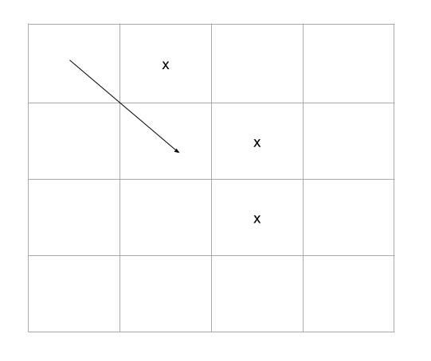
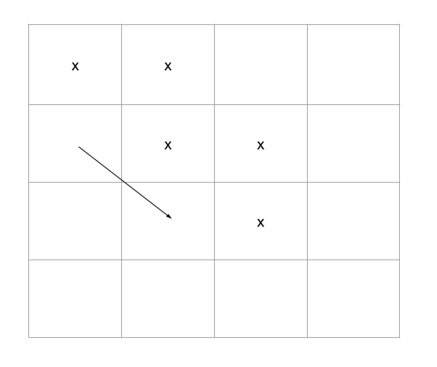

# 문제
```
https://www.acmicpc.net/problem/3109

&Title
3109번 - 빵집

&Question
유명한 제빵사 김원웅은 빵집을 운영하고 있다. 원웅이의 빵집은 
글로벌 재정 위기를 피해가지 못했고, 결국 심각한 재정 위기에 
빠졌다.원웅이는 지출을 줄이고자 여기저기 지출을 살펴보던 중에, 가스비가 제일 
크다는 것을 알게되었다. 따라서 원웅이는 근처 빵집의 가스관에 몰래 
파이프를 설치해 훔쳐서 사용하기로 했다.빵집이 있는 곳은 R*C 격자로 
표현할 수 있다. 첫째 열은 근처 빵집의 가스관이고, 마지막 
열은 원웅이의 빵집이다.원웅이는 가스관과 빵집을 연결하는 파이프를 설치하려고 한다. 
빵집과 가스관 사이에는 건물이 있을 수도 있다. 건물이 있는 
경우에는 파이프를 놓을 수 없다.가스관과 빵집을 연결하는 모든 파이프라인은 
첫째 열에서 시작해야 하고, 마지막 열에서 끝나야 한다. 각 
칸은 오른쪽, 오른쪽 위 대각선, 오른쪽 아래 대각선으로 연결할 
수 있고, 각 칸의 중심끼리 연결하는 것이다.원웅이는 가스를 되도록 
많이 훔치려고 한다. 따라서, 가스관과 빵집을 연결하는 파이프라인을 여러 
개 설치할 것이다. 이 경로는 겹칠 수 없고, 서로 
접할 수도 없다. 즉, 각 칸을 지나는 파이프는 하나이어야 
한다.원웅이 빵집의 모습이 주어졌을 때, 원웅이가 설치할 수 있는 
가스관과 빵집을 연결하는 파이프라인의 최대 개수를 구하는 프로그램을 작성하시오. 


&Input
첫째 줄에 R과 C가 주어진다. (1 ≤ R 
≤ 10,000, 5 ≤ C ≤ 500)다음 R개 줄에는 
빵집 근처의 모습이 주어진다. '.'는 빈 칸이고, 'x'는 건물이다. 
처음과 마지막 열은 항상 비어있다. 

&Output
첫째 줄에 원웅이가 놓을 수 있는 파이프라인의 최대 
개수를 출력한다. 

&Example
-input
5 5
.xx..
..x..
.....
...x.
...x.

-output
2
```

# 요약
* 김원웅이라는 나쁜 빵집사장이 지출을 줄이고자 근처 빵집의 가스관에 몰래 파이프를 설치해서 훔쳐쓰려함
* 첫번째 열에서 마지막 열까지가면 파이프는 연결된거임
* 위대각선, 아래대각선, 오른쪽으로 연결이 가능함
* 파이프끼리 겹칠수 없음
* 연결가능한 최대 파이프라인 개수를 구해라

# 접근
* 0번째 row부터 r번째 row순서대로 최대한 위를 파이프 경로로 설정하여 전진한다. 이 개념만 적용하면 그냥 backtraking문제와 다를것 없다.
* dfs를 통해 0~row만큼 파이프 경로를 설정해본다 파이프라인이 완성될 경우 결과 1 증가시켜준다.
* 방문은 초기화 하지 않는다.

> visited=false로 초기화 하지 않은 이유가 이해가 안된다면 아래 예시를 보자.

아래와 같이 도중에 막혔을때를 생각해보자.



만약 탐색이 끝난 후 false로 초기화 해줄 경우 y=2에서 시작할때 두곳을 탐색하게 된다.


초기화 해주지 않는 경우 한곳만 탐색해도 된다. 즉 이전에 탐색하여 안가도 되는 불필요한 곳은 가지 않게 초기화 해주지 않는 것이다.



# 풀이
1. 방문한 경우 true로 기록하며 되돌리지 않는다(어차피 그 다음 탐색은 y좌표가 하나 증가하고 시작하므로 탐색범위가 줄어서 더 유리하다.)
1. 3방향으로 뻗어나간다. 아래의 경우 다음으로 넘어간다.
    * y가 범위 밖이다.
    * 이미 방문했다.
    * 벽이다.
1. 해당 방향으로 재귀를 돌려준다
1. x == c - 1 인 경우 결과값을 더해주고 함수를 종료한다.

# 소스
```
#include <iostream>
#include <string>
using namespace std;

#define BLANK '.'
#define WALL 'x'

int r, c, res = 0;
string map[10001];
bool visited[10001][501];
int dy[3] = { -1, 0, 1 }, dx[3] = { 1, 1, 1 };
bool flag;

void backtracking(int y, int x) {
	if (flag)return;
	visited[y][x] = true;
	if (x == c - 1) {
		++res;
		flag = true;
		return;
	}

	for (int i = 0; i < 3; ++i) {
		int ny = y + dy[i], nx = x + dx[i];

		if (ny < 0 || ny >= r)continue;
		if (visited[ny][nx])continue;
		if (map[ny][nx] == WALL)continue;

		backtracking(ny, nx);
	}
}

int main() {
	ios::sync_with_stdio(false);
	cin >> r >> c;
	for (int i = 0; i < r; ++i)
		cin >> map[i];

	for (int i = 0; i < r; ++i) {
		flag = false;
		backtracking(i, 0);
	}
	cout << res << endl;
	return 0;
}
```