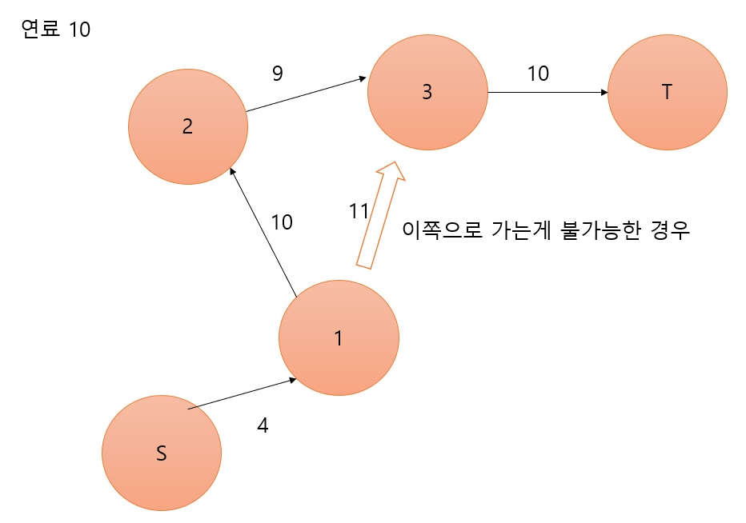

# 문제
```
https://www.acmicpc.net/problem/2585

&Title
2585번 - 경비행기

&Question
경비행기 독수리호가 출발지 S에서 목적지 T로 가능한 빠른 
속도로 안전하게 이동하고자 한다. 이때, 경비행기의 연료통의 크기를 정하는 
것이 중요한 문제가 된다. 큰 연료통을 장착하면 중간에 내려서 
급유를 받는 횟수가 적은 장점이 있지만 연료통의 무게로 인하여 
속도가 느려지고, 안정성에도 문제가 있을 수 있다. 한편 작은 
연료통을 장착하면 비행기의 속도가 빨라지는 장점이 있지만 중간에 내려서 
급유를 받아야 하는 횟수가 많아지는 단점이 있다. 문제는 중간에 
내려서 급유를 받는 횟수가 k이하 일 때 연료통의 최소용량을 
구하는 것이다. 아래 예를 보자.위 그림은 S, T와 7개의 
중간 비행장의 위치를 나타내고 있는 그림이다. 위 예제에서 중간급유를 
위한 착륙 허용 최대횟수 k=2라면 S-a-b-T로 가는 항로가 S-p-q-T로 
가는 항로 보다 연료통이 작게 된다. 왜냐하면, S-p-q-T항로에서 q-T의 
길이가 매우 길어서 이 구간을 위해서 상당히 큰 연료통이 
필요하기 때문이다. 문제는 이와 같이 중간에 최대 K번 내려서 
갈 수 있을 때 최소 연료통의 크기가 얼마인지를 결정하여 
출력하면 된다. 참고사항은 다음과 같다.모든 비행기는 두 지점 사이를 
반드시 직선으로 날아간다. 거리의 단위는 ㎞이고 연료의 단위는 ℓ(리터)이다. 
1ℓ당 비행거리는 10㎞이고 연료주입은 단위로 한다.두 위치간의 거리는 평면상의 
거리이다. 예를 들면, 두 점 g=(2,1)와 h=(37,43)간의 거리 d(g,h)는 
\(\sqrt{(2-37)^2 + (1-43)^2}\) = 54.671... 이고 50＜d(g,h)≤60이므로 필요한 연료는 
6ℓ가 된다.출발지 S의 좌표는 항상 (0,0)이고 목적지 T의 좌표는 
(10000,10000)으로 모든 입력 데이터에서 고정되어 있다.출발지와 목적지를 제외한 비행장의 
수 n은 3≤n≤1000이고 그 좌표 값 (x,y)의 범위는 0＜x,y＜10000의 
정수이다. 그리고 최대 허용 중간급유 횟수 k는 0≤k≤1000이다. 

&Input
첫 줄에는 n과 k가 하나의 공백을 사이에 두고 
주어진다. 그 다음 n개의 줄에는 각 비행장 (급유지)의 정수좌표가 
x y 형식으로 주어진다. 

&Output
S에서 T까지 k번 이하로 중간급유 하여 갈 수 
있는 항로에서의 최소 연료통 용량에 해당되는 정수를 출력한다. 

&Example
-input
10 1
10 1000
20 1000
30 1000
40 1000
5000 5000
1000 60
1000 70
1000 80
1000 90
7000 7000

-output
708
```

# 요약
* 경비행기를 s에서 t까지 가능한 빠른속도로 이동하려함
* 연료통의 크기를 정하려 하는데, 연료통이 크면 속도가 느려지고, 연료통이 작으면 급유를 여러번 받아야한다.
* 거리는 피타고라스 공식, `필요 연료량 = 거리/10 올림 L`
* 시작좌표 (0, 0), 목적지 좌표 (10000, 10000)
* k번 이하의 급유를 받을 연료통의 최소용량은?

# 접근
* 연료통 크기를 기반으로 이진탐색을 한다.
* 여기서 생각해볼게 있다.
    * 멀리 떨어진 노드면 무조건 최선인가?x 현재 위치에서 x y는 +고, x는 -인경우가 있을수 있다. 오히려 목표와 더 멀어질수 있다는 것
    * 그럼 목적지로 향하는 경우인 노드만 넣어도 괜찮을까? 그리고 현재 연료통으로 최선인것만 고르면 되지 않나? x greedy가 가능하면 좋겠지만 예외를 생각해보면 이런경우가 있다.
    
    * 결국은 dfs나 bfs를 통한 완전탐색으로 도착이 가능한지 확인을 해주어야한다.

# 풀이
1. 각 노드마다의 거리를 구한다. 이때 루트를 씌우지 않는 이유는 연산비용이 크기때문이다. 딱히 안씌워도 `a^2+b^2 = c^2`으로 비교해주면 된다.
    ```
    airfield[0].y = airfield[0].x = 0;
        airfield[n + 1].y = airfield[n + 1].x = 10000;
        for (int i = 0; i <= n; ++i) {
            for (int j = i; j <= n + 1; ++j) {
                if (i == j)dist[i][j] = 1e9;
                else dist[i][j] = dist[j][i] = pow(airfield[i].y - airfield[j].y, 2) + pow(airfield[i].x - airfield[j].x, 2);
            }
        }
    ```
1. 이진 탐색으로 올바른 최소 연료탱크 크기를 구한다.
    ```
    while (l <= r) {
            int mid = (l + r) / 2;
            fuel = mid * mid * 100;
            memset(visited, false, sizeof(visited));
            if (dfs(0, 0)) {
                r = mid - 1;
            }
            else {
                l = mid + 1;
            }
        }
    ```
1. dfs를 통해 해당 연료탱크 크기로 목적지까지 갈 수 있는지 확인한다.
    ```
    bool dfs(int cur, int cnt) {
        if (dist[cur][n + 1] <= fuel)return true; // 현재 위치에서 목적지까지 갈수 있으면 종료
        if (cnt > k)return false; // 연료 보충 횟수 초과시 종료
        visited[cur] = true;

        for (int i = 1; i <= n; ++i) {
            // 이미 방문했거나 가는데 연료가 모자랄경우 continue
            if (visited[i])continue;
            if (dist[cur][i] > fuel)continue;
            // dfs 돌려줌
            if (dfs(i, cnt + 1))return true;
        }
        return false;
    }
    ```

# 틀렸던 이유
* 배열 범위 하나 삐끗해서 런타임 에러남
* visited배열 돌때마다 초기화안해줌...

# 소스
약간 의문점이 있다.

내 소스에서는 모든 행위가 끝난 후 return하기 전에 `visited[cur] = false`를 해주지 않는다.

쓸데 없이 반복 방문할꺼라 생각했기 때문이다.

그런데 다음 방문에 더 적은 cnt, 즉 더 적게 항공을 방문하고 오는 경우가 있을 수 있다.

그렇기 때문에 `visited[cur]=false`를 해주거나 `visited[노드][방문횟수]`로 선언을 해주는게 더 적절하다고 생각된다.

테케가 빈약한건지 내가 잘못생각한건지는 잘모르겠다. 물론 이렇게 짜면 탐색을 더 많이하니깐 더 느리다.

고로 이 문제는 dfs보다 bfs로 푸는게 더 적합하지 않은가 싶다. bfs로 할 경우 중복방문에 대한 처리를 따로 해줄 필요가 없기 때문이다.

```
#include <iostream>
#include <cmath>
#include <cstring>
using namespace std;

struct pos{
	int y, x;
};
int n, k;
pos airfield[1002];
double dist[1002][1002];
int fuel;
bool visited[1002];

bool dfs(int cur, int cnt) {
	if (dist[cur][n + 1] <= fuel)return true; // 현재 위치에서 목적지까지 갈수 있으면 종료
	if (cnt > k)return false; // 연료 보충 횟수 초과시 종료
	visited[cur] = true;

	for (int i = 1; i <= n; ++i) {
		// 이미 방문했거나 가는데 연료가 모자랄경우 continue
		if (visited[i])continue;
		if (dist[cur][i] > fuel)continue;
		// dfs 돌려줌
		if (dfs(i, cnt + 1))return true;
	}
	return false;
}

int main() {
	ios::sync_with_stdio(false);
	cin.tie(NULL);
	cin >> n >> k;
	for (int i = 1; i <= n; ++i) {
		cin >> airfield[i].y >> airfield[i].x;
	}
	airfield[0].y = airfield[0].x = 0;
	airfield[n + 1].y = airfield[n + 1].x = 10000;
	for (int i = 0; i <= n; ++i) {
		for (int j = i; j <= n + 1; ++j) {
			if (i == j)dist[i][j] = 1e9;
			else dist[i][j] = dist[j][i] = pow(airfield[i].y - airfield[j].y, 2) + pow(airfield[i].x - airfield[j].x, 2);
		}
	}

	int l = 1, r = 14143; // root(2)*10000
	while (l <= r) {
		int mid = (l + r) / 2;
		fuel = mid * mid * 100;
		memset(visited, false, sizeof(visited));
		if (dfs(0, 0)) {
			r = mid - 1;
		}
		else {
			l = mid + 1;
		}
	}
	cout << l << endl;
	return 0;
}

```