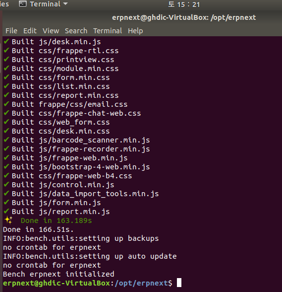

뭔가 완성된 오픈소스를 분석해보는건 첨이라 좀 적어서 정리해가며 해볼까 한다.

# erpnext 주소
* <https://erpnext.com/>
* <https://github.com/frappe/erpnext>

# erpnext?
js와 python, mariadb으로 만들어진 frappe이라는 프레임워크 기반으로 만들어진 서버사이드 프로그램이다. Frappe Technologies Pvt에서 무료 오픈소스로 만들어졌다.

# erpnext를  공부하려는 이유?
* erp는 내가 프로그래밍 초기부터 만들고 싶었던것 중 하나이다. 프로그래밍계의 끝판왕이라는듯 많은 고수분들께서 만들어보는걸 권했지만 다들 선뜻손을 못대었었다.
* erpnext는 파이썬기반으로 타 언어로 짜인것보다 더 쉽고 빠르게 이해할 수 있을것이라 생각했기 때문이다.
* frappe이라는 자신이 따로 구축한것 기반이라는게 매력적으로 들렸다 어떻게 나누어 설계하는지 공부할 수 있는 좋은 계기가 될꺼라 생각했다.
* 몇천개의 회사가 이미 이 플랫폼을 사용하고 있다는 점에서 신용을 느꼈으며 공부해두면 차후 쓸일이 있을거라 생각했다.

# 먼저 프로그램에 대해 알아보자
해당 프로그램에 대해 아는 지식이 없는채 소스만 접근해서 알아차리는건 매우 힘든 일이다. 여기는 다행히도 documentation으로 자신의 프로그램에 대한 메뉴얼이 있다.

* <https://erpnext.com/docs/user/manual/en>
* <https://erpnext.com/docs/user/videos/learn>

## 미리 세팅된 환경 실행해보기
* <https://erpnext.org/get-started>

위 링크에 들어가서 아래로 내리면 Virtual Machine Images를 제공한다. 가상환경으로 다 세팅된걸 제공하는것이다. 우선 프로그램에 대해 알아봐야하기 때문에 다운받아주고 virtual box를 다운받아 .ova를 가져오기 하여 실행한다.(나는 Development Image로 받았다)

* <https://erpnext.org/download>

위 링크는 위에서 다운받은 demo 이미지를 실행하는 법이다. 무척이나 심플하다.

```
username : frappe
password : frappe
입력 후 로그인
그리고 호스트 컴퓨터에서 웹브라우저로 접속
http://localhost:8080

안된다면 ifconfig후 inet addr: 옆에 써져있는 ip를 이용해 접속한다.
http://ip주소:8080

그래도 안된다면 virtualbox 설정이 잘못되었을 가능성이 크다.. 이미 다 세팅된것보다 새로 세팅을 해서 하는게 더 빠를수도

user: Administrator
password: admin
아이디로 접속하면된다.
```

## 직접 세팅해보기

### 우분투 설치
데비안 계열인 우분투를 사용하여 erpnext를 세팅해보자 아래 링크에서 우분투 iso 파일을 다운해주자 버전은 최신이 아닌 16버전으로 다운받길 바란다.

<https://ubuntu.com/download/desktop>

만약 최신버전에 python3로 하고 싶다면 아래 링크를 참조하자

<https://discuss.erpnext.com/t/how-to-install-erpnext-version-12-on-ubuntu-18-04/51246/37>

```
virtual box에서 새로 만들기를 눌러준다.
이름 : erpnext
종류 : linux
버젼 : Debian(64-bit)
램 : 많을수록굿
나머지 세팅 그대로 넘겨줌

이제 시작을 눌러주면 디스크 선택이 나온다. 위 링크에서 받은 iso 파일을 지정해주자

english, install ubuntu

... 이하 기본적인 우분투 리눅스 설치는 우분투 설치법을 검색하여 해주자
```

### erpnext 설치
때 마침 좋은 글이 있어서 이 글을 기반으로 설치를 해보려 한다.

<https://www.howtoforge.com/how-to-install-erpnext-on-ubuntu-1804/>

업데이트 및 유저 추가
```
sudo apt-get update -y
sudo apt-get upgrade -y
```

erpnext 전용 아이디를 생성해주자(안해줘도 무관)
```
sudo useradd -m -s /bin/bash erpnext // 유저 추가
sudo passwd erpnext // 비밀번호 설정

sudo usermod -aG sudo erpnext // 유저 권한주기
su - erpnext // 유저 변경
nano .bashrc

아래 환경변수 한줄 추가
PATH=$PATH:~/.local/bin/

reboot // 다시 시작하여 설정사항 적용되게함
```

필요한 패키지 설치
```
// erpnext의 시스템에 종속성을 가진것들 설치
sudo apt-get install libffi-dev python-pip python-dev libssl-dev wkhtmltopdf -y


// ningx와 mariadb 설치
// 주의! mariadb는 10.2이전 버전을 설치해야 된다... sudo를 입력해서야지만 root로 로그인을 할 수 있게끔 되어 있어서 root비밀번호 설정을 해도 로그인이 안되어 차후 비밀번호 입력할때 어플리케이션 측에서 루트로 로그인을 못한다;;
sudo apt-get install nginx mariadb-server -y

// 50-server.cnf 파일 변경
sudo nano /etc/mysql/mariadb.conf.d/50-server.cnf

// 적당한 위치에 아래줄을 추가
[mysqld]
// 저장 파일 포맷을 barracuda로 지정
innodb-file-format=barracuda
// 테이블당 파일개수 ON
innodb-file-per-table=1
// index key prefix를 767바이트에서 3072바이트로 늘려줍니다
innodb-large-prefix=1
character-set-client-handshake = FALSE

[mysql]
default-character-set = utf8mb4


//파일 수정이 끝났으면 서비스 restart 해준다
sudo systemctl restart mariadb

// 제대로 실행되었나 확인도 해준다
sudo systemctl status mariadb

// 빠져나올땐
ctrl + c
```

redis, node.js 설치
```
sudo curl --silent --location https:deb.nodesource.com/setup_8.x | sudo bash -
 sudo apt-get install gcc g++ make -y
 sudo apt-get install nodejs redis-server -y
 sudo npm install -g yarn
```

 mariadb 설정
```
 sudo mysql_secure_installation

  Enter current password for root (enter for none):
    Set root password? [Y/n]: N
    Remove anonymous users? [Y/n]: Y
    Disallow root login remotely? [Y/n]: Y
    Remove test database and access to it? [Y/n]:  Y
    Reload privilege tables now? [Y/n]:  Y


// 마리아db접속 비밀번호 없으므로 그냥 엔터치면됨
sudo mysql -u root -p

// db, user 만들어줌
create database erpnextdb;
create user erpnextuser@localhost identified by 'password';

// 권한을 상승시켜줌
CREATE USER erpnext@localhost IDENTIFIED BY 'password';
CREATE DATABASE erpnext;
GRANT ALL ON erpnext.* TO 'erpnext'@'localhost' with grant option;
FLUSH PRIVILEGES;
QUIT;

// 명령 방출후 종료
FLUSH PRIVILEGES;
EXIT;
```

ERPNext 설치
```
// 폴더 만들고 frappe 다운
sudo mkdir -p /opt/erpnext
sudo chown -R erpnext /opt/erpnext
cd /opt/erpnext
git clone https://github.com/frappe/bench bench-repo

// 깃설치 안됬다면
sudo apt-get install git

sudo apt-get install npm
sudo npm install -g yarn
// 다운받은 폴더에 bench 모듈 설치
sudo pip install -e bench-repo
// 프레임 워크 초기화
bench init erpnext
```

이렇게 나오면 성공한 것이다.



```
//erpnext로 위치 변경하고 node1.example.com를 도메인으로 사이트를 만듬
bench new-site node1.example.com
// 폴더 접근 권한 변경
sudo chown -R erpnext:erpnext /opt/erpnext/erpnext
// 모든설정이 완료되었습니다 이제 시작하면 끝!
bench start
```

