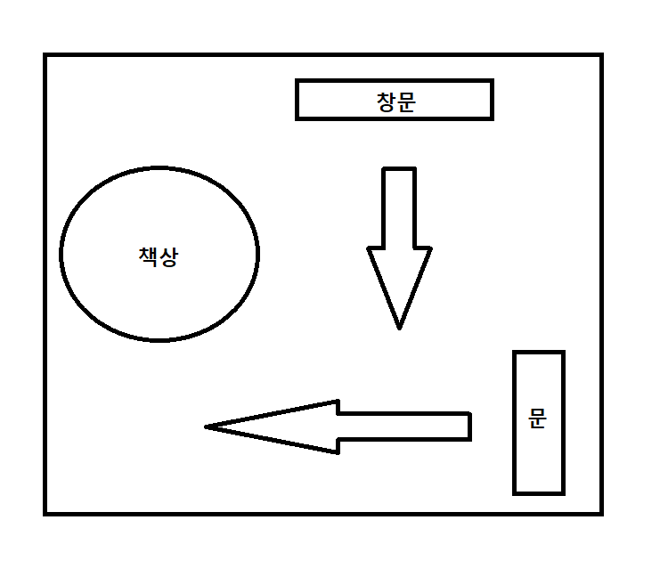
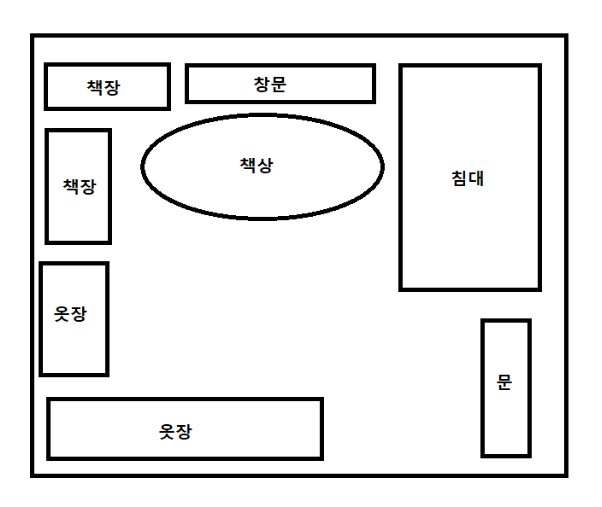
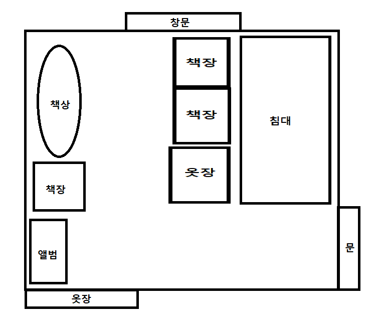

유튜브, 블로그 등을 통해 많은 공부법을 습득하고 실천해보고 있는데 정작 듣기만하니깐 시간이 지나면 다 잊어버리고 예전에 하던대로 공부하고 있다.. 흑흑 공부법을 익히는건 쉽지가 않다. 짬짬히 나한테 맞는 공부법 찾을때마다 정리하자

# 학습방법
책을 볼때 기본적으로 목차가 나뉘어져 있다. 그리고 해당 목차마다 파트로 나누어진 이유가 있다. 우리는 해당 파트에서 배워야 하는 것이 무엇이고, 다 공부하고나서 그것에 대한 질의에 답을 할 수 있어야 한다.

개념책들은 기본적으로 요약 및 정리가 되어있다. 그렇기 때문에 우리가 처음 한번 보고 그걸 이해하고 넘겨보기는 많이 힘들다. 그렇기 때문에 책을 여러 내용이 겹겹히 둘러쌓여 있는 책이라고 생각하고 여러번 회독한다.

회독방식은 7번읽기 공부법의 응용으로 한다.(나한테 7번은 너무 많은것 같다.. 금방 지치고 흥미도 떨어지기 때문에 횟수를 적당히 하는게 바람직할것 같다.)

* 가장 먼저 목차와 소제목을 보고, 오늘 공부할 내용이 무엇인지 파악한다(1번)
* 표, 그림, 핵심요약(사이드에 있는 내용) 등을 무시하고 글만 읽으며 중요한 내용에 줄을 긋는다.(2번)
* 전체적으로 읽으며 연습문제가 있으면 풀어나간다.(3번)
* 회독을 하는 이유는 다음 회독에 읽을 양을 줄이고, 더 빠르게 읽을 수 있게 하기위해서임을 잊지말자.

# 복습방법
인간은 망각의 동물이다. 어떠한 것을 기억하려면 뇌에 계속해서 자극을 주고 중요하다 인식을 해야지 비로소 기억에 남는다. 그래서 우리는 공부할때 복습을 하라고들 하며, 실제로 매우 중요하다. 복습 방법은 정말 다양하지만 실제로 실천하기는 대부분 어렵다.

예를 들면 백지 복습법을 하자고 하면, 백지에 내가 배운것들을 적어넣으라는데 금방 배운것들을 기억해서 적는다?? 내가 기억력이 좋은 천재가 아닌 이상 너무나 힘든일이다. 또 다른 예시로 망각곡선을 활용한 1, 3, 7, 14, 30 복습법이 있다. 이건 습관으로 잡기만 하면 정말 좋겠지만 시간이 지날 수록 복습해야 될게 최대 5일치가 된다. 복습에 할애하는 시간이 너무나 많아지고 날짜 체크해가며 저렇게 한다는 것도 현실적이지가 않다. 그리고 복습하려면 그 날 공부했던 책도 다 갖고 다녀야 되는거자나?! 오우 쉣 

따라서 간단하게 복습은 해당 과목 공부를 시작할때, 끝날때 두번하는데 시작할때는 이전에 공부했던 분량, 끝날때는 오늘 공부했던 분량 복습을 진행해주시면 되겠다.

복습은 10분 내외로 투자하고, 큰틀에서 자신이 중요하다고 생각하는 것들, 해당 내용에 대해서 질의를 만들고 해당 질의에 답할 수 있는지 확인하며 복습을 진행해나가면 된다.

이외에도 한 챕터가 끝나면 해당 챕터에 대한 전체적인 맥락을 잡아주는 복습이 필요한데 이걸 블로그로 정리하며 살을 덧붙여서 완성해주면 된다!! 그럼 다시 해당 과목을 공부할땐 블로그에 정리했던 내용만 쓱쓱 보면 되겠지 헤헷

* 백지복습법, 1, 3, 7 , 14, 30 같은 현실적으로 실천하기 어려운 복습은 NO!
* 복습은 내가 모르는것을 보완하는 과정이 아닌, 정리하는 과정이다.
* 복습은 짧게 10분내외로 할 수 있게한다.
* 복습은 해당 과목 공부 시작할때 이전의 것, 공부 끝나고 공부했던 것 두번 해준다.
* 문제처럼 몇가지 자신만의 질의를 만들고 해당 질의에 대해 쓸수 있는지 확인하자.
* 챕터별 주요맥락에 따라 블로그에 정리하며 최종 복습을 진행해준다.

# 뽀모도로와 목표 설정
뽀모도로는 우리가 학창시절에 50분 수업하고 10분 쉬는시간을 가지는것과 비슷한 방식을 사용한다. 인간이 집중할 수 있는 시간은 생각보다 길지 않다. 자신이 몇시간이나 앉아서 공부할 수 있는건 엉덩이가 질긴거지 결코 집중력이 높은것이 아니다. 수학 문제를 풀때도 2시간 스트레이트로 푸는것보다 50분 풀고 10분쉬는 식으로 두번하는것이 더 많은 문제를 풀 수 있다.

나의 경우는 30분 공부하고 5분 쉬는것을 지향한다. 시계는 어플을 써도 되고 수능시계를 써도 된다. 나같은 경우는 TIME TIMER를 사용했다. 공부법은 간단하다. 30분 동안 목표량을 정하고 공부하고, 알람이 울리면 5분 동안 쉬면서 스트레칭해주고 볼일보면 된다. 생각보다 단순하지만 이 공부법에 장점이 있다. 먼저 말한 집중을 하며 공부 할 수 있는 시간이 그냥 공부하는거보다 길다는점, 그리고 목표를 설정하고 공부를 하기 때문에 메타인지가 가능하며, 매번 자신이 할 수 있는 목표량의 조금씩 많은량을 책정하여 (약 110%) 시간제한을 두고 공부하기 때문에 학습속도와 성장속도가 어마어마하게 증가한다.

목표가 있는 상태, 그리고 더 높은 목표를 향해 공부하는 것은 생각보다 상당히 중요하다. 인간에게는 선천적 재능, 후천적 재능이 있다. 더 높은 목표를 향해 공부를 하는것은 바로 후천적 재능을 조금씩 끌어 올리는 것이다. 인간은 태어나서 계속해서 성장한다. 성장하지 못하는 인간은 도태된다. 이 부분에 대해서 더 깊이 알고 싶다면 `뇌의 가소성`에 대해 알아보자.

* 뽀모도로는 공부시간/쉬는시간, 목표를 정하고 공부하는 공부법이다.
* 주기적으로 쉬어주는 것은 집중력 향상에 도움이 된다.
* 목표를 기존에 성취한 양보다 약간 높게 책정해 기존보다 성장할 수 있게 한다.
* 만약 정해진 시간 동안 못하는 경우 세가지 선택이 있다.
    * 너무 높은 경우라 판단하고 목표를 재설정한다.
    * 추가시간을 가져서 마저 목표를 달성한다.
    * 계획표에 못한 부분을 적고 주말이나 보충 가능한 시간에 마무리 한다.

# 우리의 인생의 갈림길을 결정하는 1초
우리가 무언가를 시작하려 할때, 즉 컴퓨터를 키고, 게임을 키는 행위, 핸드폰을 키는 행위, 유튜브 영상을 보는 행위, 알람이 울릴때 끄고 다시 자는 행위 등 이러한 것들이 일어나는데, 이러한 것들을 판단하는데 1초의 시간도 걸리지 않는다. 그리고 그 후는 아무 생각없이 그 행위가 끝날때까지 진행한다. 그래놓고 아 왜 나는 안될까? 내가 왜그랬을까? 하고 자책한다.

공부도 마찬가지다 우리가 공부하려고 마음 먹고 앉아서 시작하는걸 결정하는데 1초의 시간도 걸리지 않는다. 나는 지금껏 그 1초의 갈림길에서 항상 내가 아닌 내 무의식이 시키는 것을 선택했다. 이러한 결정의 순간 우리에게 하나의 습관만 적용한다면 달라질 수 있다. 바로 무언가 다른 일을 하기 전에 10초만 눈을 감는 습관을 가지는 것이다. (이 습관을 주기적으로 주입해주어야한다.) 우리는 1초를 10초를 늘리는데 성공했다. 이제 그럼 우린 그 10초 동안 무엇을 해야할까?? 바로 앞으로 내가 정해진 시간 동안 어떠한 일을하고 있을지를 상상하는 것이다. 그리고 그 일을 시작한다. 그러고 그 행위가 끝나면 내가 상상했던 일이 현실로 다가와있다.

# 공부 환경
공부를 할 수 있는 환경을 만드는것은 생각보다 중요하다. 공부 잘하는 애들은 어디서든 잘해~ 라고 생각할 수 있지만 그들에겐 환경에 의거하지 않는 습관이 몸에 베였기 때문일뿐이다.

먼저 방해요소를 제거 해야된다. 가장 먼저 공부할 때 방해요소를 파악하는 것인데, 나 같은 경우는 핸드폰이었다. 공부할 때 집중하지 못하고 자꾸 카톡을 보고 유튜브를 보게 된다. 이제 방해요소를 파악하면 방해요소를 제거한다. 핸드폰이 방해가 된다면 어떻게 할까? 답은 공부하는 장소에 핸드폰을 들고 들어가지 않는것이다. 나 같은 경우에는 방에 들어갈땐 반드시 핸드폰을 끄고 밖에 놔두고 공부했다. 끈 이유는 쉬는시간에 나와서 보는 미련까지 없애기 위해서다. 이런식으로 자신의 방해요소를 파악하고 자신과의 약속으로 방해요소를 제거해주자.

이제 해야될것은 공부하기 좋은 환경을 만드는 것인데, 집에선 공부가 안되고 도서관에선 공부가 잘된다는 말을 다들 하곤한다. 왜 그럴까? 답은 방에 배치의 문제가 있는데, 대부분의 집에는 침대와 책상이 같이 배치되어있다. 이는 공부에 심히 방해가 되는 배치이다. 공부하는 곳은 공부하는 곳이고, 자는 곳은 자는곳인게 확실히 구분되어야 한다. 방이 좁은 경우는 칸막이를 통해 장소를 구분짓든 아니면 방을 따로 만들어주는게 좋다.

이제 침대와 책상이 분리되었으면 책상을 어떻게 배치하느냐의 문제이다. 책상은 풍수지리설에 따르면 사람은 등에 공간이 있으면 무의식적으로 경계하기 때문에, 이러한 본능적 위기감이 계속되면 침착성이 없어지거나 집중력이 떨어져서 공부에 집중하기 어렵다고 한다. 풍수지리설 같은 뚱딴지 같은걸 믿느냐? 라고 하겠지만 대대로 내려오는 조상님들이 하는 말은 다 이유가 있는법이다. 정리하면 아래와 같은 조건을 만족하면 좋다고한다.

* 등에 공간이 있으면 무의식적으로 경계를 하게 된다.
* 창문과 문에 일직선 되는 위치는 피한다.
* 자는 공간과 공부하는 공간을 분리하라
* 구조상 불가능 하다면 창문가리개를 사용하거나, 공간분리 가벽을 사용하는것도 방법이다.

대충 저 말대로 한다면 아래와 같은 상황에서 책상 배치는 이러할 것이다.

나는 이전에 배치를 이렇게 했었다.

이후는 이렇게 바꾸어 보았다!! 창문이 중앙에 있고 침대 자리가 고정이라 아무리 생각해도 이렇게 밖에 할 수가 없었다. ㅠㅠ

원래는 침대와 책상사이에 가벽만 세우려고 했었는데 창고에 높은 책장 하나 더 꺼내와서 책상 뒤에 두개 배치하니 확실히 집중하기 좋은 환경이 되었다. 나 같은 경우는 퇴근 후 야간에 집에서 공부하기 때문에 내 방의 환경을 좀 바꾸어줄 필요가 있었다. 집에서 공부한다면 두세시간과 약간의 돈을 투자해서 공부하기 좋은 환경을 갖추어보는것도 추천한다.

# 바른 자세
* 바른자세를 하기 위핸 의자와 책상의 높이
* 바른자세를 했는지 확인하는법

# 참고
* <https://www.youtube.com/channel/UCnoMoEViyPVWsKch6X-N61w>
* <https://www.youtube.com/channel/UC8WehOwMTO72Yr6erErwpdA>
