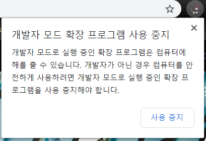

간단한 크롬 확장앱을 만들어서 쓸려고 보니깐 크롬을 킬때마다 이 창이 뜬다..

딱히 웹스토어에 올릴것도 아니고 올릴려면 개발자 등록 수수료 5달러도 지불해야 된다 =ㅅ=

이에 대한 해결책이 있나 찾아보았다.

1. chrome dev 버전 받기
1. chrome.dll 수정하기
    
# chrome dev 버전 받기
간단하다. 그냥 크롬 개발자용을 설치하면 이런 창은 뜨지 않는다. 개발자라면 이게 정석적인 방법일 것이다. 가장 추천하는 방법이다.

<https://www.google.com/chrome/dev/>

# 기업 정책 사용하기
1. 먼저 확장프로그램이 개발자 모드로 설치되었다는 가정하에 시작하겠다.
1. <http://dl.google.com/dl/edgedl/chrome/policy/policy_templates.zip> 에서 정책파일을 다운받아준다.
1. 압축을 푼 후 zip파일에 있던 `windows\admx\chrome.admx`를 `c:\windows\policydefinitions`에 파일을 옮겨준다.
1. `\windows\admx\ko-KR\chrome.adml`을 `c:\windows\policydefinitions\ko-KR\chrome.adml`
1. <chrome://extensions>에서 해당 확장프로그램에 세부사항을 눌러 ID를 메모장에 복붙해둔다.
1. win+R키를 누른 후 gpedit.msc를 실행시킨다. 에러가 날 경우 win pro, enterprise이외에는 그룹 정책이 disabled 되어 있는데 <https://www.youtube.com/watch?v=J28r5u5Wqy4> 이 영상 설명에 있는 배치파일을 그대로 따라해서 enable로 해주고 다시 실행시켜보자
1. 사용자 구성 - 관리템플릿 - 구글 크롬 - 확장 프로그램 - 화이트리스트 정책을 눌러서 사용함 눌러주고 아까 메모했던 ID 넣어주면됨

근데 이거 설정하면 조직에서 관리하는 앱으로 되면서 별로인거 같다..

원래대로 되돌리려면 아까 옮겼던 정책파일 삭제하기 전에 줬었던 옵션들 다 죽여주고 삭제해주면 원상태 복구된다.

