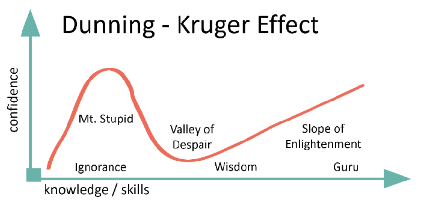

학창 시절에 공부잘하는 친구가 시험을 망쳤다고 말하고, 못하는 친구가 시험을 잘봤다고 말하는 상반된 모습을 보여주는 것을 여러분은 종종 본적이 있을것이다. 이러한 현상을 연구한것이 있는데 이것이 바로 더닝 크루거이다. `능력이 없는 사람이 잘못된 결정을 내려 잘못된 결론에 도달하지만, 능력이 없기 때문에 자신의 실수를 알아차리지 못하는 현상을 가리킨다.`

더닝 크루거 효과에 따르면, 위와 같은 예시에서 전날 밤 벼락치기로 공부하고 나서 시험을 잘 본 것처럼 느끼는 것은 대표적인 더닝 크루거 효과일 가능성이 높다.

```
학사: 난 무엇이든 다 안다.
석사: 내가 모르는 것도 많다.
박사: 난 아무것도 모른다.
교수: 난 진짜 X도 모르는데 내가 말하면 다들 믿는다.
```



* 능력이 없는 사람은 환영적 우월감의 착각으로 실제 실력보다 높게 자신의 판단
* 능력이 없는 사람은 자신에 대한 오해에 기인하여 결론을 지음
* 능력 있는 사람은 자신의 실력을 과소평가하여 환영적 열등감을 가짐
* 능력 있는 사람의 착오는 다른 사람에 대한 오해에서 기인함

나도 it 공부를 하면 할 수록 요즘 들어 실력이 느는것 같지 않고 위축이 되곤 한다. 러닝 커브가 상당히 높아져서 공부가 예전처럼 재밌지도 않다. 더닝 크루거 효과는 어떻게 보면 인간의 메타인지 능력의 중요성을 입증하는 실험이였을지도 모르겠다. 내가 어느 정도 수준에 있는지 이성적으로 인지하고 판단한다면, 여러 잡념에 휩쌓이지 않고 자신이 선택한 길을 올곧게 향할 수 있을 것이기 때문이다.

`빈 수레가 요란하다`,  `벼는 익을수록 고개를 숙인다` 라는 말이 있다. 과거의 나, 혹은 지금의 나의 모습이 아닐지는 생각해보자.

마지막으로 더닝 크루거 영상 하나 :)
