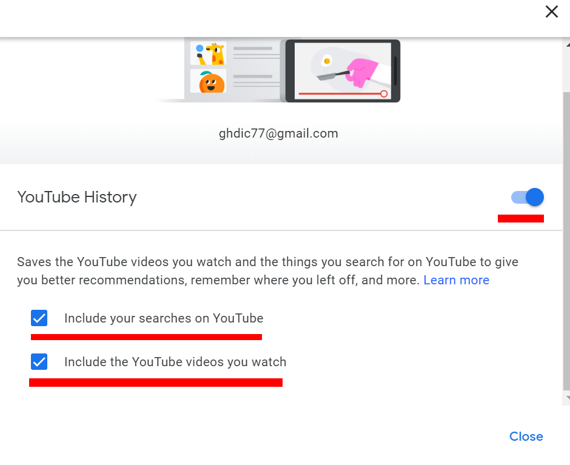

# 나는 유튜브 중독자다

나는 유튜브를 보는걸 정말 좋아한다. 매일 매일 재밌는 영상이 무수히 많이 올라오기 때문에 질리지 않고 볼 수 있다. 내가 볼게 없다고 판단하면 AI가 즉각 반영해서 새로운 추천 영상을 추천해주기도 한다.

어느샌가 나는 일상에 4~6시간이 넘는시간을 유튜브에 할애하고 있었고 땔래야 땔 수 없는 상태에 놓이게 되었다.

내 글을 보러왔다는건 다들 나랑 같은 상황이라 그런걸꺼라 생각한다. 유튜브에는 공부와 학습 관련 좋은 영상도 많은데 내가 보는건 게임, 엔터테이먼트 같은거만 보게된다.

그럼 서론은 이 정도로만 하고 유튜브 중독을 방지하기 위한 세팅을 설명하겠다.

유튜브 중독의 주 원인은 바로 추천영상에서 비롯된다. 계속 자신이 흥미 없고 재미없는 영상을 추천해주면 유튜브에서 멀어지게 될 것이다.

# 추천 기능 죽이기

먼저 히스토리로 들어가자

옆에 히스토리 청소 및, 히스토리 기록 관련 설정을 할 수 있는 옵션이 있다. 이녀석들을 clear, turn off 시켜주자, 그리고 세번째 줄쳐진 녀석을 눌러준다.

그럼 새로운 창이 뜰꺼다. Change Setting을 눌러주자.

빨간줄 처진거 눌러서 다 꺼버린다. 

> 만약 내가 공부 관련한 영상만 서치해서 본다고 한다면 첫번째줄은 켜놓아도 된다. 그럼 공부 관련 영상이 추천으로 많이 뜰것이다

마무리로 아래있는 휴지통을 눌러서 모든 activity를 삭제하자. 그럼 더 이상 AI가 나에게 올바른 추천을 해주지 않을것이다.

# 필요한사람만 구독 및 불필요한 영상 관심 없음 표시

not interested 기능을 이용하면 관련된 영상이 더 이상 추천 되지 않는다. 이 기능 관련 disabled를 하지 않았으므로 잘 작동된다. 내가 롤 영상을 더 이상 보지 않기로 맘을 먹었다면 롤 영상 보이는대로 not interested 눌러주자

유튜브 구독을 끊는다. 그럼 더 이상 추천 해주지 않는다. 사요나라 빠따형 ㅠㅠ

# 언어 및 지역 변경

그 사람이 사는 지역 및 언어에 따라 영상을 추천해주는 기능이 있기 때문에 이것도 바꾸어 준다.

오른쪽 상단에 내 아이콘을 누르면 언어 및 지역을 바꿀수 있다. 나는 영어 공부도 겸하고 있으니 영어과 미국으로 설정을 바꿀것이다.

# 결과

아주 깔끔해졌다. 지역을 미국으로 바꿔서 Trending에 들어가도 미국기준 순위영상이 나온다. 이렇게 설정한 후 유튜브 보는 시간이 많이 줄었다 :)

여러분도 한번쯤 해보는걸 권한다.