# 아~ 공부 안된다
요즘 공부가 잘 안된다.. 집중력도 완전 gg 퇴근 후 집에 가서도 침대에 쭉 누워있다가 다음날을 맞이한다. 이런 무기력한 삶은 싫은데 이런 날이 자꾸 반복된다.

맞다 이건 공부 할 때 오는 우울증과 같은것이다 인터넷에 쳐보니 나와같은 증상을 호소하는 사람이 생각보다 많았다. 이에 대한 해결책으로 자신이 제어 할 수 있는 행위를 하라는(통제력) 애기를 샤오TV에서 들었다. 그래서 글 좀 끄적여볼려고 한다.

# wikihow 공부잘하는법

> [wikihow공부잘하는법글 링크](https://ko.wikihow.com/%EA%B3%B5%EB%B6%80-%EC%9E%98-%ED%95%98%EB%8A%94-%EB%B2%95)

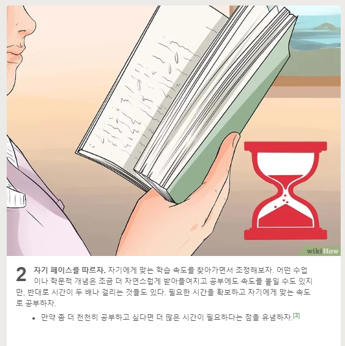

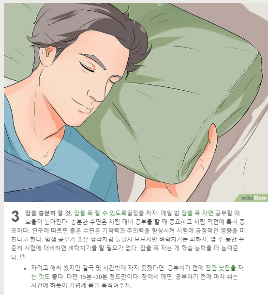

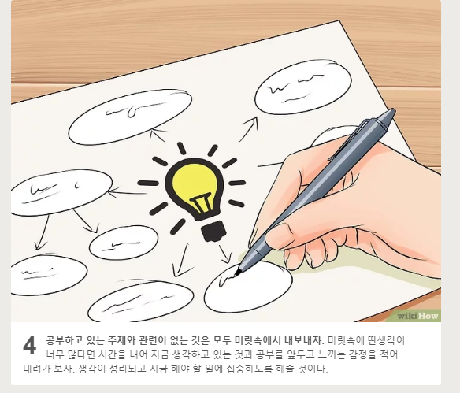

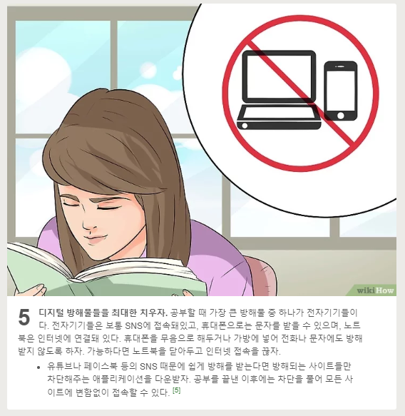

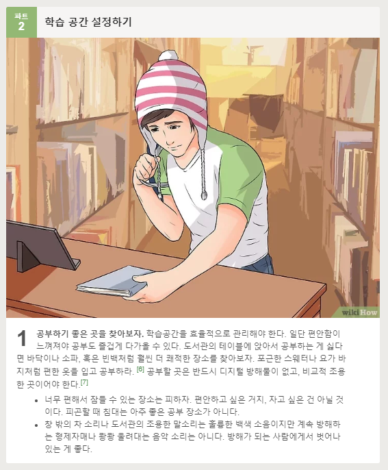

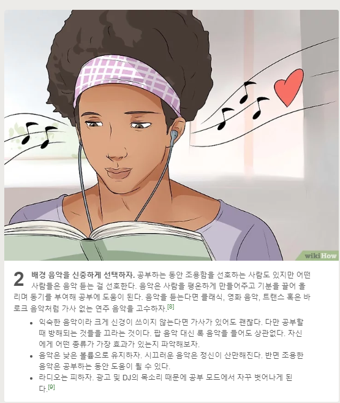

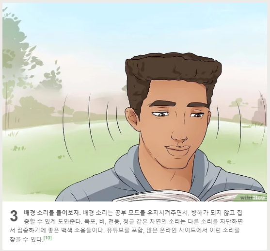

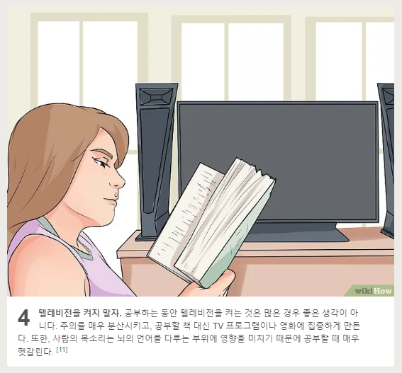

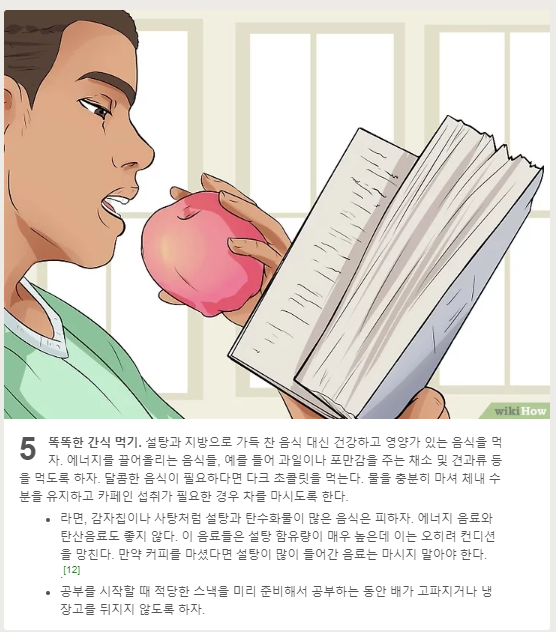

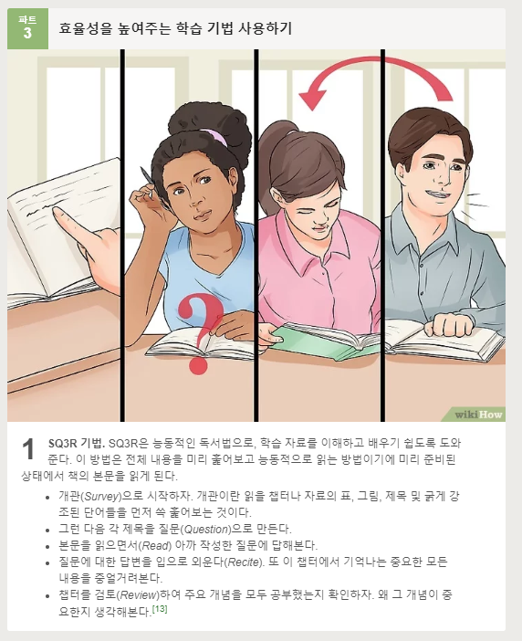

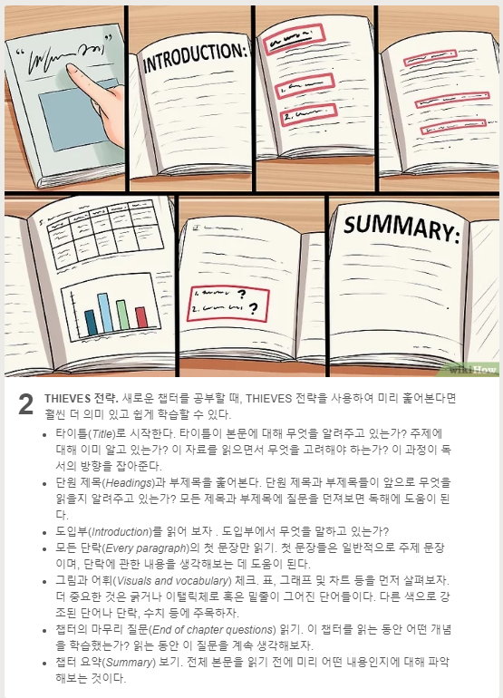

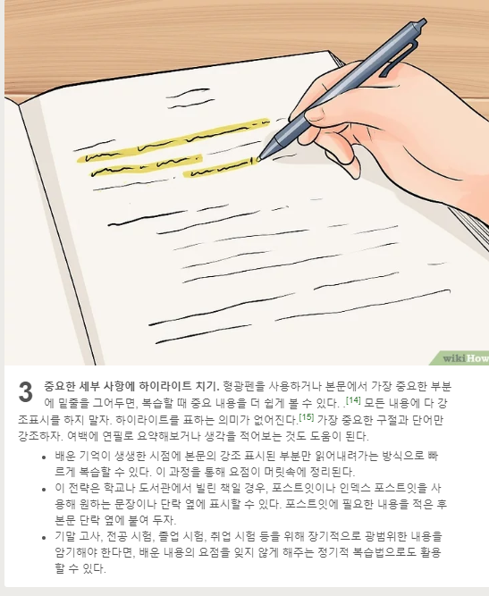

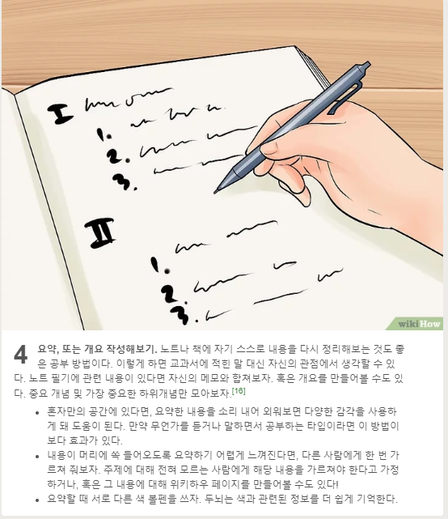

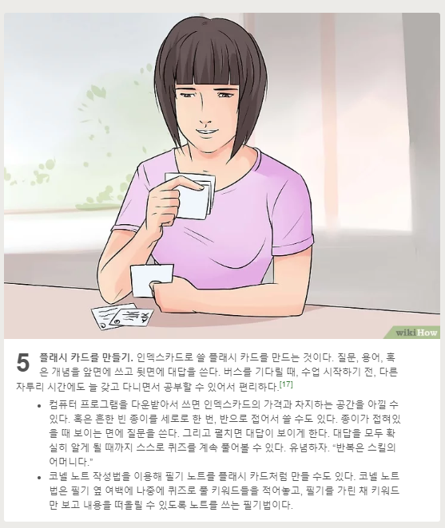

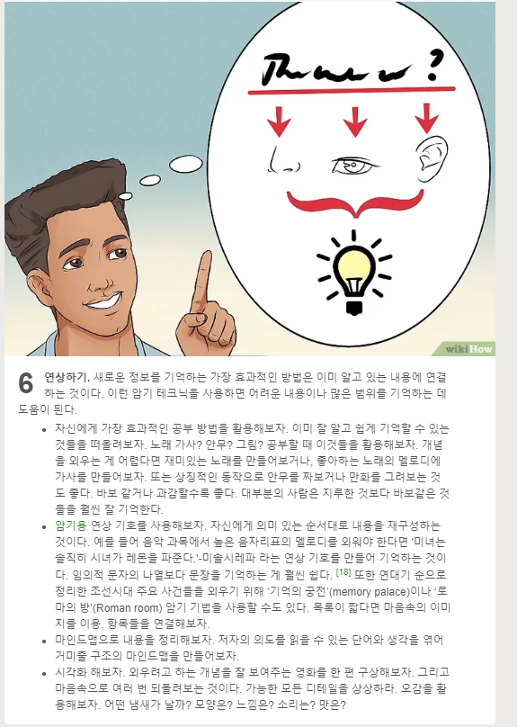

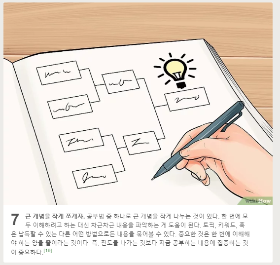

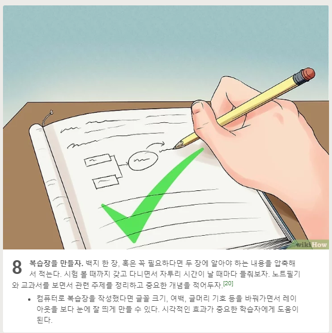

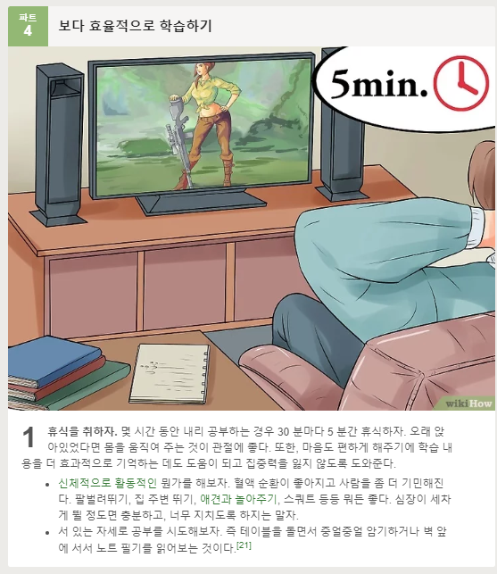

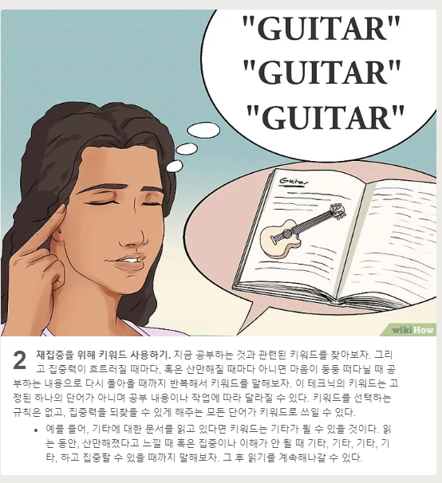

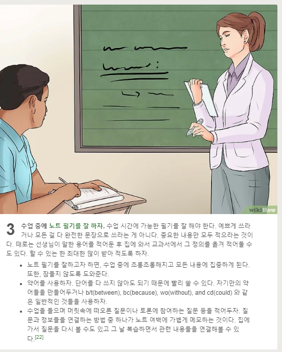

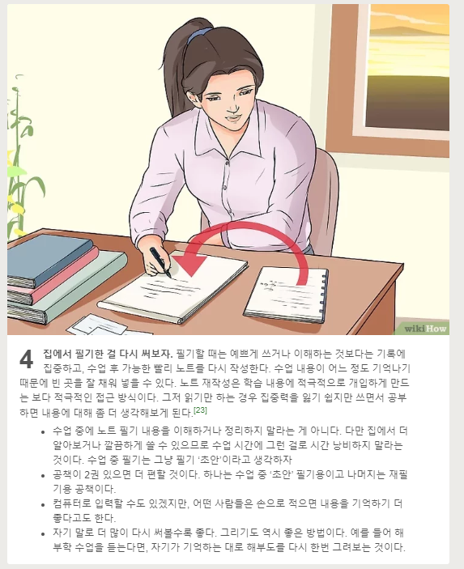

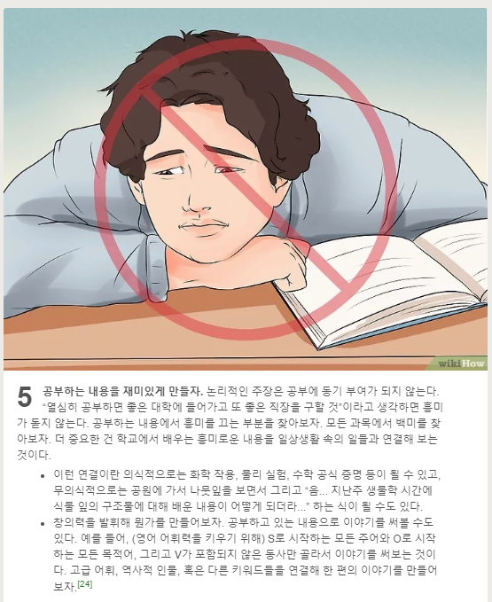

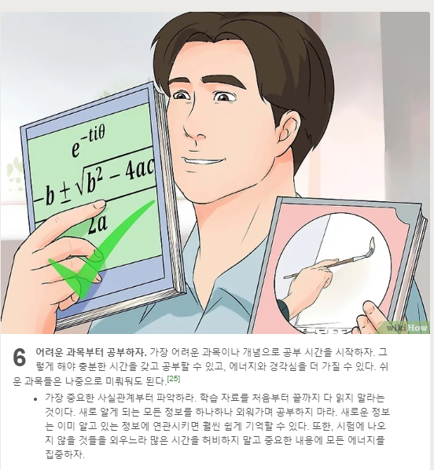

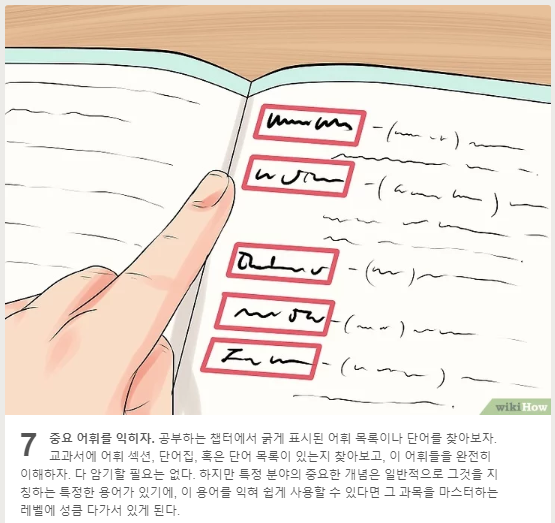

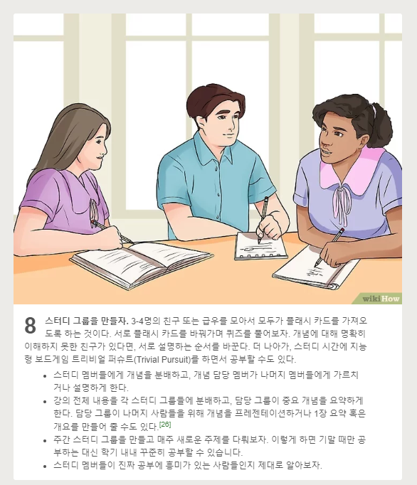

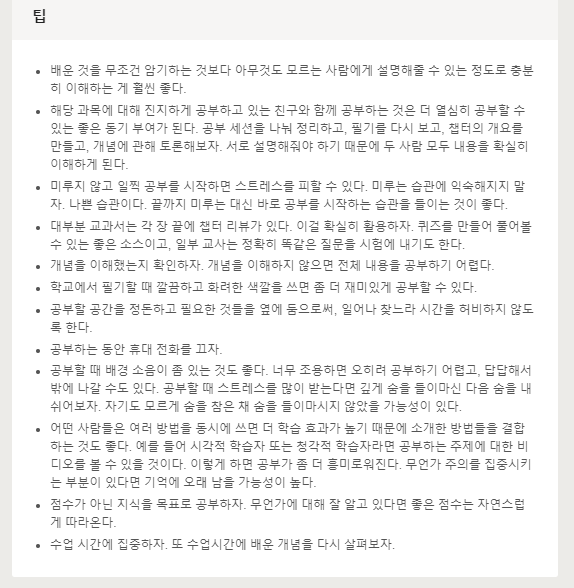

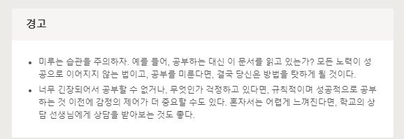

# wikihow 공부조언

> [나무wiki 공부 조언](https://namu.wiki/w/%EA%B3%B5%EB%B6%80%20%EC%A1%B0%EC%96%B8)
